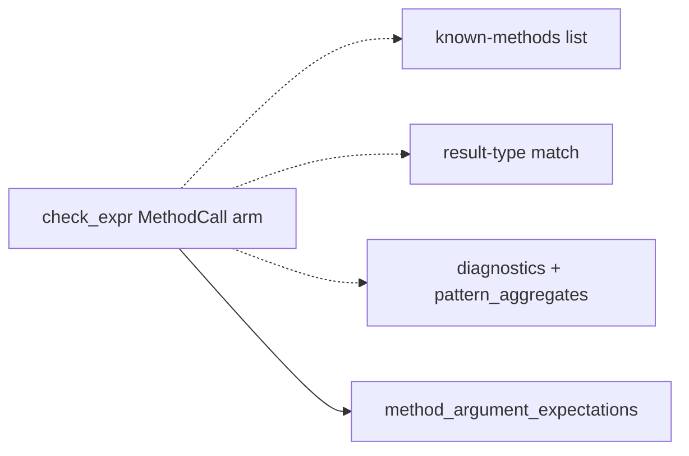
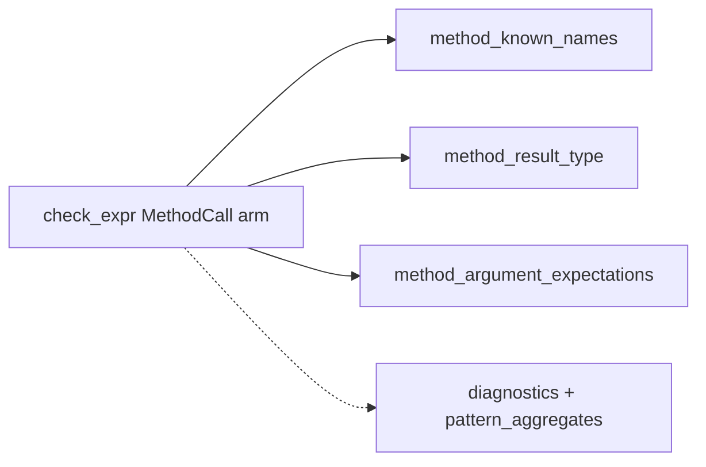
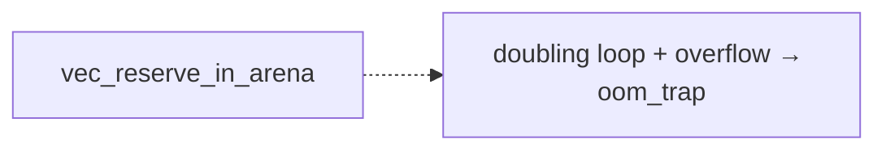
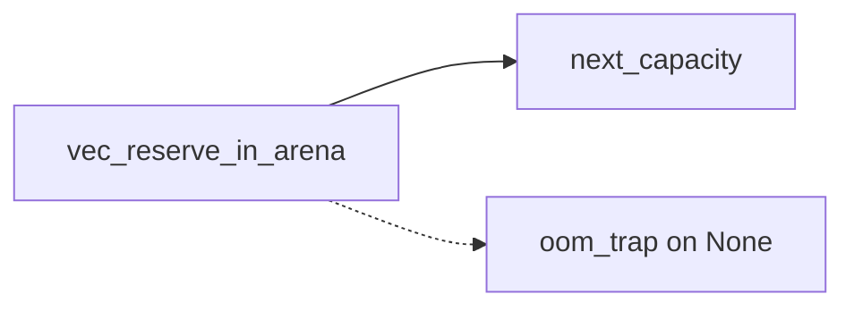

# Architecture review — vow — 2026-08-31

**Scope**: Rust compiler crates weighted by heat from `git log` — `vow-types`, `vow-ir`,
`vow-codegen`, `vow-runtime`, `vow-clif-shim`, `vow-verify`, `vow`. This routine's prior firings
landed nine "extract an inline policy into a pure, tested seam" refactors (PRs #1105, #1095,
#1080, #1073, #1064, #1067, #1049, #1054, #1048); this run continues that line and dedups against
them.
**Picked**: `builtin-method-result-type-seam` — see the PR and `.architecture/backlog.md`.
**Degradations**: Exploration sub-agents hit a session rate limit (HTTP 429) and were cut off;
the scan was completed inline per the skill's stated fallback. Design-it-twice (step 4) was
likewise run inline. No other degradations — `gh` authenticated, quality gate discoverable.

In the Mermaid diagrams below, **solid edges are the interface** (what a caller sees) and
**dashed edges are inside the implementation** (hidden behind the seam).

## Candidates

### builtin-method-result-type-seam — resolve builtin-method result types through a pure seam · Strong · score 22/25

- **Files**: `vow-types/src/check.rs:1941-2122` (the `ExprKind::MethodCall` arm of `check_expr`);
  estimate **1 file**.
- **Score**: **22/25**
  - Leverage **4** — one deeply-nested caller (a ~170-line match arm) stops computing the policy
    inline, and a whole class of test setup disappears: exercising a builtin method's result type
    today needs a full `TypeChecker` plus a parsed `MethodCall` expression; after, it is a pure call
    `method_result_type(&recv_ty, "get")`.
  - Locality **4** — all builtin-method type policy would sit in three adjacent pure functions
    (`method_argument_expectations` already exists; result-type and known-names join it). Adding or
    changing a builtin method's result becomes a one-function edit instead of surgery on a giant arm.
  - Blast radius **1** (band: contained, no published interface; 1 file) — inverted term `6-1 = 5`.
  - Heat **5** — the hottest policy surface in the tree: `check.rs` and this exact arm changed in
    #1125, #1129, #1123, #1071, #1063, all at the top of `git log`.
- **Problem**: the `MethodCall` arm is a shallow-by-inlining hotspot — ~170 lines that tangle three
  separable concerns: (a) which methods a receiver kind exposes, (b) what type a given method
  returns, and (c) diagnostics (unknown-method hints, BTreeMap key-type check, `unwrap` arity,
  pattern-aggregate recording). Concerns (a) and (b) are pure functions of `(recv_ty, method)` but
  cannot be tested without standing up the checker, and they read almost identically to the
  already-extracted `method_argument_expectations` seam right above them — the asymmetry is the
  smell.
- **Deletion test**: deleting the extracted resolver would force every result-type decision back
  inline into `check_expr` — complexity **concentrates** in the seam, it does not merely move. Pass.
- **Solution**: extract the pure result-type/known-methods resolution into free functions mirroring
  `method_argument_expectations` (`fn method_result_type(receiver: &Ty, method: &str) -> Option<Ty>`
  and a known-names accessor), leaving all diagnostics and side effects (`emit_error`,
  `pattern_aggregates` insertion) in `check_expr`. The exact interface is adjudicated in `## Design`.
- **Benefits**: **leverage** — the giant arm shrinks to a thin driver that calls three sibling pure
  resolvers; **locality** — builtin-method type knowledge is co-located and independently evolvable;
  **test surface** — result types become directly unit-testable (`method_result_type(&vec_i64,
  "get") == Some(Option<i64>)`) with no checker, matching how the arg-expectation policy should have
  been testable all along.

Before: the arm inlines the known-methods list and the result-type match (dashed = tangled inside
the arm), while only argument expectations are already a seam.

After: three sibling pure seams (solid) resolve the policy; the arm keeps only diagnostics (dashed).

### vec-reserve-next-capacity-seam — pull Vec growth policy out of the arena FFI path · Worth exploring · score 17/25

- **Files**: `vow-runtime/src/lib.rs:1498-1519` (`vec_reserve_in_arena_no_null_check`); estimate
  **1 file**.
- **Score**: **17/25**
  - Leverage **3** — one call site simplifies materially, and the overflow-to-OOM growth policy
    becomes testable without a live arena.
  - Locality **3** — the doubling/overflow decision concentrates in one pure function.
  - Blast radius **1** — inverted term `5`.
  - Heat **3** — `lib.rs` is active overall, but these specific growth lines are cooler than the
    checker arm.
- **Problem**: the capacity-doubling loop (`while new_cap < required { new_cap *= 2 }` with a
  checked-mul OOM guard) is a pure policy buried inside an `unsafe` FFI function that mutates a raw
  `VowVec` descriptor. Its overflow behaviour — the interesting part — cannot be exercised without
  building an arena and a descriptor.
- **Deletion test**: pass — deleting the seam concentrates the growth math back inline.
- **Solution**: extract `fn next_capacity(old_cap: usize, required: usize) -> Option<usize>`
  (`None` = overflow → the caller keeps `oom_trap`).
- **Benefits**: leverage/locality modest; the real win is a directly testable overflow policy.

## Dropped

| Candidate | Dropped because |
|---|---|
| `esbmc-ce-description-heuristic` | Known-inert: the multi-property counterexample description heuristic in `parse_esbmc_output` has latent bugs, but the only caller destructures `Failed(_)` and discards the description, so extracting it deepens nothing observable. Leverage 1 — fails the deletion test. |
| `solver-classify-function` | Already a pure, unit-tested seam (`vow-verify/src/solver_strategy.rs::classify_function`, tests `test_classify_*`). No shallowness to remove. |

## Too large to automate

| Candidate | Why it is not one-PR work |
|---|---|
| `clif-shim-region-parity` | `vow-clif-shim` exposes pure, tested `hidden_region_count` / `hidden_region_for_store_target` seams that the Rust `vow-codegen` backend has no equivalent for. Bringing the Rust backend to parity crosses a crate/tier seam and touches codegen output — blast radius 4, a human should schedule it. |

## Pick

`builtin-method-result-type-seam` (22/25) over the runner-up candidate
`vec-reserve-next-capacity-seam` (17/25). The gap is 5 points, so this was **not** a close call.
Both are blast-radius-1 and both pass the deletion test, but the pick wins decisively on heat (5 vs
3 — it is the single hottest policy surface in the tree, changed by five recent PRs) and on leverage
(4 vs 3 — it dissolves a ~170-line arm and mirrors an established sibling seam, whereas the runner-up
is a few lines of arithmetic). The runner-up is the natural next firing.

## Design

Filled in step 4 (design-it-twice + adjudication), after this report was first committed.
