# Architecture review — vow — 2026-08-31

**Scope**: Hot-spot scan of the recently-changed compiler crates (`vow-types`, `vow-codegen`,
`vow-runtime`, `vow-verify`, `vow` driver), weighted by `git log` heat over the last 40 commits.
`compiler/main.vow`, `vow/src/skill.rs`, and the spec/skill markdown dominate the raw churn but
are embedded-string or documentation surfaces with no pure-policy seam, so attention went to the
Rust type-checker and codegen paths where recent bug-fix churn clusters.
**Picked**: `cast-legality-verdict` — see [PR](#) and `.architecture/backlog.md`
**Degradations**: none. `gh` authenticated; `codebase-design` available; sub-agent exploration used.

Diagram convention (replaces the upstream HTML legend): **solid edges are the interface**
a caller sees; **dashed edges are inside the implementation**, invisible to callers.

## Candidates

### cast-legality-verdict — classify `as`-cast legality as a pure verdict  ·  Strong  ·  score 22/25

- **Files** — `vow-types/src/check.rs:2708-2730` (the `ExprKind::Cast` arm of the ~1200-line
  `check_expr_inner`); classifier lands beside the sibling seams `method_result_type` (`:380`) and
  `integer_type_range` (`:652`). File-count estimate: **1**.
- **Score** — **22/25**
  - Leverage **4**: one deeply-nested caller stops reaching past the seam, and it removes a whole
    class of test setup — cast legality is currently only reachable by driving the full checker; a
    pure `classify_as_cast` is unit-tested directly, exactly like `method_result_type` at `:6863`.
  - Locality **4**: `as`-cast legality is a recurring bug surface (#1142 closed an `as` bypass,
    #1157 resolved cast target types) — concentrating the rule in one named pure function makes the
    next such change a one-function edit plus a test, not an edit inside the mega-arm.
  - Blast radius **1** (inverted → +5): one file, no published interface, no CLI/wire change.
  - Heat **5**: `check.rs` is the hottest Rust file (7 of the last 40 commits), and casts
    specifically drew #1142/#1153/#1157 this cycle.
- **Problem** — the arm inlines a 4-way legality **policy** (lit-int→integer ⇒ range-check;
  both integer widths known and `tgt < src` ⇒ narrowing error; source not `Never` ⇒ type-mismatch;
  otherwise OK) directly among `check_integer_literal_range`, two `emit_error_with_hints` calls, and
  the `nonneg_casts` mutation. The pure decision — a function of `(src_ty, tgt_ty)` only — is
  invisible: to know "is this cast legal" you read imperative control flow tangled with diagnostics.
  It is a **shallow** stretch of a large module: the decision's essential complexity is small, but it
  is spread across an interface (the arm) far wider than itself.
- **Deletion test** — extracting `classify_as_cast` **concentrates** complexity: the legality rule
  becomes one pure function with a total `enum` of outcomes, and the arm shrinks to a `match` that
  wires each verdict to its diagnostic/side-effect. Inlining it back would scatter the rule across
  the arm again. Passes.
- **Solution** — add `enum AsCastVerdict { CheckLiteralRange, Narrowing, Invalid, Ok }` and a pure
  `fn classify_as_cast(src: &Ty, tgt: &Ty) -> AsCastVerdict`, preserving the exact priority order of
  the existing `if/else if` chain. The arm matches the verdict: `CheckLiteralRange` runs the existing
  literal-range check, `Narrowing`/`Invalid` emit the existing diagnostics verbatim, `Ok` does
  nothing. The `nonneg_casts` insertion is verdict-independent and stays unchanged after the match.
- **Benefits** — **leverage**: the legality rule gains direct unit tests over `(Ty, Ty)` pairs,
  pinning the narrowing/widening/same-width/`Never` boundaries that recent PRs kept getting wrong.
  **locality**: future cast-rule changes and their regressions land in one pure function and its
  tests. **test surface**: the behaviour is exercised through the classifier's interface without
  standing up a checker, an AST, or a diagnostics sink.

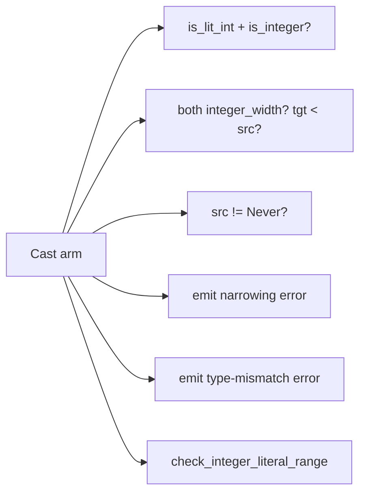

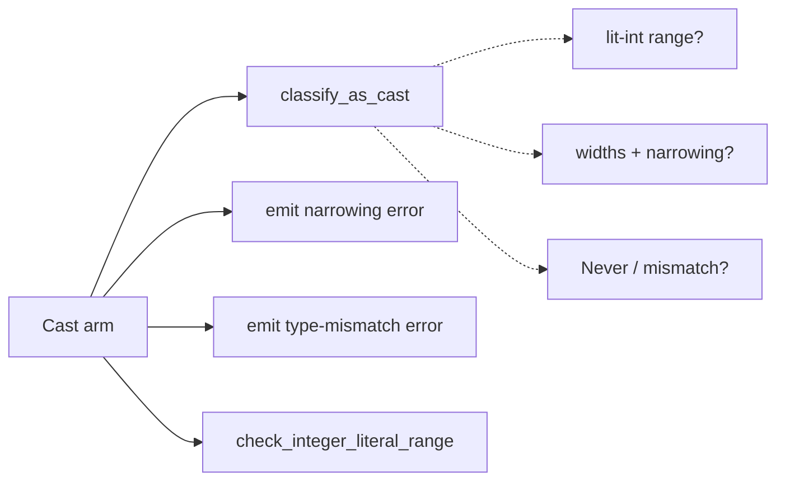

### ce-trace-reconstruction — pure block-visit → source-trace derivation  ·  Worth exploring  ·  score 21/25

- **Files** — `vow/src/counterexample.rs:327-376`, two inline loops inside
  `build_structured_counterexample_with_module` (`:185-394`). Estimate: **1**.
- **Score** — **21/25** (leverage **4**: removes the need to build a whole `Counterexample` +
  `Function` + call-site index to test the trace mapping; locality **4**; blast **1** → +5;
  heat **4**: file rewritten by CE-parity #1149 this cycle).
- **Problem** — pure derivations of `Vec<CePathStep>` and `Vec<CeBranchDecision>` from
  `func.blocks` + the visited-block set are buried in a builder that also does blame resolution,
  name mapping, and call-site filtering. The trace logic can only be observed through the whole
  builder.
- **Deletion test** — extracting `reconstruct_execution_path` / `reconstruct_branch_decisions`
  concentrates the block→trace mapping in two pure functions. Passes.
- **Solution** — `fn reconstruct_execution_path(blocks, visited) -> Vec<CePathStep>` and a sibling
  for branch decisions; the builder calls them.
- **Benefits** — leverage/locality on the counterexample output path; the existing single test
  (`execution_path_and_branch_decisions_from_block_visits`) can target the pure logic directly.

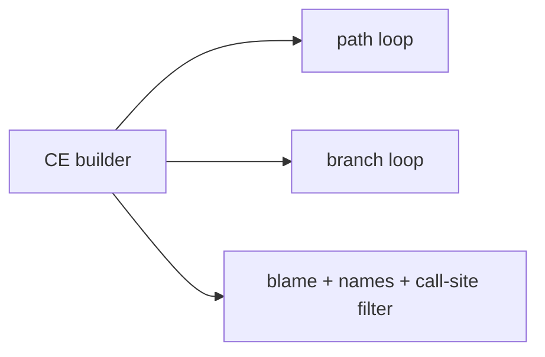

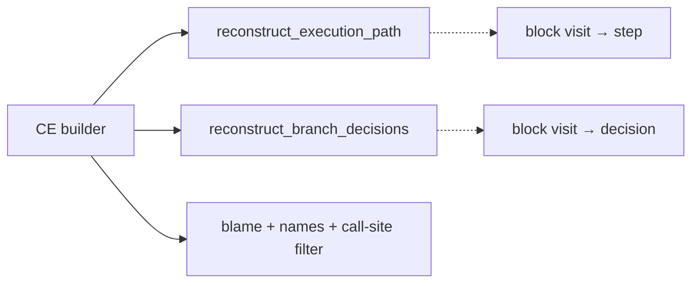

### integer-literal-range-fit — pure literal-fits-target verdict  ·  Worth exploring  ·  score 21/25

- **Files** — `vow-types/src/check.rs:1539-1566` (`check_integer_value_range`). Estimate: **1**.
- **Score** — **21/25** (leverage **4**: 2 call sites (`:1412`, `:1893`) plus the subtle
  `negative_max`/`i64::MIN` asymmetry that a direct test should pin; locality **4**; blast **1** → +5;
  heat **4**). Runner-up candidate — see *Pick*.
- **Problem** — the pure "does this `ConstIntValue` fit `target`, and what is the range text" decision
  is fused to `emit_error_with_hints`. `integer_type_range` is already extracted; the fit/describe
  step is not.
- **Deletion test** — extracting `fn literal_out_of_range(value, target) -> Option<String>` (the
  range text when out of range) concentrates the fit rule onto the range type. Passes.
- **Benefits** — the negative-max edge becomes directly testable; both call sites simplify.

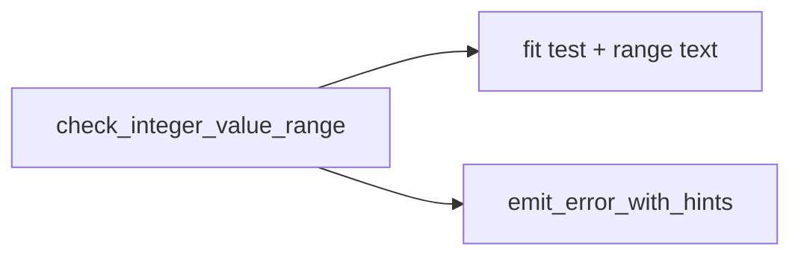

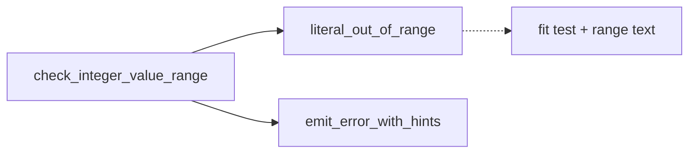

### call-argument-coercion-action — pure call-arg coercion classifier  ·  Worth exploring  ·  score 21/25

- **Files** — `vow-codegen/src/cranelift_backend.rs:398-432` (`coerce_call_argument`). Estimate: **1**.
- **Score** — **21/25** (leverage **4**: removes the Cranelift-builder dependency the current test
  `call_argument_coercion_refuses_only_wide_narrowing` needs; locality **4**; blast **1** → +5;
  heat **4**: file changed today, #1137). Carries mild extra caution: codegen output must stay a
  byte-identical bootstrap fixed point, so the extraction must be a pure re-expression that applies
  the identical `builder.ins()` sequence.
- **Problem** — the pure decision {reduce / reject-I128-narrowing / sextend / uextend / nop}, a
  function of `(actual_bits, expected_bits, is_i128, signed)`, is interleaved with `builder.ins()`
  emission and can only be tested by building a Cranelift function.
- **Deletion test** — extracting `fn call_argument_coercion(...) -> CoercionAction` concentrates the
  legality policy; the wrapper applies the action. Passes.

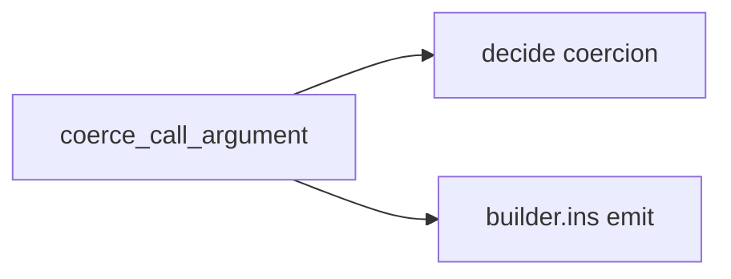

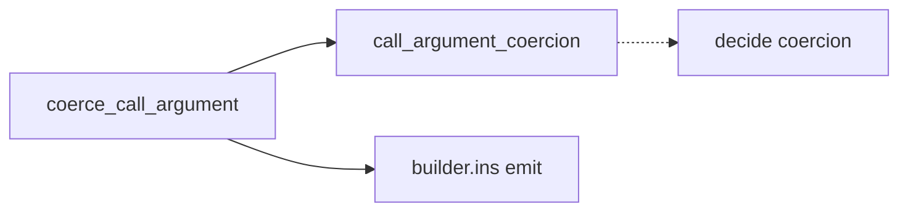

### arm-pattern-support-classifier — pure unsupported-match-arm reason  ·  Speculative  ·  score 19/25

- **Files** — `vow-types/src/check.rs:2982-3040` (`validate_arm_pattern`). Estimate: **1**.
- **Score** — **19/25** (leverage **3**: 1 call site, and a test already drives the impure method;
  locality **4**; blast **1** → +5; heat **4**).
- **Problem** — a pure classification of a match-arm `Pat` (+`is_last`) into an
  `Option<(message, hint)>` "unsupported reason" is fused to `emit_error_with_hints` and a bool
  return; it uses no `self`.
- **Deletion test** — extracting `fn unsupported_arm_pattern(pat, is_last) -> Option<(&str, &str)>`
  concentrates the "which arm patterns are unsupported, and why" policy. Passes, but lower leverage.

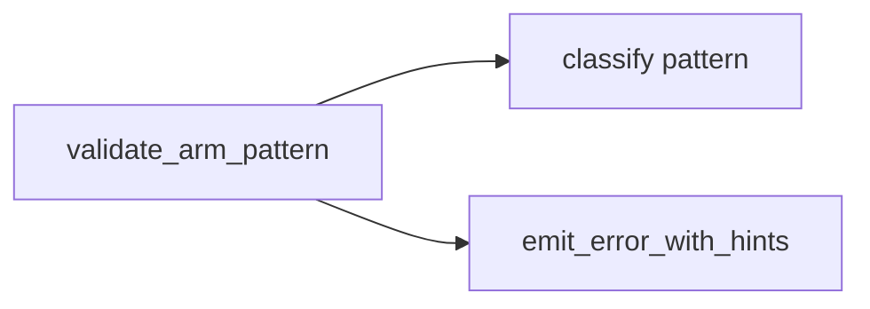

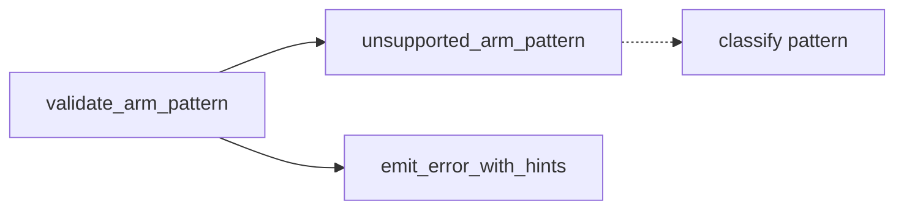

### vec-reserve-next-capacity-seam — pure capacity-growth policy  ·  Worth exploring  ·  score 17/25

- **Files** — `vow-runtime/src/lib.rs:1473-1519` (`vec_reserve_in_arena_no_null_check`). Estimate: **1**.
- **Score** — **17/25** (leverage **3**, locality **3**, blast **1** → +5, heat **3**). Carried
  forward from the prior firing as its named runner-up; module still present at `:1473`.
- **Problem** — the capacity-doubling/overflow policy is inline with the `oom_trap` side-effect.
- **Solution** — `fn next_capacity(old_cap, required) -> Option<usize>`, leaving `oom_trap` at the
  call site.

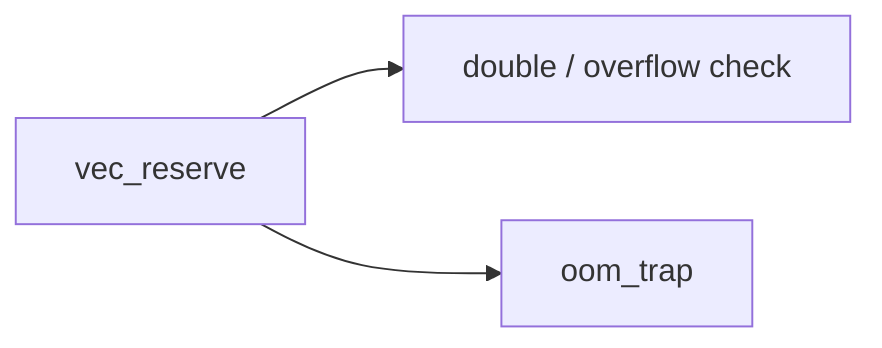

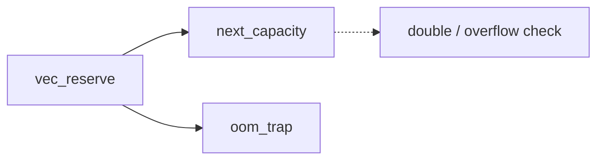

## Dropped

| Candidate | Dropped because |
|---|---|
| `esbmc-ce-description-heuristic` | Leverage 1 — inert: the only caller destructures `Failed(_)` and discards the description, so extraction deepens nothing observable. Re-checked; filter still applies. |
| `solver-classify-function` | Already a pure, unit-tested seam (`test_classify_*`) — no shallowness to remove. Re-checked; still deep. |

## Too large to automate

| Candidate | Why |
|---|---|
| `clif-shim-region-parity` | Blast radius 4 — crosses the `vow-clif-shim` ↔ `vow-codegen` crate/tier seam and touches codegen output (~20+ files). Not one-PR work; a human should schedule it. Re-checked; still large. |

## Pick

**`cast-legality-verdict` (22/25).** It is the highest-scoring surviving candidate and the strongest
fit for the seam pattern this routine has already landed twice (`method_argument_expectations`,
`method_result_type` via #1153): a pure `fn(&Ty, …) -> verdict` extracted from a diagnostics-heavy
arm and tested directly. Its heat is the highest in the tree — `as`-cast legality drew three PRs this
cycle — so the deepening pays off against changes that are demonstrably still arriving (YAGNI is
satisfied by observed churn, not speculation).

The top two are **within 1 point**: three candidates tie at 21/25 (`ce-trace-reconstruction`,
`integer-literal-range-fit`, `call-argument-coercion-action`). The designated **runner-up candidate**
is **`integer-literal-range-fit`** — it has the most concrete leverage of the cluster (2 call sites),
stays in the same hot file as the pick, and carries no codegen fixed-point risk, making it the
natural next firing. A reviewer who disagrees with the pick has the full scored cluster to choose
from.

## Design

_Written in step 4, after this report was first committed._
