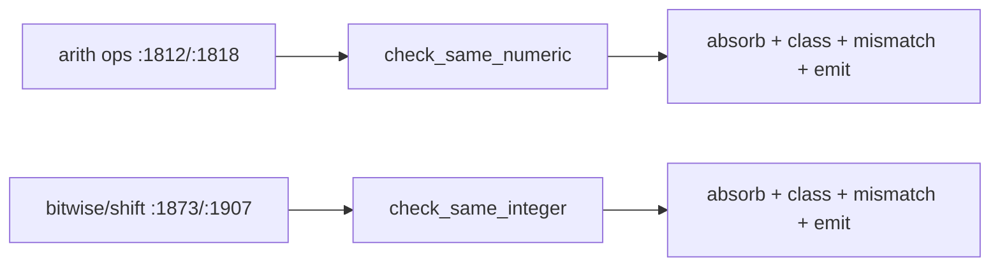
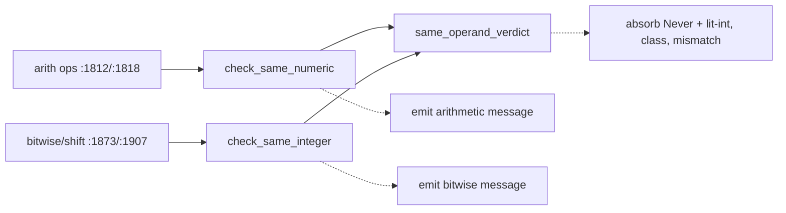

# Architecture review — vow — 2026-09-03

**Scope**: Hot-spot scan weighted by `git log` (last 60 commits). The type checker
`vow-types/src/check.rs` dominates the heat map (36 commits / 90 days), followed by
`vow-codegen/src/cranelift_backend.rs` (27), `vow-runtime/src/lib.rs` (24), and
`vow-ir/src/lower/mod.rs` (17). The scan looked for **shallow** decision logic — an inline
policy whose interface is nearly as complex as its implementation — that could become a
**deep**, pure, unit-testable seam, mirroring the seams two prior firings landed in this same
file (`method_result_type`, `cast_verdict`, `zero_comparison_verdict`).

**Picked**: `same-operand-type-verdict` — see the PR and `.architecture/backlog.md`.

**Degradations**: none. `gh` authenticated; sub-agent exploration available.

**Diagram convention**: solid edges are the interface a caller sees; dashed edges are behaviour
hidden *inside* the implementation, behind the seam.

## Candidates

### `same-operand-type-verdict` — collapse the twin operand-type checks into one pure seam · Strong · score 23/25

- **Files**: `vow-types/src/check.rs:3016` (`check_same_numeric`), `:3124` (`check_same_integer`);
  4 call sites at `:1812`, `:1818`, `:1873`, `:1907`. Estimate: **1 file**.
- **Score**: **23/25** — leverage 4, locality 5, blast radius 1, heat 5.
  - *leverage 4* — the same operand-matching policy backs four binary-operator call sites; a test
    gains a pure `(Ty, Ty, class) → verdict` surface in place of full-pipeline `check_expr` setup.
  - *locality 5* — the operand-matching policy lives in **two** near-identical methods today, so any
    change to it (a new absorbable-literal rule, a new operand class) is a two-place edit; after the
    seam it is a one-place edit. (This is the axis the pick hinges on — see *Pick*.)
  - *blast radius 1* — one file, no published interface changes; the two method signatures are
    unchanged, callers untouched.
  - *heat 5* — `check.rs` is the hottest file in the tree, 36 commits in 90 days.
- **Problem**: `check_same_numeric` and `check_same_integer` are line-for-line twins. Each runs the
  same four-step decision — absorb a `Never` operand, absorb a literal-int operand into its concrete
  sibling, reject a wrong-class operand, reject a type mismatch — and differs only in the class
  predicate (`is_numeric_or_lit_int` vs `is_integer_or_lit_int`) and two diagnostic strings. The
  decision is **shallow and duplicated**: its logic is interleaved with `self.emit_error_with_hints`,
  so the only way to test "does `i32 + u64` mismatch?" is to drive the whole checker. The interface
  (a `&mut self` method returning `Ty`) is as wide as the body.
- **Deletion test**: delete the two bodies and the operand-matching policy has nowhere to live —
  it **concentrates** into one pure function. Complexity does not move to callers: the four call
  sites already pass `(lhs_ty, rhs_ty, span)` and want a `Ty` back.
- **Solution**: extract `same_operand_verdict(lhs, rhs, class) -> SameOperandVerdict` as a pure free
  function beside `cast_verdict`, with `OperandClass::{Numeric, Integer}` selecting the class
  predicate. Each method collapses to a thin `match verdict { … self.emit_* … }` wrapper that keeps
  only its distinct `ErrorCode::TypeMismatch` message and hint.
- **Benefits**: *leverage* — every operand-matching verdict becomes assertable as a value, without a
  `Checker`. *locality* — the `Never`-absorb / literal-absorb / class / mismatch ordering (subtle:
  `Never + String` is legal and returns `String` unchecked) lives once. *test surface* — the verdict
  is exercised through a two-argument pure call; the messages stay pinned at the call site by both
  the new `TestEmitter` tests and the existing `tests/error/*_arith.vow` goldens.

**Before** — two callers, each wiring its own decide-and-emit skeleton:



**After** — one shared verdict seam; callers keep only their messages:



### `integer-literal-range-fit` — pure literal-fits-target decision · Strong · score 22/25

- **Files**: `vow-types/src/check.rs:1582` (`check_integer_value_range`); callers `:1455`, `:1936`.
  Estimate: **1 file**.
- **Score**: **22/25** — leverage 4, locality 4, blast radius 1, heat 5 (re-heated from 21/25 in the
  prior firing, as `check.rs` moved to heat 5).
  - *leverage 4* — pins the `negative_max` / `i64::MIN` sign-magnitude asymmetry as a value.
  - *locality 4* — the fit decision + range-text formatting concentrate in one function.
  - *blast radius 1* — one file, no interface change. *heat 5* — same hot file.
- **Problem**: `check_integer_value_range` interleaves the pure decision (does the literal fit? what
  is the range text?) with `emit_error_with_hints`; the fit rule is only testable through the checker.
- **Deletion test**: **concentrate** — `literal_out_of_range(value, target) -> Option<String>` is the
  reusable core; the caller keeps only the diagnostic.
- **Solution**: extract `literal_out_of_range`; leave `emit_error_with_hints` at the call site.
- **Benefits**: *leverage/locality* — the asymmetric-bound arithmetic becomes a pinned value.
  *test surface* — a pure `(value, target) → Option<range-text>` call.
- **Runner-up candidate.** Lost to the pick by one point on *locality*: it has no duplication to
  collapse (one method, not two), so its locality is 4 to the pick's 5. See *Pick*.

### `call-argument-coercion-action` — pure coercion decision in codegen · Worth exploring · score 21/25

- **Files**: `vow-codegen/src/cranelift_backend.rs:398` (`coerce_call_argument`). Estimate: **1 file**.
- **Score**: **21/25** — leverage 4, locality 4, blast radius 1, heat 4 (`cranelift_backend.rs`,
  27 commits / 90 days — hot but below `check.rs`; scored 4, not 5, to keep the hottest file's 5
  meaningful).
- **Problem**: the `(actual_bits, expected_bits, is_i128, signed)` coercion policy is tangled with
  `builder.ins()` emission.
- **Deletion test**: concentrate — the decision is a pure `CoercionAction`; emission stays at the site.
- **Caveat**: codegen must stay a byte-identical bootstrap fixed point. A pure-decision extraction
  *should* be byte-identical, but verifying it costs a bootstrap triple-test — heavier and riskier for
  an unattended firing than a `vow-types` seam. This is why it ranks below two `check.rs` candidates it
  ties or nearly ties on the raw axes.

### `arm-pattern-support-classifier` — pure unsupported-arm reason · Worth exploring · score 20/25

- **Files**: `vow-types/src/check.rs:3045` (`validate_arm_pattern`). Estimate: **1 file**.
- **Score**: **20/25** — leverage 3, locality 4, blast radius 1, heat 5.
- **Problem**: the `match`-arm-support policy returns an inline `Option<(&str, &str)>` and emits in the
  same method; a pure `unsupported_arm_pattern(pat, is_last)` would be the seam.
- **Deletion test**: concentrate (mild) — the reason table is the reusable core.

### `ce-trace-reconstruction` — pure block-visit loops · Worth exploring · score 20/25

- **Files**: `vow/src/counterexample.rs:327` (`build_structured_counterexample_with_module`).
  Estimate: **1 file**.
- **Score**: **20/25** — leverage 4, locality 4, blast radius 1, heat 3 (`counterexample.rs`,
  7 commits / 90 days — coldest of the top candidates).
- **Problem**: two pure block-visit → source-trace loops sit inside a builder that also does
  blame/name/call-site work.
- **Deletion test**: concentrate — `reconstruct_execution_path` / `reconstruct_branch_decisions`.

### `narrow-shift-findings` — pure shift-operand findings · Worth exploring · score 20/25

- **Files**: `vow-types/src/check.rs:1875` (narrow `Shl`/`Shr` arm). Estimate: **1 file**. (Fresh
  this firing.)
- **Score**: **20/25** — leverage 3, locality 4, blast radius 1, heat 5.
- **Problem**: two *independent* checks (shift-count must be `u32`; const count in range) each emit
  separately, inline.
- **Deletion test**: concentrate (mild).
- **Caveat**: both diagnostics can fire on one expression (`const_int_value` folds through `Cast`), so
  the seam must return a **struct of two independent findings**, not a single-variant enum — a single
  verdict would silently drop one diagnostic, a behaviour change.

### `vec-reserve-next-capacity-seam` — pure capacity-doubling policy · Speculative · score 18/25

- **Files**: `vow-runtime/src/lib.rs:1473` (`vec_reserve_in_arena_no_null_check`). Estimate: **1 file**.
- **Score**: **18/25** — leverage 3, locality 3, blast radius 1, heat 4 (re-heated).
- **Problem**: the capacity-doubling/overflow policy is inline with `oom_trap`.
- **Deletion test**: concentrate — `next_capacity(old_cap, required) -> Option<usize>`.

### `negation-verdict` — pure unary-negation verdict · Speculative · score 18/25

- **Files**: `vow-types/src/check.rs:1952` (`UnaryOp::Neg`). Estimate: **1 file**. (Fresh this firing.)
- **Score**: **18/25** — leverage 2, locality 4, blast radius 1, heat 5.
- **Problem**: a 3-way `{Unsigned, NonNumeric, Ok}` decision tangled with two emits. Small.

### `builtin-receiver-kind` — pure receiver classification · Speculative · score 17/25

- **Files**: `vow-types/src/check.rs:2174` (MethodCall arm). Estimate: **1 file**. (Fresh this firing.)
- **Score**: **17/25** — leverage 2, locality 3, blast radius 1, heat 5.
- **Problem**: the receiver-kind classification is pure, but its primary output is a display string for
  the "unknown method" error — presentation the landed-seam pattern deliberately keeps at the call
  site. Only the classification dedup is a real gain. Marginal.

### `unwrap-payload-ty` — pure unwrap payload-type selection · Speculative · score 17/25

- **Files**: `vow-ir/src/lower/mod.rs:4186` (`lower_unwrap`). Estimate: **1 file**. (Fresh this firing.)
- **Score**: **17/25** — leverage 2, locality 4, blast radius 1, heat 4 (`lower/mod.rs`, 17 / 90 days).
- **Problem**: `payload_ty` selection is pure but reads two `ctx` lookups; making it pure means
  pre-computing those and passing them in. Small.

## Dropped

| Candidate | Dropped because |
|---|---|
| `esbmc-ce-description-heuristic` | Leverage 1 — fails the deletion test. The only caller destructures `Failed(_)` and discards the description, so extraction deepens nothing observable. Latent bugs are unreachable. Re-checked 2026-09-03: caller unchanged. |
| `solver-classify-function` | Already a pure, unit-tested seam (`test_classify_*`). No shallowness to remove. Re-checked 2026-09-03. |

## Too large to automate

| Candidate | Why | For a human |
|---|---|---|
| `clif-shim-region-parity` | Blast radius 4 — crosses the `vow-clif-shim` / `vow-codegen` crate seam and touches byte-identical codegen output (~20+ files). Re-checked 2026-09-03: still large. | Schedule as a standalone, human-reviewed PR with a bootstrap triple-test. |

## Pick

**`same-operand-type-verdict`, 23/25.** It is the highest-scoring surviving candidate and the cleanest
structural twin of the already-landed `cast_verdict` seam: two duplicated decide-and-emit methods
collapse to one pure verdict function.

**The top two are within one point** (23 vs the runner-up candidate `integer-literal-range-fit` at 22),
so the pick is close and `integer-literal-range-fit` is the natural next firing. The single point is
entirely *locality*: both candidates are single-file, but `same-operand-type-verdict` collapses a
policy that today lives in **two** methods (locality 5), while `integer-literal-range-fit` has no
duplication to collapse (locality 4). If a reviewer scores that duplication as locality 4 instead of 5,
the two tie at 22 and the deterministic tie-break (lower blast radius → higher heat → most-recently-
touched file) would still favour `check.rs`; the pick is robust to that re-score on blast/heat, though
the "most-recently-touched" leg would then reach past `check.rs` to `cranelift_backend.rs`. The report
records the close call so a reviewer can disagree in the PR.

`call-argument-coercion-action` (21) scores just below but carries a byte-identical-bootstrap risk that
makes a `vow-types` seam the safer unattended pick.

## Design

Design-it-twice: three parallel sub-agents each produced a radically different interface for the
`same_operand_verdict` seam; a fourth sub-agent that authored none of them adjudicated against
depth → locality → seam placement → test surface → blast radius.

**Winner — Design C: `Result<Ty, OperandError>`.**

```rust
#[derive(Debug, Clone, Copy, PartialEq, Eq)]
enum OperandClass { Numeric, Integer }        // .admits(&Ty) selects the class predicate

#[derive(Debug, Clone, PartialEq, Eq)]
enum OperandError { WrongClass { lhs: Ty }, Mismatch { lhs: Ty, rhs: Ty } }

fn same_operand_ty(lhs: Ty, rhs: Ty, class: OperandClass) -> Result<Ty, OperandError> {
    if lhs == Ty::Never { return Ok(rhs); }   // (b) Never short-circuits before the class check
    if rhs == Ty::Never { return Ok(lhs); }
    let (lhs, rhs) = absorb_lit_int_operand(lhs, rhs);   // (a) failures carry post-absorb types
    if !class.admits(&lhs) { return Err(OperandError::WrongClass { lhs }); }
    if lhs != rhs { return Err(OperandError::Mismatch { lhs, rhs }); }
    Ok(lhs)
}
```

Each twin collapses to `match same_operand_ty(lhs, rhs, OperandClass::Numeric) { Ok(ty) => ty,
Err(WrongClass{lhs}) => { emit; Ty::Unit }, Err(Mismatch{lhs,rhs}) => { emit; Ty::Unit } }`, keeping
its four message/hint literals inline at the call site. `ErrorCode::TypeMismatch` is shared.

- **Depth (decisive)** — all three designs hide the same decision; C hides it behind the strictly
  smallest novel surface. The success bucket folds into the prelude's `Ok`, so the only new type a
  caller learns is the two-variant `OperandError`; the happy path reads `Ok(ty) => ty` with the bare
  prelude name.
- **Locality / test surface** — C ties the runner-up: the decision (including the subtle
  `Never`-before-absorb ordering and the lhs-only class check) lives in one pure function, unit-tested
  on `(Ty, Ty, OperandClass)` with no `Checker`; the message strings stay inline at the two call sites.
- **Seam placement** — a real seam (two adapters, numeric and integer) at the one axis that varies, the
  class predicate, named at the call site via `OperandClass::Numeric` rather than a leaked predicate.

**Runner-up design — Design A: bespoke `enum SameOperandVerdict { Ok(Ty), WrongClass(Ty),
Mismatch(Ty, Ty) }`.** The direct `cast_verdict` twin; identical to C on locality, seam placement, test
surface, and blast radius. It lost on depth alone: its `SameOperandVerdict::Ok(Ty)` re-implements the
semantics of `Result::Ok` and must be *fully qualified in every match arm*, because a bare `Ok(x)`
pattern binds to the prelude's `Result::Ok` and fails to type-check (confirmed: even `cast_verdict`
writes `CastVerdict::Ok` at its call site). `cast_verdict` is bespoke only because of its non-error
`LiteralRange` follow-up bucket, which fits neither `Option` nor `Result`; this seam has no such
bucket — exactly one success value and two distinct failure reasons — so it is textbook `Result<Ty, E>`
and *extends* the file's established `Option`-returning-seam convention (`method_result_type`,
`integer_type_range`, `merge_result_ty`) rather than diverging from it.

**Eliminated — Design B: data-driven `OperandClass` policy struct + shared `check_operand_class`
emitter.** A five-field struct of message fragments is a wide, shallow interface (fails depth); it
splits message assembly across a `format!` template that does not cleanly express the "a numeric type"
vs "an integer type" article difference or the non-parallel "matching types" / "matching integer types"
hint tail — forcing an extra eight-string equality test to avoid silent corruption (fails locality and
test surface). Its own author recommended against it: with only two operand classes and no third
operator family in the tree, the flexibility is speculative (YAGNI). The correct promotion trigger is a
*third* operator family arriving with the same `Never`→absorb→class→mismatch shape.

**Corrections applied to the winner before implementation** (from the adjudicator):

- Derive `OperandError` as `Debug, Clone, PartialEq, Eq` (holds a non-`Copy` `Ty`); `OperandClass` as
  `Debug, Clone, Copy, PartialEq, Eq`.
- Do **not** symmetrize the class check — it tests `lhs` only, after absorb, so `(I64, Str, Numeric)`
  yields `Mismatch{I64, Str}` (not `WrongClass`); pin this.
- Move the message text verbatim; the unguarded "a/an" article and the non-parallel hint tail are the
  exact copy-paste-swap bug the refactor risks, so add a `Checker`-level assertion on each twin's
  `WrongClass` message (no golden test covers it today).
- Pin the non-obvious `(LitInt, F64, Numeric) → Mismatch{LitInt, F64}` edge: absorb does not fire
  (`F64` is not an integer), `LitInt` passes the numeric class check, then mismatches the float.
