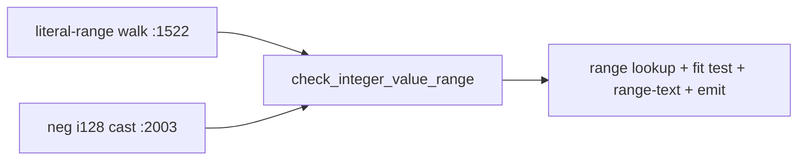
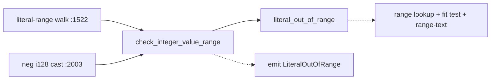

# Architecture review — vow — 2026-09-04

**Scope**: Hot-spot scan weighted by `git log`. The type checker `vow-types/src/check.rs`
still dominates the heat map (37 commits / 90 days after `same-operand-type-verdict` landed
as #1234), followed by `vow-codegen/src/cranelift_backend.rs`, `vow-runtime/src/lib.rs`, and
`vow-ir/src/lower/mod.rs`. The scan looked for **shallow** decision logic — an inline policy
whose interface is nearly as complex as its implementation — that could become a **deep**,
pure, unit-testable seam, mirroring the seams three prior firings landed in this same file
(`method_result_type`, `cast_verdict`, `same_operand_ty`).

**Picked**: `integer-literal-range-fit` — see the PR and `.architecture/backlog.md`. This was
the carried-forward runner-up candidate from the 2026-09-03 firing; with its blocker
(`same-operand-type-verdict`, #1234) now merged, it is the top eligible candidate.

**Degradations**: none. `gh` authenticated (PR #1234 reconciled to `landed`); sub-agent
exploration available.

**Diagram convention**: solid edges are the interface a caller sees; dashed edges are behaviour
hidden *inside* the implementation, behind the seam.

## Candidates

### `integer-literal-range-fit` — pure literal-fits-target decision · Strong · score 22/25

- **Files**: `vow-types/src/check.rs:1649` (`check_integer_value_range`); the two call sites at
  `:1522` (`check_integer_literal_range`) and `:2003` (the `-(x as i128)` negation arm). The pure
  core reads only the already-free `integer_type_range` (`:694`) and the `ConstIntValue`
  (`:501`) fields. Estimate: **1 file**.
- **Score**: **22/25** — leverage 4, locality 4, blast radius 1, heat 5.
  - *leverage 4* — the fit decision pins the `negative_max` / `i64::MIN` sign-magnitude asymmetry
    (`integer_type_range` carries `negative_max: Some(i128::MIN.unsigned_abs())` precisely because
    the signed minimum is one larger in magnitude than the maximum) as a value a test can assert on
    both call sites without driving `check_expr`.
  - *locality 4* — the fit decision plus the range-text formatting concentrate in one pure function;
    no duplication to collapse (one method, not two — this is the single point that separates it from
    a locality-5 pick like the landed `same-operand-type-verdict`).
  - *blast radius 1* — one file, no published interface change; `check_integer_value_range`'s
    signature is unchanged, both callers untouched.
  - *heat 5* — `check.rs` is the hottest file in the tree, 37 commits in 90 days.
- **Problem**: `check_integer_value_range` interleaves the pure decision (does the literal fit the
  target's sign-magnitude range? what is the range text?) with `self.emit_error_with_hints`. The
  fit rule — including the subtle `value.negative` branch that consults `negative_max` and the
  `is_none_or` handling of unsigned targets — is only testable by constructing a `Checker` and
  driving a full type-check. The interface (a `&mut self` method returning nothing) is as wide as
  the body it hides.
- **Deletion test**: **concentrate** — delete the body and the fit-and-format policy has nowhere to
  live but a pure `literal_out_of_range(value, target) -> Option<String>`. Complexity does not move
  to callers: both call sites already hold `(ConstIntValue, &Ty, Span)` and only want the diagnostic
  emitted, so they keep just the `emit_error_with_hints` call.
- **Solution**: extract the fit decision and range-text into a pure free function beside
  `cast_verdict` / `same_operand_ty`; `check_integer_value_range` collapses to a
  `let Some(range_text) = literal_out_of_range(value, target) else { return };` guard followed by the
  unchanged emit. (The exact return shape is settled in *Design*.)
- **Benefits**: *leverage* — the asymmetric-bound arithmetic (`u8` rejects `-1`; `i8` accepts `-128`
  but rejects `-129`; `i128::MIN`; a non-integer target returns `None`) becomes a pinned value.
  *locality* — the fit rule and its range text live once. *test surface* — a pure
  `(value, target) → Option<range-text>` call, exercised alongside the existing `cast_verdict` and
  `same_operand_ty` unit tests; the message strings stay pinned at the call site by the existing
  `check_stmt_let_i32_literal_out_of_range_rejected` end-to-end test (`:5668`).

**Before** — two callers, each handing a `&mut self` method that decides *and* emits:



**After** — the fit decision behind one pure seam; callers keep only the emit:



### `builtin-constructor-spec` — pure builtin-constructor table · Strong · score 22/25 · fresh this firing

- **Files**: `vow-types/src/check.rs:2867-3016` (the `EnumConstruct` arm's builtin dispatch, ~150
  lines). Estimate: **1 file** (large single-file diff).
- **Score**: **22/25** — leverage 4, locality 4, blast radius 1, heat 5.
  - *leverage 4* — a hand-rolled `match (enum_name, variant_name)` decides arity, per-argument
    `ArgExpect`, and result-shape for `String::from`, `Vec::new`, `Option::Some`, `Result::Ok`, and
    ~8 more, with no table backing it — unlike methods, which already have
    `method_result_type` (`:380`) and `method_argument_expectations` (`:337`). A pure
    `builtin_constructor_spec(enum, variant) -> Option<CtorSpec>` reads only two `&str`, making all
    ~12 constructor specs assertable without the checker. Not leverage 5: only one call site (the
    single `EnumConstruct` arm), and the `Some`/`Ok`/`Err` result wraps the *checked* payload, so
    result-shape assembly stays partly at the call site.
  - *locality 4* — constructor arity/argument policy concentrates into one table; today a new
    constructor is an inline `match`-arm edit interleaved with checking.
  - *blast radius 1* — one file, no published interface change.
  - *heat 5* — `check.rs`.
- **Problem**: the constructor policy is fully inline and shallow; it is the last builtin dispatch in
  the file without a pure table twin.
- **Deletion test**: **concentrate** — collapses ~150 interleaved lines into a table plus a generic
  argument-checking loop.
- **Runner-up on score, and this firing's tie with the pick** (see *Pick*).

### `coerce-context-argument-epilogue` — collapse repeated coerce-and-emit glue · Worth exploring · score 21/25 · fresh this firing

- **Files**: `vow-types/src/check.rs`, the `check_expr + check_contextual_integer_literal_ranges +
  can_context_coerce + emit` epilogue repeated ~10× (`:1377`, `:1464`, `:2115`, `:2201`, `:2663`,
  `:2802`, `:2917`, `:2999`, `:3063`). Estimate: **1 file**.
- **Score**: **21/25** — leverage 3, locality 5, blast radius 1, heat 5.
  - *leverage 3* — the *decision* `can_context_coerce(from, to)` is **already** a pure free function
    (`:263`); what repeats is `&mut self` glue. A collapsing helper `check_coerced(&mut self, expr,
    actual, expected, describe_mismatch)` is a 4-parameter wrapper (one a message closure) around 3
    statements — apply the deletion test to the *helper itself* and its interface is nearly as wide
    as its body: a shallow module. Tests gain nothing (still `&mut self`; the pure part is already
    extracted). This is sibling-epilogue dedup, not a new pure seam.
  - *locality 5* — a change to the coerce-and-emit protocol becomes a one-place edit across ~10 sites.
  - *blast radius 1* — one file. *heat 5* — `check.rs`.
- **Problem**: ten near-identical decide-and-emit epilogues, each with a divergent message.
- **Deletion test**: **concentrate** (dedup), but into a shared `&mut self` emitter, not a pure seam.
- **Note**: not compiler drift — `compiler/checker.vow` inlines the same glue at its own Call /
  StructLiteral / EnumConstruct / Return sites, so both compilers are equally shallow here; ranked
  purely on dedup value.

### `call-argument-coercion-action` — pure coercion decision in codegen · Worth exploring · score 21/25

- **Files**: `vow-codegen/src/cranelift_backend.rs:398` (`coerce_call_argument`). Estimate: **1 file**.
- **Score**: **21/25** — leverage 4, locality 4, blast radius 1, heat 4 (`cranelift_backend.rs` hot
  but below `check.rs`; scored 4 to keep the hottest file's 5 meaningful).
- **Problem**: the `(actual_bits, expected_bits, is_i128, signed)` coercion policy is tangled with
  `builder.ins()` emission.
- **Deletion test**: concentrate — the decision is a pure `CoercionAction`; emission stays at the site.
- **Caveat**: codegen must stay a byte-identical bootstrap fixed point. A pure-decision extraction
  *should* be byte-identical, but verifying it costs a bootstrap triple-test — heavier and riskier
  for an unattended firing than a `vow-types` seam.

### `arm-pattern-support-classifier` — pure unsupported-arm reason · Worth exploring · score 20/25

- **Files**: `vow-types/src/check.rs` (`validate_arm_pattern`). Estimate: **1 file**.
- **Score**: **20/25** — leverage 3, locality 4, blast radius 1, heat 5.
- **Problem**: the `match`-arm-support policy returns an inline `Option<(&str, &str)>` and emits in the
  same method; a pure `unsupported_arm_pattern(pat, is_last)` would be the seam.
- **Deletion test**: concentrate (mild) — the reason table is the reusable core.

### `ce-trace-reconstruction` — pure block-visit loops · Worth exploring · score 20/25

- **Files**: `vow/src/counterexample.rs:327` (`build_structured_counterexample_with_module`).
  Estimate: **1 file**.
- **Score**: **20/25** — leverage 4, locality 4, blast radius 1, heat 3 (`counterexample.rs`,
  ~7 commits / 90 days — coldest of the top candidates).
- **Problem**: two pure block-visit → source-trace loops sit inside a builder that also does
  blame/name/call-site work.
- **Deletion test**: concentrate — `reconstruct_execution_path` / `reconstruct_branch_decisions`.

### `narrow-shift-findings` — pure shift-operand findings · Worth exploring · score 20/25

- **Files**: `vow-types/src/check.rs` (narrow `Shl`/`Shr` arm). Estimate: **1 file**.
- **Score**: **20/25** — leverage 3, locality 4, blast radius 1, heat 5.
- **Problem**: two *independent* checks (shift-count must be `u32`; const count in range) each emit
  separately, inline.
- **Deletion test**: concentrate (mild).
- **Caveat**: both diagnostics can fire on one expression, so the seam must return a **struct of two
  independent findings**, not a single-variant enum — a single verdict would silently drop one
  diagnostic, a behaviour change.

### `recover-unknown-name-prologue` — collapse unresolved-name recovery glue · Speculative · score 18/25 · fresh this firing

- **Files**: `vow-types/src/check.rs` (`:2142` undefined fn, `:2773` unknown struct, `:3019` unknown
  enum, `:3037` enum-has-no-variant). Estimate: **1 file**.
- **Score**: **18/25** — leverage 2, locality 4, blast radius 1, heat 5.
- **Problem**: on an unresolved name, four sites repeat "optionally `suggest_similar`, emit, still
  drain child exprs to avoid cascade, return a fallback `Ty`". The `suggest_similar` decision (`:203`)
  is already pure; the repeated part is `&mut self` recovery glue with divergent messages.
- **Deletion test**: concentrate (4→1), but into a `&mut self` recovery helper, not a pure seam; low
  leverage.

### `vec-reserve-next-capacity-seam` — pure capacity-doubling policy · Speculative · score 18/25

- **Files**: `vow-runtime/src/lib.rs:1473` (`vec_reserve_in_arena_no_null_check`). Estimate: **1 file**.
- **Score**: **18/25** — leverage 3, locality 3, blast radius 1, heat 4.
- **Problem**: the capacity-doubling/overflow policy is inline with `oom_trap`.
- **Deletion test**: concentrate — `next_capacity(old_cap, required) -> Option<usize>`.

### `negation-verdict` — pure unary-negation verdict · Speculative · score 18/25

- **Files**: `vow-types/src/check.rs` (`UnaryOp::Neg`). Estimate: **1 file**.
- **Score**: **18/25** — leverage 2, locality 4, blast radius 1, heat 5.
- **Problem**: a 3-way `{Unsigned, NonNumeric, Ok}` decision tangled with two emits. Small.

### `builtin-receiver-kind` — pure receiver classification · Speculative · score 17/25

- **Files**: `vow-types/src/check.rs` (MethodCall arm). Estimate: **1 file**.
- **Score**: **17/25** — leverage 2, locality 3, blast radius 1, heat 5.
- **Problem**: the receiver-kind classification is pure, but its primary output is a display string the
  landed-seam pattern deliberately keeps at the call site. Marginal.

### `unwrap-payload-ty` — pure unwrap payload-type selection · Speculative · score 17/25

- **Files**: `vow-ir/src/lower/mod.rs` (`lower_unwrap`). Estimate: **1 file**.
- **Score**: **17/25** — leverage 2, locality 4, blast radius 1, heat 4.
- **Problem**: `payload_ty` selection is pure but reads two `ctx` lookups; making it pure means
  pre-computing those and passing them in. Small.

### `division-abort-spec` — shared div/rem abort policy across three crates · Speculative · score 16/25 · fresh this firing

- **Files**: `vow-codegen/src/cranelift_backend.rs:325` (`divisor_abort_condition`),
  `vow-verify/src/c_emitter.rs:2882` (`emit_checked_arith`), `vow-runtime/src/lib.rs:2987`
  (`define_wide_div_rem!`). Estimate: **3 files, 3 crates**.
- **Score**: **16/25** — leverage 3, locality 4, blast radius 4, heat 4.
  - *blast radius 4* — crosses the codegen / verify / runtime crate seam. Blast **4, not 5**, so it is
    a candidate a human can schedule, not *Too large to automate*; but it also carries the
    byte-identical bootstrap fixed-point risk, so it is not an unattended pick.
- **Problem**: "a zero divisor aborts all four div/rem ops; signed division additionally aborts on
  `MIN / -1`" is triplicated, each crate re-encoding it in a different output form. `vow-runtime`'s own
  comment (`:2987`) states it is kept in sync with Cranelift's trap set by hand — an acknowledged but
  unenforced coupling. A shared `division_abort_spec(opcode, ty) -> {check_zero, check_min_neg_one}`
  reads only `Opcode` + type; each backend's emission stays local.
- **Deletion test**: concentrate the policy, but the pure residue is two booleans while the bulk
  (per-language emission) stays local — real but modest leverage.
- **Worth triaging (not a refactor, not filed this firing)**: the exploration noticed
  `divisor_abort_condition` (codegen) applies the zero-divisor trap to `WrappingDiv`/`WrappingRem` as
  well as the checked ops, while `emit_checked_arith` (verify) emits a `DivZero` guard only for the
  *checked* operators. If the verifier does not model wrapping-div-by-zero as an abort elsewhere,
  codegen would abort where the verifier proves-safe — a *potential* soundness gap. This is unverified
  and outward-facing; recorded here for a human to triage, deliberately **not** opened as an issue.

## Dropped

| Candidate | Dropped because |
|---|---|
| `same-operand-type-verdict` | Not dropped — **landed** as #1234 (merged 2026-09-03). Recorded here only to note the reconciliation that unblocked this firing's pick. |
| `esbmc-ce-description-heuristic` | Leverage 1 — fails the deletion test. The only caller destructures `Failed(_)` and discards the description, so extraction deepens nothing observable. Latent bugs are unreachable. Re-checked 2026-09-04: caller unchanged. Do not re-surface. |
| `solver-classify-function` | Already a pure, unit-tested seam (`classify_function` at `solver_strategy.rs:129`, `test_classify_*`). No shallowness to remove. Re-checked 2026-09-04: still pure. |

## Too large to automate

| Candidate | Why | For a human |
|---|---|---|
| `clif-shim-region-parity` | Blast radius 5 — crosses the `vow-clif-shim` / `vow-codegen` crate seam and touches byte-identical codegen output (~20+ files). Re-checked 2026-09-04: `hidden_region_count` / `hidden_region_for_store_target` seams still present in the shim, no parity in the Rust backend; still large. | Schedule as a standalone, human-reviewed PR with a bootstrap triple-test. |

## Pick

**`integer-literal-range-fit`, 22/25.** It is a top-scoring surviving candidate and the cleanest
structural twin of the already-landed `cast_verdict` / `same_operand_ty` seams: one inline
decide-and-emit method collapses to a pure `Option`-returning verdict function beside them, with the
diagnostic left at the two call sites. It was the carried-forward runner-up candidate from
2026-09-03, unblocked now that #1234 has merged — taking it keeps the routine's backlog memory
stable.

**The top two are tied at 22** with the fresh `builtin-constructor-spec`. The mechanical tie-break
(lower blast radius → higher heat → most-recently-touched file) cannot separate them: both are one
file in `check.rs` at blast 1, heat 5. The tie is broken on **earlier `First seen`** —
`integer-literal-range-fit` (2026-08-31) over `builtin-constructor-spec` (2026-09-04). This is the
only tie-break that keeps the backlog stable: letting a freshly-scanned candidate displace a
carried-forward one on a tie would let every firing's scan reshuffle equal-scored entries, which is
exactly the memory the routine exists to preserve. `builtin-constructor-spec` is recorded `proposed`
at 22 as the natural next firing. Secondary reasons the pick also wins on risk: it is a ~15-line
extraction (vs `builtin-constructor-spec`'s ~150-line single-file diff), and it pins a real
correctness asymmetry (`negative_max` / `i64::MIN`) that has no dedicated test today.

## Design

Design-it-twice: three parallel sub-agents each produced a *radically different* interface for the
seam; a fourth sub-agent that authored none of them adjudicated against depth → locality → seam
placement → test surface → blast radius.

**Winner — Design A: minimal surface, no new type.**

```rust
/// `Some(range_text)` when `value` does not fit integer type `target`; `None`
/// when it fits *or* `target` is not an integer (nothing to report). The
/// returned string is the human range (`-128..=127`, `0..=255`) the diagnostic
/// interpolates into both its message and its hint. Emission, the error code,
/// the span, and the literal's own display text stay at the call site.
fn literal_out_of_range(value: ConstIntValue, target: &Ty) -> Option<String> {
    let range = integer_type_range(target)?;
    let out_of_range = if value.negative {
        range.negative_max.is_none_or(|max| value.magnitude > max)
    } else {
        value.magnitude > range.positive_max
    };
    if !out_of_range {
        return None;
    }
    Some(match range.negative_max {
        Some(max) => format!("-{max}..={}", range.positive_max),
        None => format!("0..={}", range.positive_max),
    })
}
```

`check_integer_value_range` shrinks to a thin `&mut self` **adapter** — the single owner of the
`LiteralOutOfRange` wording — that both call sites (L1522, L2003) still route through, unchanged:

```rust
fn check_integer_value_range(&mut self, value: ConstIntValue, target: &Ty, span: Span) {
    let Some(range_text) = literal_out_of_range(value, target) else {
        return;
    };
    self.emit_error_with_hints(
        ErrorCode::LiteralOutOfRange,
        format!("literal {} does not fit in {target} (range {range_text})", value.display()),
        span,
        vec![format!("use a value in {range_text} or choose an explicit narrowing intrinsic")],
    );
}
```

- **Depth (decisive)** — A hides the range lookup, the sign-asymmetric fit test, *and* the range-text
  render behind a two-argument interface that introduces **zero new named types**. It dominates the
  runner-up on both axes of depth: strictly smaller interface (no type the caller must learn and
  destructure) and strictly more behaviour hidden (C hands the range-text render back to the caller).
- **Seam placement** — one adapter, byte-identical wording at both call sites: a *decision-isolation*
  seam, not a variation-bearing one (contrast the landed `same_operand_ty`, whose two divergent
  adapters made a real rendering seam). Because nothing renders differently across this seam, the
  house convention "return a semantic value, render at the call site" has no consumer here — so A's
  one convention divergence (a "decision" function that also owns range-*text* formatting) is
  acceptable *in this instance*, where it would not be for `same_operand_ty`. YAGNI (CLAUDE.md) then
  favours the design that adds no speculative surface.
- **Test surface** — `literal_out_of_range` is pure and `Checker`-free; asserting the returned
  `Option<String>` pins both the decision and the exact range-text shape in one assertion, on the
  `negative_max`/`i64::MIN` asymmetry (`i8 -128` → `None`, `-129` → `Some("-128..=127")`; `u8 -1` and
  `u8 256` → `Some("0..=255")`; `i128::MIN` magnitude → `None`; non-integer target → `None`). The full
  message + hint is still pinned end-to-end by one adapter-level test through the checker.
- **Blast radius** — smallest of the three: one free function, one shrunk method, zero call-site
  churn, zero new types, zero new derives.

**Runner-up design — Design C: `Option<LiteralRangeMiss>` neutral-bounds newtype.**
`fn literal_range_miss(value, target) -> Option<LiteralRangeMiss>` where `LiteralRangeMiss { range }`
is a `Copy` newtype carrying the bounds the literal missed; the adapter re-derives the range text.
C restores the file convention (the seam returns a *semantic value*, the call site renders) and needs
no clone. It **lost at depth**: as submitted it introduces a named type the caller must learn and
destructure (`.range`) while hiding *less* behaviour than A (the caller re-derives the range text).
Its genuine merits — convention fidelity, semantic-value return — are *locality* (criterion 2)
virtues, and depth (criterion 1) separated the two before locality was ever reached. C would win only
if a second adapter with divergent wording were anticipated; with one adapter and byte-identical
output, that flexibility is speculative (YAGNI). This is the runner-up design carried into the PR body.

**Eliminated — Design B: rich `LiteralRangeMiss { value, target, range }` with `message()` /
`hints()` / `range_text()` methods.** Fully text-testable off the checker (its one real advantage, at
criterion 4), but out at criterion 1: a three-method domain type whose methods are pass-through
formatters is the shallow-module smell CLAUDE.md names explicitly (interface nearly as wide as the
implementation), it incurs a `Ty` clone on the error path, and its author conceded it is "partly
YAGNI" for two call sites and one message.

**Corrections applied to the winner before implementation** (from the adjudicator):

- Keep the single `&mut self` adapter; do **not** inline at both call sites — inlining would duplicate
  the two `format!` templates and is exactly how byte-identical output drifts.
- `is_none_or` (Rust 1.82) is already used verbatim in the current method body, so MSRV is a non-issue
  — the extracted function keeps the identical expression.
- Take `value` by value (`ConstIntValue` is `Copy`), keep `target: &Ty` borrowed — no clone.
- Doc the return contract: `Some` = range text; `None` covers *both* "fits" and "non-integer target".
- Pin the asymmetry at the pure layer with exact strings on both arms, plus one adapter-level
  (`TestEmitter`-style) test locking the full message + hint byte-for-byte, since message assembly
  lives at the call site.
