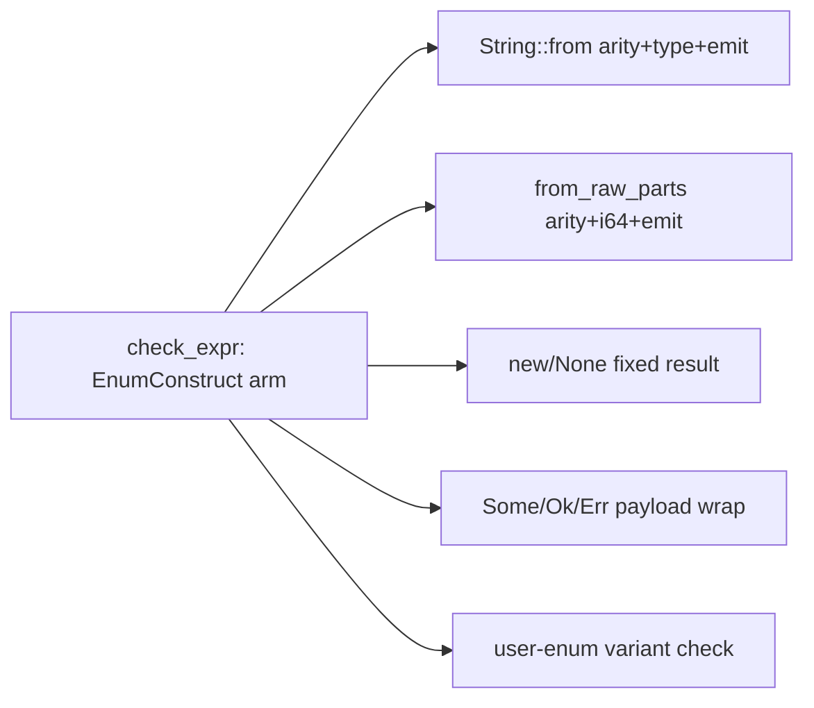
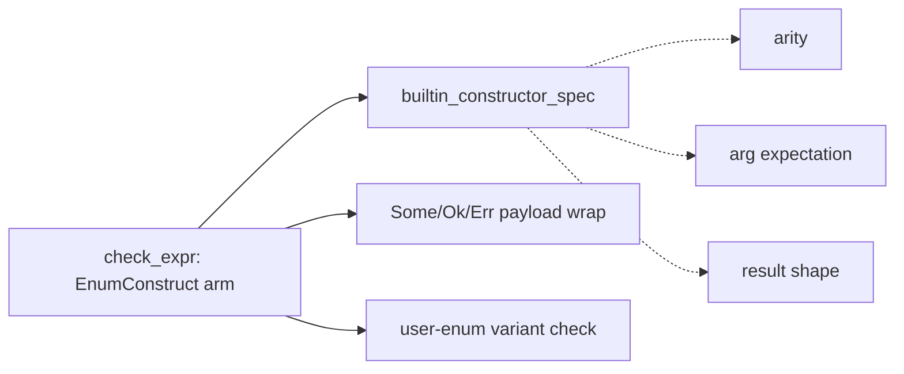

# Architecture review — vow — 2026-09-11

**Scope**: `vow-types/src/check.rs` (the type checker) as the standing hot spot — 28 commits/90d,
the file every prior firing has deepened. A workspace-wide sub-agent sweep looked for fresh candidates
outside it (vow-ir, vow-codegen, vow-verify, vow-runtime, vow, vow-syntax, vow-diag); the strongest
fresh finds are recorded below but none outscored the carried-forward `check.rs` pick.
**Picked**: `builtin-constructor-spec` — see [PR #TBD] and `.architecture/backlog.md`
**Degradations**: none — `gh` authenticated, sub-agent available, advisor used at step 4.

Diagram convention (replaces the upstream HTML legend): **solid edges are the interface** a caller
sees; **dashed edges are inside the implementation**, hidden behind the seam.

## Candidates

### builtin-constructor-spec — fold the EnumConstruct builtin dispatch into a spec seam · Strong · score 22/25

- **Files** — `vow-types/src/check.rs:2879-3028` (the `match (enum_name, variant_name)` builtin arm
  of `ExprKind::EnumConstruct`), private free fn added near the sibling seams
  `method_result_type:380` / `method_argument_expectations:337` / `cast_verdict:668` /
  `same_operand_ty:808`. **Estimate: 1 file, ~150 lines moved.**
- **Score — 22/25**
  - Leverage **4** — a single pure table serves ~11 compiler-known constructors and removes their
    arity/argument/result policy from the `check_expr` giant; mirrors the landed `method_result_type`
    seam that did the same for methods. Not 5: the payload-typed variants (`Some`/`Ok`/`Err`) and the
    FFI-coercion variants (`from_raw_parts_copy`) keep bespoke wrapping at the call site, so the table
    is partial.
  - Locality **4** — adding or correcting a builtin constructor becomes a one-entry edit in one table
    instead of a new inline arm interleaved with diagnostics. Not 5 because payload wrapping still
    lives at the call site.
  - Blast radius **1** — one file, no published interface; the fn is private to the crate. (Band 1.)
  - Heat **5** — `check.rs` is the hottest file in the tree (28 commits/90d) and the EnumConstruct arm
    is squarely in the churn.
- **Problem** — the arm is **shallow-by-interleaving**: ~145 lines where the *policy* of each builtin
  (how many arguments, what each argument must be, what type it yields) is inseparable from the
  *diagnostics* (`emit_error_with_hints`, per-builtin message and hint text) and the *recovery*
  (draining `fields` through `check_expr` on the error path). Understanding "what does `Vec::new`
  yield?" or "how many args does `String::from_raw_parts_copy` take?" means reading past four
  diagnostic blocks. The mechanical part — a lookup table keyed on `(enum, variant)` — has no seam of
  its own, so it cannot be unit-tested without constructing a `Checker` and asserting on emitted
  diagnostics (which is exactly how the 11 existing tests at L6189-6351 are forced to work).
- **Deletion test** — delete the arm and the complexity **concentrates**: every caller of
  `EnumConstruct` would have to re-derive the builtin arity/argument/result rules. It does not merely
  move — the rules are genuine domain knowledge (Option/Result/Vec/String/HashMap/BTreeMap
  constructors), not glue. This is a real deepening candidate, not a wrapper.
- **Solution** — extract the compiler-known-constructor policy into a pure
  `builtin_constructor_spec(enum, variant) -> Option<CtorSpec>` returning arity + per-argument
  expectation + result shape, mirroring `method_result_type` / `method_argument_expectations`. The
  generic argument-checking loop, the payload-typed result wrapping (`Some`/`Ok`/`Err`), and every
  diagnostic string stay at the call site, keyed on the spec. Exact interface chosen at step 4.
- **Benefits** — **leverage**: the arity/argument/result table is unit-testable on `(enum, variant)`
  pairs with no `Checker`, the way `cast_verdict`/`same_operand_ty` are; the giant `check_expr` shrinks
  by ~120 lines. **Locality**: a new builtin constructor is a table row, not an inline arm. **Test
  surface**: the 11 diagnostic-driven tests keep passing unchanged, and new table-shape assertions
  need no emitter.
- **Before / After**

Above: every builtin's policy is inlined in the arm, interleaved with its own diagnostics.

Below: the mechanical arity/arg/result table sits behind one seam; only the genuinely
payload-dependent wrapping and user-enum path stay inline.

- **Recommendation strength** — Strong. It is the deterministic top of the ranking, mirrors four
  already-landed seams, and is fully pinned by existing tests. The one caveat — a ~150-line
  heterogeneous diff rather than a ~15-line verdict — is a behaviour-preservation *risk*, watched by
  the step-5 diff/estimate guard, not a reason to skip.

### coerce-context-argument-epilogue — collapse the repeated coerce-and-emit epilogue · Worth exploring · score 21/25

- **Files** — `vow-types/src/check.rs` (~10 sites: L1377, L1464, L2115, L2201, L2663, L2802, L2917,
  L2999, L3063). Estimate ~1 file.
- **Score — 21/25** (leverage 3, locality 5, blast radius 1, heat 5). Leverage 3: the helper is a
  shallow `&mut self` wrapper of three statements (`check_expr` + `check_contextual_integer_literal_ranges`
  + `can_context_coerce`/emit), so tests gain nothing — still `&mut self`. Locality 5: a change to the
  coercion-error epilogue would become a one-place edit across ~10 sites.
- **Problem / deletion test** — sibling-epilogue duplication, not a pure-seam candidate. Deleting the
  (hypothetical) helper moves complexity back to ~10 call sites rather than concentrating new domain
  knowledge — hence leverage 3.
- **Recommendation strength** — Worth exploring. Runner-up **candidate** by the tie-break; the natural
  next firing if the pick lands.

### call-argument-coercion-action — extract the codegen coercion decision · Worth exploring · score 21/25

- **Files** — `vow-codegen/src/cranelift_backend.rs` (`coerce_call_argument`, ~L398-432). Estimate ~1 file.
- **Score — 21/25** (leverage 4, locality 4, blast radius 1, heat 4). Loses the runner-up tie-break to
  `coerce-context-argument-epilogue` on heat (4 vs 5).
- **Problem** — pure coercion decision (`actual_bits`, `expected_bits`, `is_i128`, `signed`) is
  interleaved with `builder.ins()` emission.
- **Recommendation strength** — Worth exploring, but carries **byte-identical-bootstrap risk**: codegen
  output must stay a byte-identical fixed point, so a `vow-types` seam is the safer unattended pick.

### comparison-operand-verdict — fold the comparison mismatch/tautology policy into a verdict · Worth exploring · score 20/25 (fresh)

- **Files** — `vow-types/src/check.rs:1898-1950` (the `Eq|Ne|Lt|Le|Gt|Ge` sub-arm). Estimate ~1 file,
  ~52 lines.
- **Score — 20/25** (leverage 3, locality 4, blast radius 1, heat 5). Leverage 3, not 4: the tautology
  half (`zero_comparison_verdict` + `never_negative_operand`) is *already* pure/testable, so the new
  testable surface is mostly the mismatch predicate and the mismatch-over-tautology priority; one call
  site.
- **Problem** — an inline `if / else if` folding the type-mismatch predicate and the
  zero-comparison-tautology decision (with a `widened_to` split) into emission — the same shallowness
  the landed `same_operand_ty`/`cast_verdict` seams removed, but one arm over.
- **Solution** — `comparison_verdict(lhs, rhs, never_negative) -> ComparisonVerdict ∈ {Mismatch,
  Tautology{always, unsigned_ty, widened_to}, Ok}`; caller pre-computes `never_negative` from the two
  existing helpers, message/hint strings stay at the call site.
- **Recommendation strength** — Worth exploring. Strongest fresh find; the natural firing after the two
  21-point runners-up.

### builtin-function-spec — table the free-function builtins · Speculative · score 20/25 (fresh)

- **Files** — `vow-types/src/check.rs:2082-2151` (`pin_to_root`, `string_matches_literal_at` branches
  of the `Call` arm). Estimate ~1 file, ~70 lines.
- **Score — 20/25** (leverage 3, locality 4, blast radius 1, heat 5). Leverage 3: only two builtins,
  and both are non-uniform (`pin_to_root` returns its argument type; `string_matches_literal_at`
  carries a static-string-literal constraint), so the spec is not a clean arity/type table — same
  behaviour-preservation profile as the picked constructor seam but with far less to gain.
- **Recommendation strength** — Speculative. The last builtin family without a spec, but thin.

### oversized-chunk-path-predicate — single-source a must-agree arena predicate · Worth exploring · score 17/25 (fresh)

- **Files** — `vow-runtime/src/lib.rs:1020` (authoritative, `__vow_arena_alloc`) and `:1246`
  (fast-skip, `arena_grow_backing`). Estimate ~1 file, 2 sites.
- **Score — 17/25** (leverage 2, locality 3, blast radius 1, heat 4). Leverage 2: the extracted
  `const fn takes_oversized_path(bytes, align) -> bool` is a one-line predicate that fails a strict
  deletion test on depth — its value is killing a documented drift hazard (the L1246 comment states its
  correctness *depends on* the L1020 placement), not deepening an interface.
- **Recommendation strength** — Worth exploring for the drift-kill; low leverage keeps it below the
  `check.rs` picks. Distinct from `vec-reserve-next-capacity-seam` (that is `next_capacity` doubling).

*Carried-forward lower-scored `proposed` candidates* (`arm-pattern-support-classifier` 20,
`ce-trace-reconstruction` 20, `narrow-shift-findings` 20, `negation-verdict` 18,
`vec-reserve-next-capacity-seam` 18, `recover-unknown-name-prologue` 18, `builtin-receiver-kind` 17,
`unwrap-payload-ty` 17) remain scored in `.architecture/backlog.md`; none reaches the pick.

## Dropped

| Candidate | Dropped because |
|---|---|
| `esbmc-ce-description-heuristic` | Leverage 1 — inert: the only caller destructures `Failed(_)` and discards the description, so extraction deepens nothing observable. Re-checked 2026-09-11: caller unchanged. |
| `solver-classify-function` | Already a pure, unit-tested seam (`test_classify_*`) — no shallowness to remove. |

## Too large to automate

| Candidate | Blast |
|---|---|
| `clif-shim-region-parity` (`vow-clif-shim` ↔ `vow-codegen`, ~20+ files, crosses a crate/tier seam and touches codegen output) | 4 — a human should schedule it |
| `division-abort-spec` (codegen/verify/runtime triplicated div-abort policy, 3 crates) | 4 — crosses a tier seam plus byte-identical-bootstrap risk; human-scheduled. The nearby unverified soundness asymmetry noted in the 2026-09-04 report is still for a human to triage. |

## Pick

**`builtin-constructor-spec`, 22/25.** Deterministic top of the ranking; the backlog's flagged
"natural next pick," now unblocked since its 22-point tie-mate `integer-literal-range-fit` (#1241)
merged 2026-09-04. Friction re-verified present and unchanged: commits #1263/#1264 touched vow-diag and
the self-hosted `checker.vow`, not `vow-types/src/check.rs`, so the EnumConstruct arm is byte-for-byte
what the 2026-09-04 firing scored.

**The pick was close** — the top two are within 1 point (22 vs 21). The runner-up **candidate** is
`coerce-context-argument-epilogue` (21/25), which beats the equally-scored `call-argument-coercion-action`
on the heat tie-break (5 vs 4) and avoids its byte-identical-bootstrap risk. Either is the natural next
firing.

## Design

_Filled at step 4 after this report was first committed._
