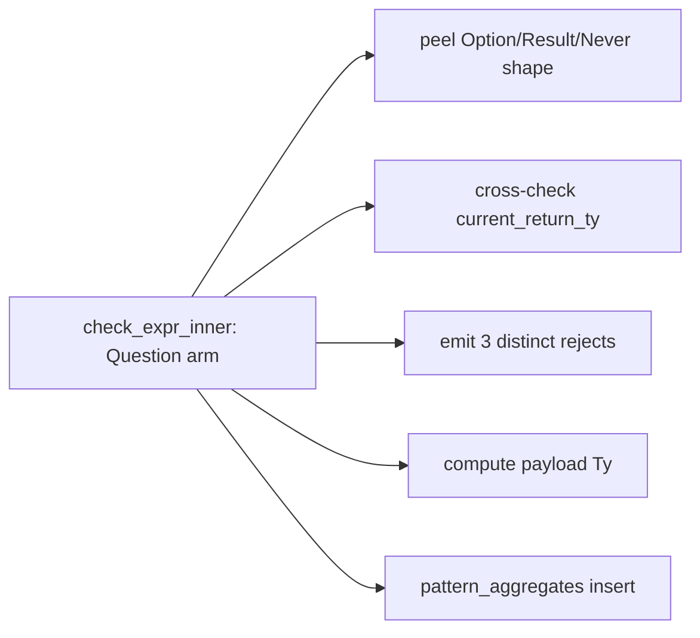
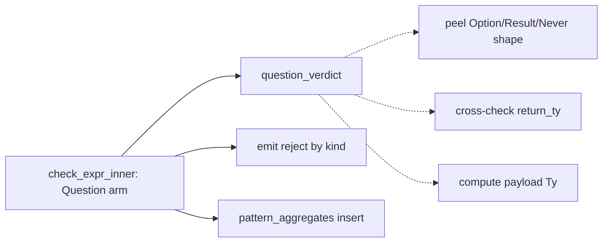

# Architecture review — vow — 2026-09-14

**Scope**: hot-spot-weighted scan of the Rust compiler crates, led by `vow-types/src/check.rs`
(heat 5 — 28 commits/90d, home of every landed deepening seam). A step-1 sub-agent walked
`check.rs`, `vow/src/counterexample.rs`, `vow-verify/`, `vow-runtime/`, `vow-codegen/`, and the
persisted `.architecture/backlog.md` was reconciled against `gh` first.

**Picked**: `question-operator-verdict` — see the PR and `.architecture/backlog.md`.

**Degradations**: advisor rate-limited this run — the step-4 design adjudication was done by this
skill against the written designs below, not by the stronger reviewer. Noted again in `## Design`.

**Diagram legend**: solid edges are the module interface; dashed edges are inside the implementation.

## Candidates

### question-operator-verdict — extract the `?`-operator payload policy into a pure verdict · Strong · score 22/25

- **Files**: `vow-types/src/check.rs:2776-2830` (the `ExprKind::Question` arm of `check_expr_inner`);
  the new seam sits beside `cast_verdict` (`check.rs:668`) and `same_operand_ty` (`check.rs:808`).
  File-count estimate: **1**.
- **Score**: **22/25**
  - **Leverage 4** — one call site, but the caller stops reaching past the seam: it no longer peels
    `Ty::Applied`/`Ty::Enum` shapes or cross-checks `current_return_ty` inline, and the 5-way policy
    becomes unit-testable without constructing a `Checker`. Matches the landed single-arm verdict seams
    `cast_verdict`/`builtin-constructor-spec`; not 5 because a single arm cannot pay back across many
    call sites.
  - **Locality 4** — a future change to `?` semantics (e.g. when Result propagation *is* lowered) becomes
    a one-place edit in the pure verdict plus its call-site emit, instead of surgery inside a 55-line arm.
  - **Blast radius 1** — one file, no published interface; `question_verdict` and its reject enum are
    crate-private, exactly like the existing seams. (6 − 1 = 5 into the total.)
  - **Heat 5** — `check.rs`, 28 commits in 90 days.
- **Problem**: the `?` arm is a **shallow** stretch of `check_expr_inner`: 55 lines in which type-shape
  inspection, three distinct rejection diagnostics, a payload-type computation, and `pattern_aggregates`
  bookkeeping are interleaved. To understand "what does `?` accept and what type does it yield" a reader
  must mentally run the whole arm; to test any single rejection they must build a checker with a function
  return context. The decision logic has no **seam** — the caller *is* the policy.
- **Deletion test**: delete the arm and the complexity does not move to callers (there is one) — it
  simply vanishes with the feature. Extracting the *decision* concentrates the five-way policy in one
  pure function; the emission and aggregate bookkeeping that genuinely need `&mut self` stay put. Passes:
  complexity concentrates, it does not merely relocate.
- **Solution**: add a pure `question_verdict(inner_ty: &Ty, return_ty: &Ty) -> Result<Ty, QuestionReject>`
  next to `cast_verdict`. `Ok(payload_ty)` carries the type the expression yields (Option-ok unwraps
  arg0; `Never` propagates as `Never`). `Err(QuestionReject::…)` names one of the three rejection kinds
  (`OptionNeedsOptionReturn`, `ResultNotLowered`, `NotTryable`). The call site matches: on `Ok` it runs
  the existing `pattern_aggregate_info` insert and returns the payload; on `Err` it emits the kind's
  message/hint (interpolating `inner_ty` for `NotTryable`) and returns `Ty::Unit`.
- **Benefits**: **leverage** — the five branches, including the subtle "Option `?` requires an Option
  return" cross-field rule, are now assertable in isolation (`question_verdict(&opt(i64), &plain) ==
  Err(OptionNeedsOptionReturn)`), a class of test that previously needed a full `Checker`. **Locality** —
  the policy lives in one pure function; diagnostics live at one call site. The test surface widens from
  "run the checker over a `.vow` snippet" to "call one total function", mirroring the payoff the landed
  seams already delivered.

**Before** — the caller *is* the policy:

**After** — decision behind one seam; emission and bookkeeping stay at the call site:

### coerce-context-argument-epilogue — collapse the repeated contextual-coercion epilogue · Worth exploring · score 21/25

- **Files**: `vow-types/src/check.rs` (~10 sites: L1377, L1464, L2115, L2201, L2663, L2802, L2917, L2999,
  L3063). Estimate: 1.
- **Score 21/25** — leverage 3, locality 5, blast radius 1, heat 5. Runner-up **candidate** (wins the
  21-point tie-break on heat 5 vs 4). Real sibling-epilogue dedup across ~10 sites, but the helper is
  `&mut self` (not a pure seam), so the test surface barely widens — hence leverage 3 and the borderline
  deletion-test note carried in the backlog.

### call-argument-coercion-action — extract the ABI width/sign coercion decision · Worth exploring · score 21/25

- **Files**: `vow-codegen/src/cranelift_backend.rs:425-459` (`coerce_call_argument`). Estimate: 1.
- **Score 21/25** — leverage 4, locality 4, blast radius 1, heat 4. A genuinely clean pure decision
  ({passthrough, ireduce, sextend, uextend, refuse-128-narrow}), but it lives in codegen, which must stay
  a byte-identical bootstrap fixed point — a `vow-types` pick is the safer unattended choice at equal
  score, and it loses the tie-break on heat (4 vs 5).

The remaining proposed candidates (`arm-pattern-support-classifier`, `narrow-shift-findings`,
`comparison-operand-verdict`, `builtin-function-spec`, `ce-trace-reconstruction`, and the rest) sit at
≤20/25; the step-1 scan re-confirmed the friction on `arm-pattern-support-classifier` and
`narrow-shift-findings` is still present. See `.architecture/backlog.md` for the full scored list.

## Dropped

No candidate was newly hard-filtered this run. The standing `dropped` rows were re-checked and still
apply:

| Candidate | Dropped because |
|---|---|
| `esbmc-ce-description-heuristic` | Leverage 1 — inert; the only caller discards the description. Caller unchanged. |
| `solver-classify-function` | Already a pure, unit-tested seam. No shallowness to remove. |
| `clif-shim-region-parity` | Blast radius 4 — see *Too large to automate*. |

## Too large to automate

- `clif-shim-region-parity` — blast radius 4, crosses the `vow-clif-shim`/`vow-codegen` crate seam and
  touches codegen output. Re-checked 2026-09-14: still large. A human should schedule it.
- `division-abort-spec` — blast radius 4, spans codegen/verify/runtime plus byte-identical bootstrap
  risk. Human-scheduled.

## Pick

`question-operator-verdict`, at **22/25**, is the deterministic top. It is a fresh candidate surfaced by
this run's step-1 scan — prior firings carded the cast, operator, method, and constructor arms of
`check.rs` but never the `?` arm — scored on the same rubric as the landed seams it mirrors. The pick was
**close**: the runner-up **candidate** is `coerce-context-argument-epilogue` at 21/25 (within 1 point),
which wins the 21-point tie-break over `call-argument-coercion-action` on heat. Both runner-ups are the
natural next firings. No `in-flight` backlog entry has an open PR (the previous pick, PR #1268, merged
2026-09-11), so implementing this run is unblocked.

## Design

_Pending step 4 — filled after this report is committed._
