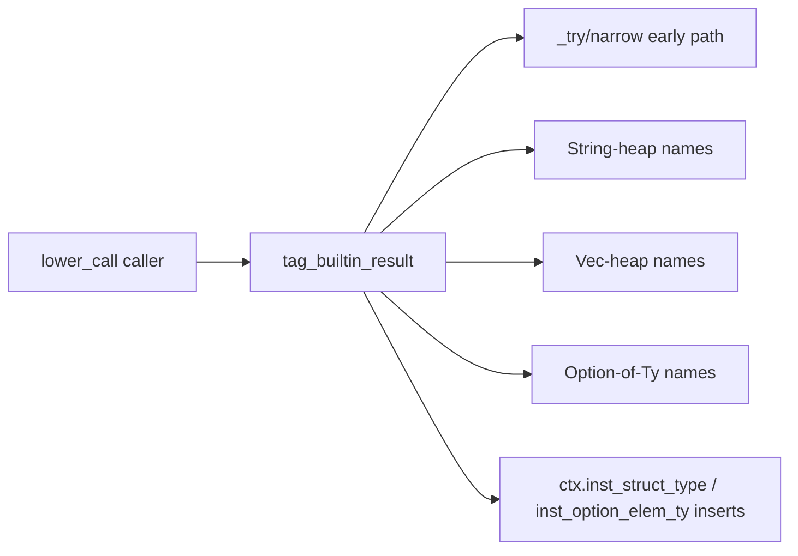
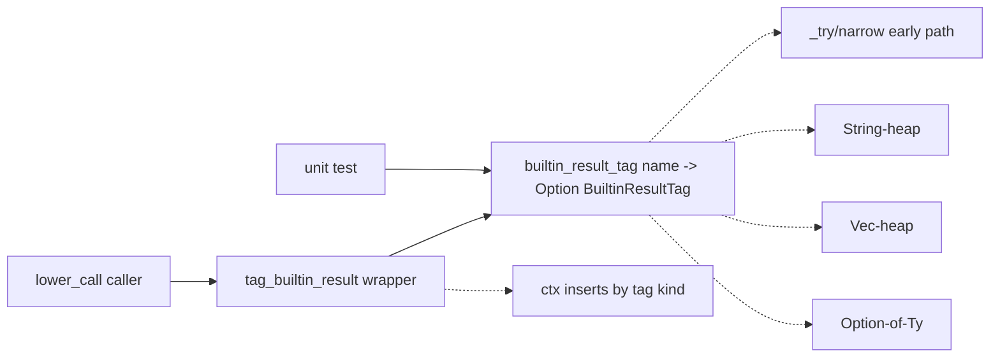

# Architecture review — vow — 2026-09-16

**Scope**: `vow-types/src/check.rs` and `vow-ir/src/lower/mod.rs` — the two hottest compiler
files in the last 120 commits (check.rs 14 touches, lower/mod.rs 10, the latter freshly churned
by #1288 two days ago). Hot-spot inference per step 1; no path argument was given.
**Picked**: `builtin-result-tag` — see PR (link added at step 6) and `.architecture/backlog.md`
**Degradations**: none. `gh` authenticated; explore sub-agent available; advisor available for
adjudication.

Diagram convention (replaces the upstream HTML legend): **solid edges are the interface** a caller
sees; **dashed edges are inside the implementation**, behind the seam.

## Candidates

### builtin-result-tag — extract the builtin-result heap/Option classifier  ·  Strong  ·  score 22/25

- **Files** — `vow-ir/src/lower/mod.rs`: the `tag_builtin_result` policy at `mod.rs:201-251`
  (single caller `mod.rs:1808`), sited beside the already-pure `narrow_intrinsic_target`
  (`mod.rs:161-183`) and the `vow_static_builtin_to_runtime` name table (`mod.rs:~60-159`).
  File-count estimate: **1**.
- **Score** — **22/25** (leverage 4, locality 4, blast radius 1, heat 5)
  - *leverage 4*: mirrors the landed `builtin_constructor_spec` seam (#1268) exactly — one dispatch
    site, a name-keyed classification table, a pure spec output — which scored leverage 4 and merged.
    The ~40-name policy is currently reachable only through full lowering, so its whole test surface
    is unlocked by the extraction, not merely shrunk.
  - *locality 4*: after the seam, a change to which builtins return heap/Option values is a one-line
    edit in one pure function, and its correctness is checkable in one unit test rather than through
    an end-to-end lowering fixture.
  - *blast radius 1*: one file, no published interface; `BuiltinResultTag` is crate-private.
  - *heat 5*: `lower/mod.rs` is the second-hottest file (10/120 commits) and `tag_builtin_result`
    itself was edited **two days ago** by #1288.
- **Problem** — `tag_builtin_result` is a **shallow** module: its interface (`name -> mutations on
  ctx`) is entangled with a large, pure classification policy (~40 builtin names → one of three tag
  kinds: a `String` heap struct-type, a `Vec` heap struct-type, or `Option<elem_ty>`). The decision
  is a total function of `name` alone, but it can only be reached by constructing a `LowerCtx` and an
  `InstId` and inspecting side effects afterwards — so it has **no locality of test**. The list has
  **already drifted**: #1288 was a bug fix that had to hand-add `proc_sample` to the String-heap arm,
  the exact class of miss a pure, testable table prevents.
- **Deletion test** — deleting `tag_builtin_result` and inlining it at the caller would **move**
  complexity into the already-large call site and scatter the name policy; extracting the pure
  classifier out of it instead **concentrates** the policy in one testable place. The seam passes.
- **Solution** — introduce a crate-private `enum BuiltinResultTag { StringHeap, VecHeap,
  OptionOf(Ty) }` and a pure `fn builtin_result_tag(name: &str) -> Option<BuiltinResultTag>` that
  performs the `_try`+`narrow_intrinsic_target` early path first, then the explicit name match.
  `tag_builtin_result` becomes a thin `&mut self`-style wrapper that matches on the tag and applies
  the `ctx.inst_struct_type` / `ctx.inst_option_elem_ty` inserts. Rust-only; `compiler/lower.vow`
  is untouched (the change is behaviour-preserving, so it introduces no new drift — the existing
  "keep in sync" invariant is unchanged, and the sync comment moves to sit above the seam).
- **Benefits** — **leverage**: the entire name→tag policy becomes unit-testable with a plain `&str`,
  no `LowerCtx`. **locality**: the tag decision and its verification live in one function.
  **test surface**: goes from zero direct coverage to exhaustively pinnable, including the two
  fall-through traps `i16_to_u8_try` / `i64_to_i32_try` (whose `u8`/`i32` targets are *not* in
  `narrow_intrinsic_target`'s supported set, so they must reach the explicit arms) and the
  early-path-only `u64_to_u32_try`.

Before — the policy is fused into the ctx-mutating function; the caller and any test must go through
lowering:

After — the pure classifier is one seam; the wrapper only applies the ctx inserts; tests hit the
seam directly:

- **Recommendation strength** — Strong.

### call-argument-coercion-action — pure call-arg coercion decision  ·  Worth exploring  ·  score 22/25

- **Files** — `vow-codegen/src/cranelift_backend.rs` (`coerce_call_argument`, ~L398-432). Estimate 1.
- **Score** — 22/25 (leverage 4, locality 4, blast radius 1, heat 5). Ties the pick on total.
- **Problem** — a pure coercion decision (`actual_bits`, `expected_bits`, `is_i128`, `signed` →
  extend/truncate/none) fused with `builder.ins()` emission.
- **Deletion test** — concentrates: a genuine pure seam.
- **Pick note** — **lost the 22-22 tie on the deterministic tie-break**: equal blast (1) and heat
  (5), then most-recently-touched file — `lower/mod.rs` (#1288, 2026-09-14) postdates
  `cranelift_backend.rs` (#1279, 2026-09-14, earlier in the log). Kept `proposed`. Soft note: a
  codegen change also carries a byte-identical-bootstrap obligation whose triple-test is heavier to
  run than a single-crate `cargo test`; that is a scheduling caution, not a rubric filter.

### coerce-context-argument-epilogue — collapse the contextual-coercion epilogue  ·  Speculative  ·  score 21/25

- **Files** — `vow-types/src/check.rs`, ~10 sites. Estimate 1.
- **Score** — 21/25 (leverage 3, locality 5, blast radius 1, heat 5).
- **Problem** — a repeated `check_expr + check_contextual_integer_literal_ranges + can_context_coerce
  + emit-mismatch` epilogue.
- **Deletion test** — mostly moves: the proposed helper is a shallow 4-param wrapper of 3 statements
  and stays `&mut self`, so the **test surface does not improve**. Runner-up by score, but a weaker
  *deepening* than the pick; the top two are within 1 point (22 vs 21), so this is the natural next
  firing only if its leverage is re-argued.

### negation-verdict — pure unary-negation verdict  ·  Worth exploring  ·  score 20/25

- **Files** — `vow-types/src/check.rs:2161-2183` (`UnaryOp::Neg` arm). Estimate 1.
- **Score** — 20/25 (leverage 3, locality 4, blast radius 1, heat 5). **Rescored 18→20**: the
  explore pass confirmed it is a *total pure function of `operand_ty`* (3-way
  `{Unsigned, NonNumeric, Ok}`, both error branches return `Unit`, Ok returns the operand type),
  testable with zero `&mut self` — leverage 2→3. The literal-folding directly above (L2138-2158)
  stays at the call site.
- **Deletion test** — concentrates. Clean textbook seam; the strongest runner-up *by deepening
  quality* even though it scores below the epilogue candidate.

### arm-pattern-support-classifier — pure unsupported-arm classifier  ·  Worth exploring  ·  score 20/25

- **Files** — `vow-types/src/check.rs:3167-3225` (`validate_arm_pattern`). Estimate 1.
- **Score** — 20/25 (leverage 3, locality 4, blast radius 1, heat 5).
- **Problem** — 8 unsupported-arm reasons already computed as a neutral `Option<(msg, hint)>` then
  emitted separately; the classifier match never touches `self`.
- **Deletion test** — concentrates, but the honest gain is "exercise the classifier without a
  `Checker`", not "untangle policy from emission" — the value is already half-realised. The correct
  seam returns an enum (caller maps variant → wording), not the `(msg, hint)` text.

## Dropped

| Candidate | Dropped because |
|---|---|
| `esbmc-ce-description-heuristic` | Leverage 1 — inert; the only caller destructures `Failed(_)` and discards the description, so extraction deepens nothing observable. Re-checked 2026-09-16: caller unchanged. Do not re-surface. |
| `solver-classify-function` | Already a pure, unit-tested seam (`test_classify_*`). No shallowness to remove. Re-checked 2026-09-16. |

(Hard filters only. `comparison-operand-verdict` was **rescored down** — leverage 3→2, total 18 —
because the explore pass found the tautology half already extracted (`zero_comparison_verdict`
check.rs:565, `never_negative_operand` check.rs:1927) and the composite verdict cannot be fully pure
(`never_negative_operand` reads `self.nonneg_casts`). It stays `proposed`, not vetoed — leverage 2
is eligible, just low.)

## Too large to automate

| Candidate | Why |
|---|---|
| `clif-shim-region-parity` | Blast radius 4 — crosses the `vow-clif-shim` / `vow-codegen` crate seam and touches codegen output. Re-checked 2026-09-16: still large. A human should schedule it. |
| `division-abort-spec` | Blast radius 4 — triplicated policy across `vow-codegen` / `vow-verify` / `vow-runtime` plus byte-identical-bootstrap risk. Human-scheduled. |

## Pick

**`builtin-result-tag`**, 22/25. It tied `call-argument-coercion-action` on total (22) and won the
rubric's deterministic tie-break: equal blast radius (1) and heat (5), broken by most-recently-touched
file — `lower/mod.rs` was edited by #1288 on 2026-09-14, after `cranelift_backend.rs`'s last touch
(#1279, same day, earlier in the log). Independently, it is the cleaner unattended pick: its
behaviour is pinnable by a single-crate `cargo test -p vow-ir` on a pure seam, whereas the codegen
candidate's byte-identical-bootstrap obligation is heavier to discharge in one firing. The top two
were within 1 point of the runner-up *candidate* by score (`coerce-context-argument-epilogue`, 21),
which is noted per ranking.md; but that runner-up is a shallow `&mut self` epilogue dedup with no
test-surface gain, so `builtin-result-tag` is also the stronger *deepening*.

## Design

Written at step 4 (design-it-twice), after this report was first committed; the file is amended and
re-committed with the adjudicated interface, the losing designs, and the reasoning.
