# Architecture review — vow — 2026-09-18

**Scope**: hot spots inferred from `git log --oneline -60` over `HEAD=6735b548`. The Rust
workspace's most-churned modules are `vow-types/src/check.rs` (28 commits/90d),
`vow-codegen/src/cranelift_backend.rs` (27), `vow-runtime/src/lib.rs` (21),
`vow-ir/src/lower/mod.rs` (20) and `vow-verify/src/esbmc.rs` (19). Three explore passes covered
`vow-types/`, `vow-ir/` + `vow-codegen/` + `vow-clif-shim/`, and `vow-verify/` + `vow/` +
`vow-runtime/` + `vow-diag/` + `vow-linker/`. `vow/src/skill.rs` was excluded (generated).

**Picked**: `builtin-method-spec` — see `.architecture/backlog.md`

**Degradations**: none. `gh` authenticated; sub-agents available; `codebase-design` vocabulary used
directly (no `CONTEXT.md` exists in this repo — see *Vocabulary note* below).

**Diagram legend**: solid edges are the **interface** a caller must learn; dashed edges are inside the
**implementation**, hidden behind a **seam**.

**Vocabulary note**: this repo has no `CONTEXT.md`. The domain vocabulary is taken from
`docs/spec/grammar.md` ("builtin method", "receiver", "lowering") and `CLAUDE.md`'s architecture
section ("IR lowering", "instruction-value uniformity"). Architecture terms are `codebase-design`'s:
**module**, **interface**, **depth**, **seam**, **adapter**, **leverage**, **locality**.

---

## Candidates

### builtin-method-spec — table the uniform builtin-method lowering arms · Strong · score 22/25

- **Files**: `vow-ir/src/lower/mod.rs:3519-3902` (the `match (recv_struct, method)` in the
  `ExprKind::MethodCall` arm of `lower_expr` (`:1405`); seam sited beside the landed
  `builtin_result_tag` (L199-259) and `vow_static_builtin_to_runtime` (L60-159) tables.
  **File-count estimate: 1.** **Diff estimate: ~250 lines removed, ~120 added (net ≈ −130), plus
  ~60 lines of new unit tests.** Step 5 watches the real diff against these numbers, not against the
  file count alone — a one-file refactor can still run away.
- **Score**: **22/25** (leverage 4, locality 4, blast radius 1, heat 5)
  - *leverage 4* — 18 of the 25 arms collapse to one table entry each, and the resulting
    `builtin_method_spec(recv, method)` is a total pure function of two `&str`, unit-testable with
    zero `LowerCtx`. Today no test can assert "what does `HashMap::remove` lower to" without building
    a whole module and lowering it. Not 5: there is one dispatch site, and callers of `lower_expr`
    do not simplify.
  - *locality 4* — adding or retargeting a builtin method is currently a 7-to-30-line edit inside a
    380-line match; afterwards it is one table row. Not 5: the arm already lives in one file, so this
    does not turn a multi-file edit into a single-file one.
  - *blast radius 1* — one file, no published interface. `MethodSpec` and `builtin_method_spec` are
    private to `vow-ir`. The emitted IR is unchanged, so `vow-codegen` and the bootstrap are
    untouched; `compiler/lower.vow` needs no mirror edit because the change is behaviour-preserving
    (same precedent as the landed `builtin-result-tag`, PR #1290).
  - *heat 5* — `lower/mod.rs` is 20 commits/90d, 10/30d, last touched **2026-09-16** (two days ago,
    by PR #1290 which extracted the sibling `builtin_result_tag` seam from this same file).
- **Problem**: the arm is a **shallow** module inlined into a **deep** one. Its interface — "given a
  receiver struct name and a method name, what do we emit?" — is one line to state, but the
  implementation is 384 lines in which that statement is never made. Eighteen arms repeat the same
  five-part shape verbatim:

  ```
  lower arg 0 (consumed) → fall back to ConstUnit if absent
  ctx.emit(Opcode::Call, <ret ty>, vec![recv_id, arg_id], CallExtern("<symbol>"), span)
  [optionally] ctx.inst_struct_type.insert(result, "Option")
  ```

  Understanding "which extern does `BTreeMap::contains` call, and what type does it return" means
  reading 15 lines of `unwrap_or_else` boilerplate to find the two facts that differ. That is the
  shallow-module smell stated in `CLAUDE.md`: the interface is nearly as wide as the implementation.

  The friction is not hypothetical. The arms have already drifted in three ways that a table makes
  visible and a 384-line match hides:
  1. **`String::contains` (L3557) uses `lower_expr` where all 17 siblings use `lower_consumed_expr`.**
     Nothing marks this as deliberate. It is either a linear-ownership decision or an oversight, and
     today there is no place where the difference is stated.
  2. **`Vec::truncate` (L3868) falls back to `ConstI64(0)` for a missing argument; the other 1-arg
     arms fall back to `ConstUnit`.** Again unmarked.
  3. **`BTreeMap::get` (L3710) tags its result `inst_struct_type = "Option"`; `HashMap::get` (L3772)
     returns a bare `Ty::I64` and tags nothing.** Two sibling map lookups, two result shapes.
- **Deletion test**: **concentrates.** Deleting `builtin_method_spec` would force every one of the 18
  facts back into the dispatch site as hand-written `ctx.emit` calls — the complexity returns in
  full, and the three drifts above become invisible again. It does not merely move: the table
  *is* the knowledge, and the applier that consumes it is generic.
- **Solution**: introduce a private, pure

  ```rust
  struct MethodSpec {
      symbol: &'static str,        // extern to call, without the __vow_ prefix handling
      ret_ty: Ty,
      arity: usize,                // 0 or 1
      consume_arg: bool,           // false only for String::contains
      missing_arg: MissingArg,     // ConstUnit | ConstI64Zero
      result_struct_tag: Option<&'static str>,   // Some("Option") for BTreeMap::get
  }

  fn builtin_method_spec(recv: Option<&str>, method: &str) -> Option<MethodSpec>
  ```

  and a ~30-line applier that lowers the argument, emits the call, and applies the tag. The seven
  non-uniform arms — `String::substring`, `String::parse_i64`, `String::parse_u64`,
  `HashMap::insert`, `BTreeMap::insert`, `Vec::push`, and the `unwrap` fallback — stay inline,
  because each does real extra work (two arguments, result-tagging with an element type, map
  argument-type lookups, wide-literal narrowing, or a call into `lower_unwrap`).
- **Benefits**: **leverage** — one table entry replaces ~14 lines of boilerplate, and the spec is a
  total pure function testable without a `LowerCtx`, an IR module, or a lowering pass. **Locality** —
  the answer to "what does this builtin method lower to" concentrates in one 60-line table adjacent
  to the two sibling tables that already answer the free-function version of the same question.
  **Test surface** — the interface *is* the test surface: `builtin_method_spec(Some("BTreeMap"),
  "get")` is a three-line assertion, where pinning the same fact today requires lowering a whole
  program and inspecting the emitted `InstData::CallExtern`. The three drifts become three explicit,
  asserted table fields.
- **Before / After**:

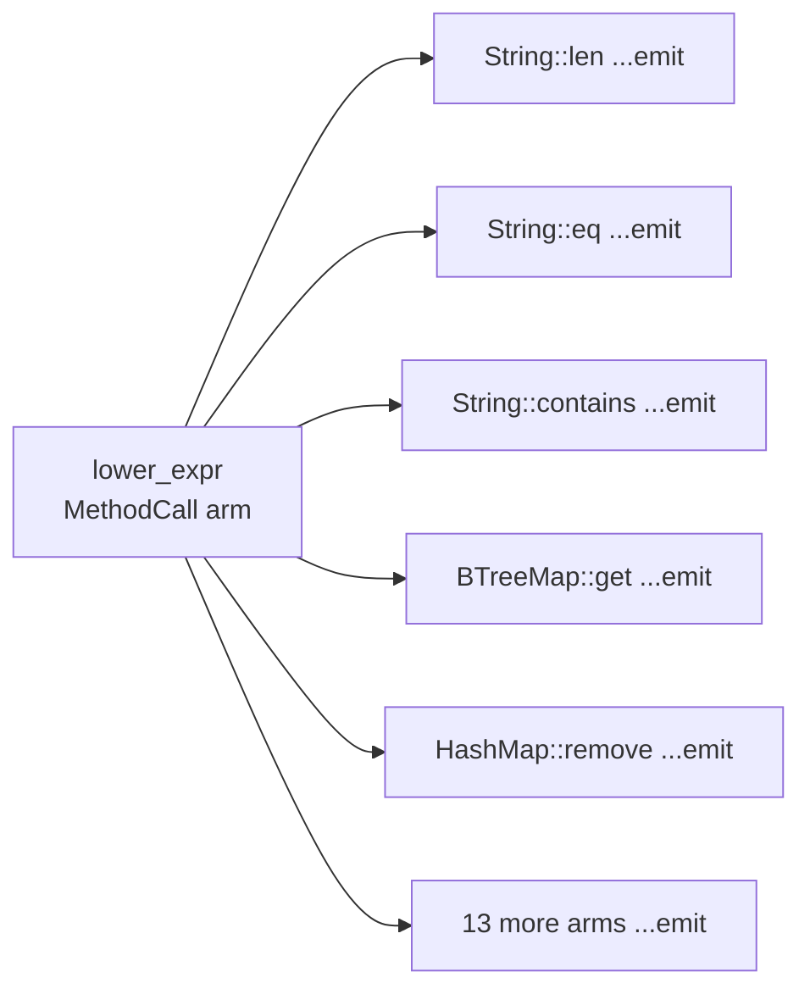

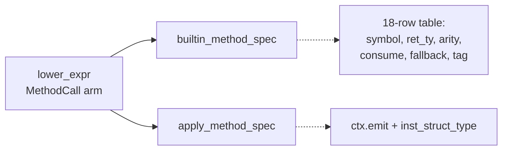

- **Recommendation strength**: **Strong**

---

### vec-reserve-next-capacity-seam — single-source the collection growth policy · Strong · score 21/25

- **Files**: `vow-runtime/src/lib.rs:1497-1522` (`vec_reserve_in_arena_no_null_check`),
  `:4193-4199` (`__vow_map_insert_in_arena`), `:4362-4369` (`__vow_btreemap_insert`).
  **File-count estimate: 1.**
- **Score**: 21/25 (leverage 4, locality 4, blast radius 1, heat 4)
  - *leverage 4* — three growth sites collapse to three one-line calls, and the overflow policy
    becomes assertable at `usize::MAX` boundaries, which is impossible today (the only test,
    `vec_reserve_rejects_overflow` at `:6844`, drives the real FFI against a real arena).
  - *locality 4* — one growth rule instead of three divergent ones.
  - *blast radius 1* — one file; `next_capacity` is private, the `extern "C"` ABI is untouched.
  - *heat 4* — 21 commits/90d, 8/30d, last 2026-09-14.
- **Problem**: the `Vec::reserve` path carries a comment (`:1491-1495`) explaining precisely why
  unchecked doubling is a bug — *"doubling `new_cap` past usize::MAX wraps it to 0 so the
  `< required` loop never terminates"* — and then the two map paths do exactly that:
  `m.cap * 2` and `new_cap * MAP_ENTRY_BYTES` are both unchecked at `:4195-4196`, as are
  `m.keys_cap * 2` and `new_cap * BTREEMAP_ENTRY_BYTES` at `:4364-4365`. The policy is stated once,
  in a comment, next to the one site that obeys it.
- **Deletion test**: concentrates — the doubling rule, the `VOW_CAP_VALUE_MASK` ceiling, and the
  byte-size product are one decision that three callers need.
- **Solution**: `fn next_capacity(old_cap: usize, required: usize, initial: usize) -> Option<usize>`,
  total and pure over three scalars, `None` meaning "the caller must `oom_trap`". All three sites
  call it.
- **Benefits**: leverage — the checked policy reaches the two sites that lack it. Locality — one
  rule. Test surface — boundary behaviour becomes a pure unit test instead of an FFI round-trip.
- **Note**: both maps are constructed with `MAP_INITIAL_CAP`/`BTREEMAP_INITIAL_CAP` = 8
  (`:4160`, `:4306`), so the zero-capacity doubling hazard is not reachable through today's
  constructors, and the overflow needs a capacity above `usize::MAX / 2`. This is a latent
  divergence being closed, not a live bug — say so in any PR that lands it.
- **Before / After**:

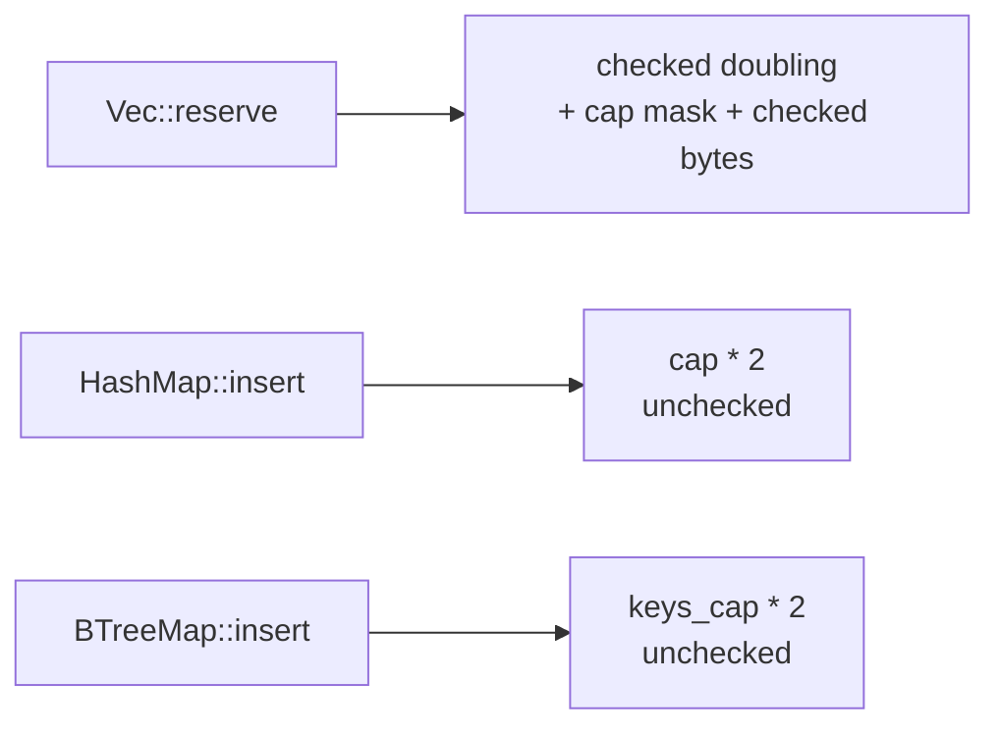

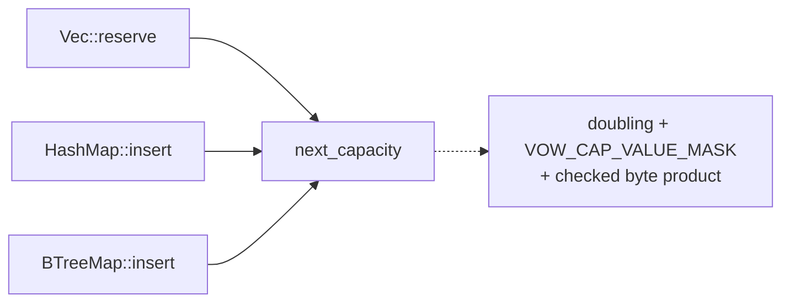

- **Recommendation strength**: **Strong**

---

### arena-variant-rule — table the arena-routed extern symbol rule · Worth exploring · score 21/25

- **Files**: `vow-codegen/src/cranelift_backend.rs:769-904` (136 lines, 22 named arms; 2 production
  call sites at `:1582` and `:3156`). **File-count estimate: 1.**
- **Score**: 21/25 (leverage 4, locality 4, blast radius 1, heat 4)
  - *leverage 4* — 22 arms collapse to two shapes: 17 `match inst.region` arms (`Root` →
    passthrough, else `"<sym>_in_arena"`) and 5 `first_arg_route` arms.
  - *locality 4* — the routing rule concentrates in one table.
  - *blast radius 1* — one file, no published interface, though it **changes stage-0 emitted code**.
  - *heat 4* — 27 commits/90d, last 2026-09-14.
- **Problem**: 136 lines encode two rules 22 times. `vow-clif-shim/src/lib.rs:625-819` already has the
  target shape — `routed_vec_extern(sym, inst_rgn, receiver_route) -> (&str, Option<i64>)`, a total
  pure function with the route pre-computed at its call site — so this is signature-mirroring of a
  landed shape, not invention. A third copy lives in `compiler/clif.vow:244-380`.
- **Deletion test**: concentrates.
- **Solution**: `fn arena_variant_rule(sym: &str) -> Option<ArenaVariantRule>` over
  `{ InstRegion, Receiver, ReceiverWithCandidate }`, plus a ~15-line applier keeping `inst.region`
  and `first_arg_route` at the call site.
- **Benefits**: leverage and locality as above; test surface — the rule becomes assertable without a
  Cranelift builder.
- **Why not picked**: it sits in the crate with the least-granular verification. `vow-codegen`
  produces stage-0 `vowc1` directly, and unlike a `vow-ir` change there is no IR-level diff to lean
  on — only the bootstrap triple. Equal score, higher risk for an unattended run.
- **Before / After**:

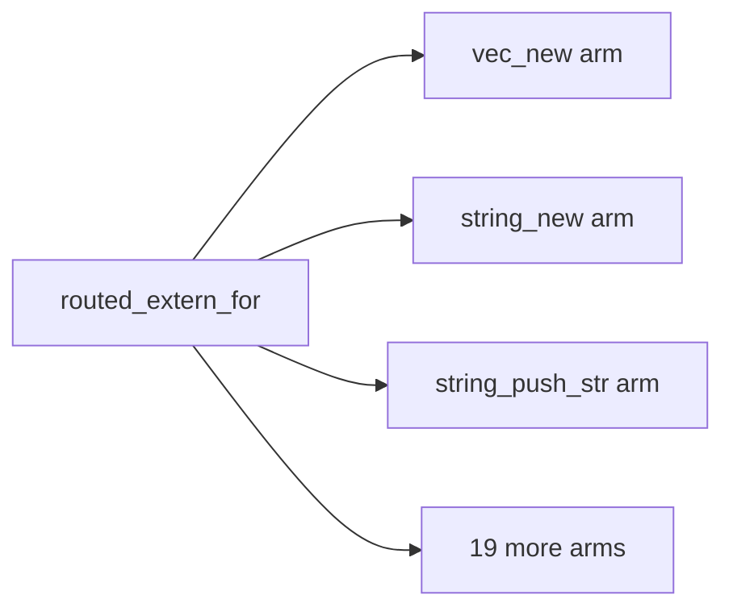

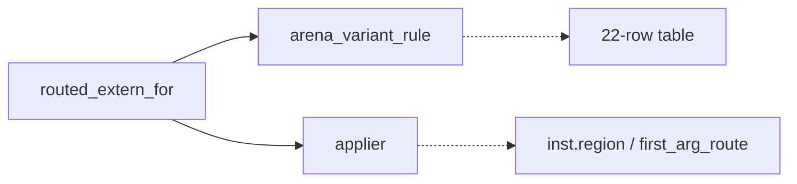

- **Recommendation strength**: **Worth exploring**

---

### esbmc-auto-timeout-policy — one rule for the auto-mode solver timeout · Worth exploring · score 21/25

- **Files**: `vow-verify/src/esbmc.rs:942-964` (`effective_multi_property_config`),
  `vow-verify/src/solver_strategy.rs:227-246` (`bv_config_for`). Self-hosted mirror at
  `compiler/verifier.vow:504-517` (`effective_timeout_for`) is documentation, not an edit target.
  **File-count estimate: 2.**
- **Score**: 21/25 (leverage 4, locality 4, blast radius 1, heat 4)
- **Problem**: the same rule — *user `--timeout` wins verbatim; else Bitwuzla is uncapped; else
  `DEFAULT_AUTO_TIMEOUT_SECS`* — is spelled three times, and the doc comment at `esbmc.rs:936-938`
  admits it. The two Rust spellings **already differ**: `effective_multi_property_config` gates on
  `config.encoding == Encoding::Auto`, `bv_config_for` does not. Both also re-implement
  `SolverConfig::resolve()`'s `Auto → Boolector` rule locally, and that local copy disagrees with
  `resolve()` (`solver_strategy.rs:80-84`) for `(Encoding::Ir, Solver::Auto)`, where `resolve()`
  yields `Z3`. The duplication has reached the tests too: `solver_strategy.rs:1091/1102/1115` and
  `esbmc.rs:2001` assert the same facts twice.
- **Deletion test**: concentrates.
- **Solution**: `fn auto_timeout_secs(encoding, solver, user_timeout) -> Option<u32>` in
  `solver_strategy.rs`, reusing `SolverConfig::resolve()` rather than re-deriving the BV rule.
- **Why not picked**: the two spellings differ *today*, so unifying them is a behaviour change on at
  least one path, not a pure extraction. That needs a decision about which spelling is correct —
  exactly the kind of fork the autonomy contract says to leave to a human. It stays `proposed` with
  that note.
- **Before / After**:

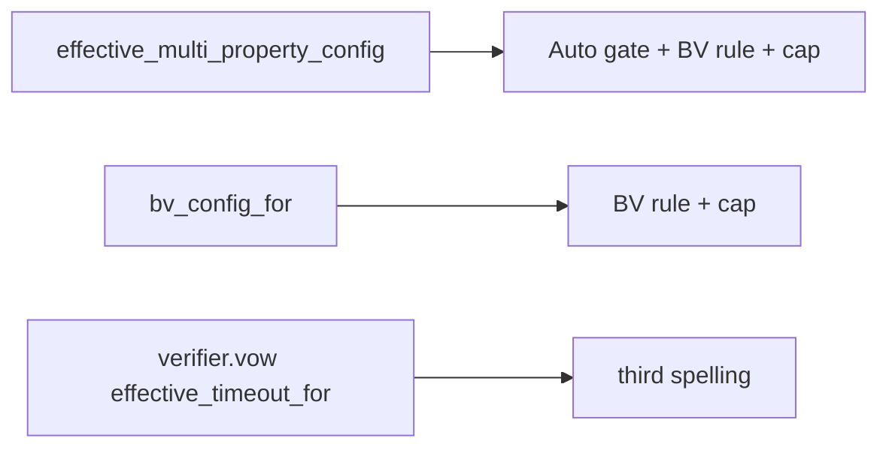

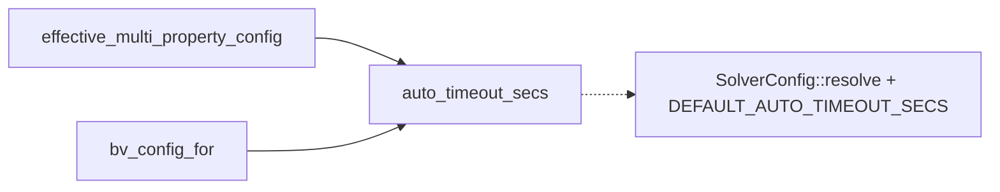

- **Recommendation strength**: **Worth exploring**

---

### builtin-generic-arity-spec — one arity rule for the five builtin generics · Worth exploring · score 20/25

- **Files**: `vow-types/src/env.rs:656-723` (`TypeEnv::resolve`, `AstType::Generic` arm; 14 call
  sites of `resolve` in `check.rs`). **File-count estimate: 1.**
- **Score**: 20/25 (leverage 4, locality 4, blast radius 1, heat 3)
- **Problem**: the five builtin generics use **two different arity policies**. `Option` (L660),
  `Result` (L671) and `BTreeMap` (L704) reject `args.len() != N`. `Vec` (L682) and `HashMap`
  (L692-697) use `args.first()` / `args.get(1)` with `ok_or_else`, so too *few* arguments error and
  too *many* are silently dropped — `Vec<i64, bool>` resolves to `Ty::Applied(Vec, [I64])`, and the
  surplus argument is never even `resolve`d, so an unknown type name in that position goes
  unreported. `vow-syntax/src/parser/types.rs` does not constrain generic arity at parse time.
- **Deletion test**: concentrates — arity, base type, and message shape are one fact per generic.
- **Solution**: `fn builtin_generic_spec(name: &str) -> Option<BuiltinGeneric>` returning
  `{ base: Ty, arity: usize }`; `resolve` looks it up, checks arity once, emits one canonical
  message, and maps `resolve` over the arguments.
- **Test-shaped gap**: `env.rs` has `resolve_option_generic_rejects_wrong_arity` (L1213) and
  `resolve_result_generic_rejects_wrong_arity` (L1272), and deliberately **no** `Vec`/`HashMap`
  equivalent. Those two missing tests are the red step.
- **Why not picked**: heat 3 — `env.rs` is 9 commits/90d and was last touched 2026-09-05.
- **Note**: unlike the other candidates this one **changes behaviour** — `Vec<i64, bool>` would start
  erroring. That is a correctness fix worth making, but it is a fix, not a deepening, and it should
  be landed as one.
- **Before / After**:

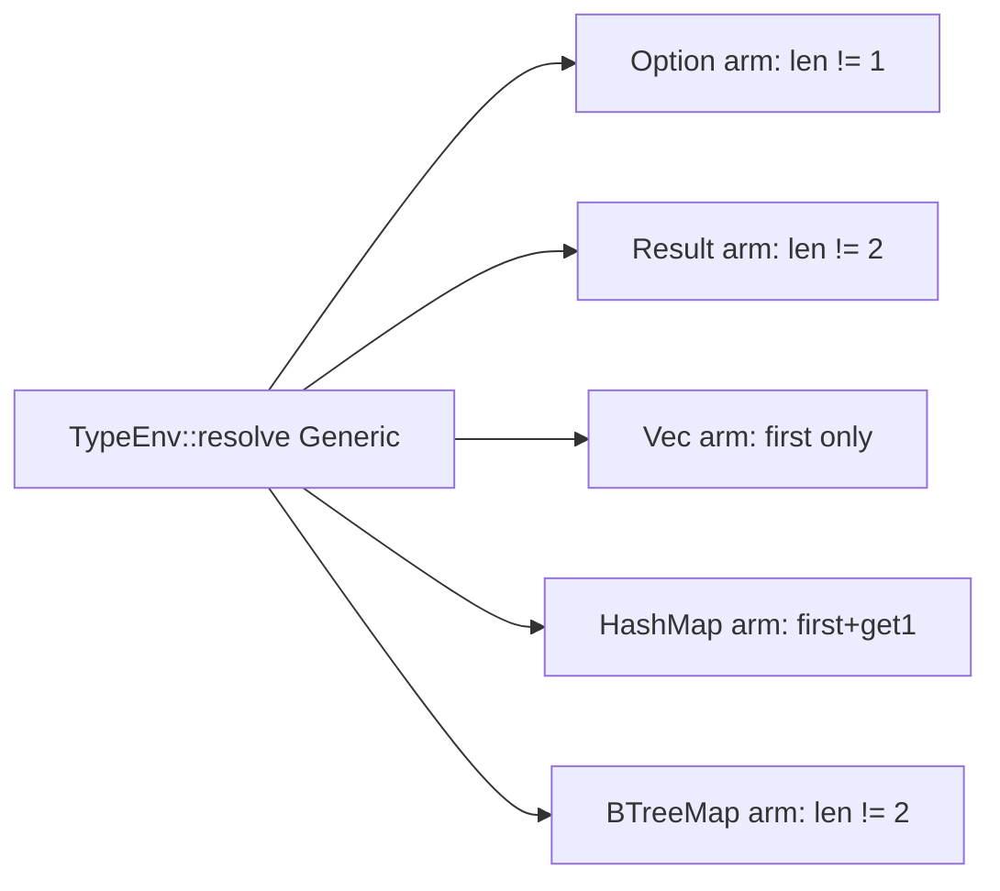

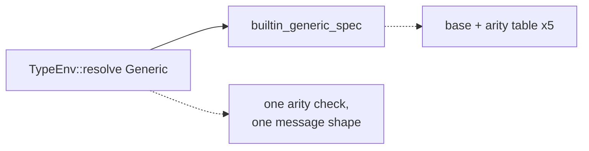

- **Recommendation strength**: **Worth exploring**

---

### negation-verdict — one unsigned-negation rule · Worth exploring · score 20/25

- **Files**: `vow-types/src/check.rs:2161-2183` (`UnaryOp::Neg` arm) and `:1696-1710` (the
  `UnaryOp{Neg}` branch of `check_integer_literal_range`). **File-count estimate: 1.**
- **Score**: 20/25 (leverage 3, locality 4, blast radius 1, heat 5)
- **Problem**: the rule is encoded twice with byte-identical message text
  (`"unary negation is not allowed on unsigned type ..."` at both `:1702-1706` and `:2165-2167`),
  and the two sites already disagree on recovery (`:1707` recurses into the operand, `:2170` returns
  `Ty::Unit`). The `Unsigned` branch of the `:2161` arm has no test —
  `unary_neg_numeric_ok` (`:4259`) and `unary_neg_non_numeric_error` (`:4271`) cover the other two.
- **Deletion test**: concentrates.
- **Solution**: `enum NegVerdict { Unsigned, NonNumeric, Ok(Ty) }` +
  `fn negation_verdict(operand_ty: &Ty) -> NegVerdict`, total over `&Ty`. Both call sites match and
  keep their own diagnostic and recovery.
- **Rescore**: 20/25, unchanged from the 2026-09-16 firing, but the *justification* is now stronger:
  the earlier card described a single-site extraction; there are two sites with a duplicated message.
- **Before / After**:

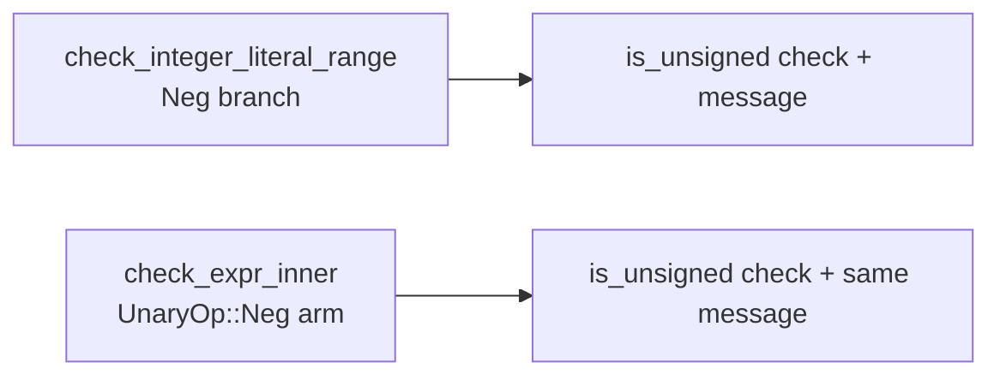

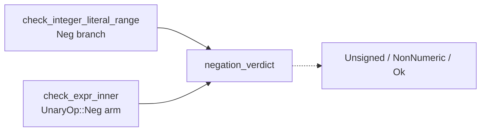

- **Recommendation strength**: **Worth exploring**

---

### Remaining candidates, carded in the backlog

Scored and merged into `.architecture/backlog.md` without full cards — none is within 1 point of the
pick, and each is either a carry-forward or a lower-leverage variant of a shape above.

| Candidate | Score | Note |
|---|---|---|
| `unwrap-payload-ty` | 20/25 | **Re-scoped**: three sites, not one — `lower/mod.rs:4206-4214`, `:3264-3284`, `:4022-4030`. The `?`-desugar site omits the `variant_payload_ty` consult the other two make. Extraction must preserve that asymmetry, not silently fix it. |
| `hidden-region-store-targets` | 19/25 | `cranelift_backend.rs:214-259`; `hidden_region_idx_for_store_target` re-inlines `hidden_region_store_targets`' collect/sort/dedup. Exact twin of the shim's landed `hidden_region_count`. |
| `contracts-clause-status-precedence` | 19/25 | `vow/src/contracts.rs:98-186`; the vacuous-override precedence has no unit coverage and cannot be tested without installing ESBMC. Heat 2. |
| `ce-trace-reconstruction` | 18/25 | `vow/src/counterexample.rs:331-356` and `:357-381` (drifted +4 from the card). 98 lines of test scaffolding for 8 assertions about two total pure loops. |
| `ce-diagnostic-shaping` | 18/25 | `vow/src/verify_outcome.rs:221-289`; total pure `counterexample_diagnostic(&StructuredCounterexample) -> Diagnostic`. Altitude win; tests already exist and carry over unchanged. |
| `c-source-variant-spec` | 18/25 | `vow-verify/src/esbmc.rs:573-661`; three siblings sharing a 9-line body, differing only in a guard and two positional booleans. |
| `oversized-chunk-path-predicate` | 17/25 | Re-verified at `vow-runtime/src/lib.rs:1011` and `:1237` (drifted −9). New evidence: the two sites have *different* overflow protection, and `:1237`'s safety rests on a non-local argument about `__vow_arena_alloc` running first. |
| `esbmc-ce-description-heuristic` | 16/25 | **Moved back to `proposed`** — see *Dropped* below. |
| `artifact-path-naming` | 16/25 | Three inline naming policies (`main.rs:501-505`, `:771-783`, `replay.rs:504-517`), zero unit coverage; the replay `cleanup` closure must enumerate exactly what the naming produced. |
| `builtin-receiver-kind` | 17/25 | Re-anchored to `check.rs:2383-2395` + `:2438-2454`. Now demonstrably redundant: `:2446`/`:2449` re-derive Option/Result with fresh `matches!` instead of reusing `is_option_or_result` computed 50 lines above. |
| `arm-pattern-support-classifier` | 20/25 | Re-anchored to `check.rs:3167-3225`. Cleanest pure shape in `check.rs`, but no defect behind it. |
| `narrow-shift-findings` | 20/25 | Re-anchored to `check.rs:2084-2115`. Best-pinned candidate in the file (8 existing tests). |
| `call-argument-coercion-action` | 19/25 | **Rescored 21→19.** New evidence: there is no shared crate for a `CoercionAction` type — `vow-clif-shim` depends on `vow-linker` + cranelift, `vow-codegen` on `vow-ir`. Extraction yields two hand-synced copies, buying none of the cross-crate agreement that is its only point. |
| `comparison-operand-verdict` | 18/25 | Carried forward; confirmed not pure (reads `self.nonneg_casts`). |
| `builtin-function-spec` | 18/25 | **Re-anchored** from `check.rs:2082-2151` (now the bitwise/shift arms) to `:2212-2240` + `:2241-2281`. |
| `recover-unknown-name-prologue` | 18/25 | **Re-anchored, 5 sites not 4**: `check.rs:1991-2005`, `:2285-2304`, `:2455-2470`, `:2503-2521`, `:2900-2916`. |
| `hint-candidate-capping` | 17/25 | **Fresh.** `check.rs:2503-2509` filters-then-takes in declaration order while `env.rs:66-96` `sorted_capped_keys` picks lex-smallest via a bounded max-heap. Two policies feeding one "did you mean" surface. |
| `const-item-literal-spec` | 17/25 | **Fresh.** `check.rs:1268-1344`; duplicated type check and duplicated "must be a literal" rejection; **no existing tests**, so the red step is larger. |
| `enum-payload-slot-index` | 17/25 | **Fresh.** `Some/Ok → slot 0, Err → slot 1` encoded at `check.rs:1790-1794`, `:3327-3338`, `:3420-3437`, and implicitly `:416`. |
| `cast-plan` | 17/25 | **Fresh.** `lower/mod.rs:4044-4105`; total and pure, but one call site and no cross-backend twin. |
| `driver-command-epilogue` | 16/25 | **Fresh.** `main.rs:726-735` / `:813-823`, plus `:539-570` / `:600-637`. Sibling-epilogue dedup, not a verdict seam. |
| `coerce-context-argument-epilogue` | 18/25 | **Downgraded from 21.** The policy (`can_context_coerce`, `check.rs:263-286`) is *already* pure; what repeats is sequencing, and the message differs at every site. The honest extraction is a `&mut self` helper, not a seam. Site count corrected to 5 loop-shaped + 3 single-value + 2 near-misses on a different predicate. |
| `literal-marker-propagation` | 15/25 | **Fresh, high value, high cost.** `check.rs:1674-1737` and `:1739-1801` are mutually-recursive `&mut self` walkers whose traversal rules silently diverge — the first descends blocks via `integer_marker_from_block`, the second via raw `block.trailing_expr`. Blast radius risk is in the restructure, not the file count. |
| `builtin-method-spec` (self-hosted mirror) | n/a | `compiler/lower.vow:3810/3826/3949/3967` carries the same arms. Not edited: the Rust change is behaviour-preserving, so no new drift. |

## Dropped

| Candidate | Dropped because |
|---|---|
| `solver-classify-function` | Already a pure, unit-tested seam (`test_classify_*`). No shallowness to remove. Re-checked 2026-09-18: unchanged. |

**`esbmc-ce-description-heuristic` is no longer dropped.** It was excluded on 2026-08-31 with the
reason *"Inert — the only caller destructures `Failed(_)` and discards the description"*, and that
reason was re-affirmed without re-verification on 2026-09-03, 09-11 and 09-16. It is false. The
description at `vow-verify/src/esbmc.rs:170-175` is live on three surfaces:

1. `esbmc.rs:907` wraps it into `VerificationResult::Failed(ce)`;
2. `vow/src/verification.rs:190` clones it into `VerifyOutcome::Failed { description, .. }`, which
   reaches `vow/src/report.rs` and is serialized as the public `counterexample` JSON field
   (asserted at `vow/src/main.rs:2893`);
3. `vow/src/cache.rs:237` persists it into the on-disk verify-failure record, with a round-trip
   assertion at `:476` — so it is part of a cache file format.

The heuristic is a three-keyword `||` disjunction with a fallback string, feeding a public JSON
field and a cache record, with **zero direct test coverage** (all ten tests calling
`parse_esbmc_output` assert `vow_id` / `values` / `block_visits` / `arith_overflow`, never
`description`). Status moves to `proposed` at 16/25 (leverage 2, locality 3, blast radius 1, heat 4).
This is the `dropped`-is-reversible rule in `ranking.md` working as intended.

## Too large to automate

| Candidate | Why |
|---|---|
| `clif-shim-region-parity` | Blast radius 4 — gives `vow-codegen` parity with the shim's tested `hidden_region_count` / `hidden_region_for_store_target` seams across a crate/tier seam, ~20+ files. Re-checked 2026-09-18: still large. |
| `division-abort-spec` | Blast radius 4 — the "zero divisor aborts; signed div also aborts on `MIN/-1`" policy is triplicated across `vow-codegen`, `vow-verify` and `vow-runtime`. A human should schedule it. The unverified soundness asymmetry noted in the 2026-09-04 report still stands. |

## Pick

**`builtin-method-spec`, 22/25.**

**The pick was close — three runners-up sit at 21/25**, one point behind:
`vec-reserve-next-capacity-seam`, `arena-variant-rule`, and `esbmc-auto-timeout-policy`. The nearest
runner-up **candidate** by the deterministic tie-break is `vec-reserve-next-capacity-seam`
(equal blast radius 1, equal-or-lower heat, and `vow-runtime/src/lib.rs` was last touched
2026-09-14 against `lower/mod.rs`'s 2026-09-16). Any of the three is a reasonable next firing.

Why `builtin-method-spec` won on the rubric:

- **Leverage 4 vs the field.** Eighteen of 25 arms collapse. `arena-variant-rule` collapses 22 arms
  but into the crate with the weakest verification story; `vec-reserve-next-capacity-seam` collapses
  three sites; `esbmc-auto-timeout-policy` collapses two.
- **Heat 5 — the only candidate at 5.** `lower/mod.rs` was touched two days ago, by PR #1290, which
  extracted the *sibling* `builtin_result_tag` seam from this same file. The area is actively being
  deepened; this is the next table in the same idiom.
- **Lowest risk at equal blast radius.** A `vow-ir` change is checked by the IR-shape `#[cfg(test)]`
  assertions in `lower/mod.rs` *and* the 213-program `tests/run/` corpus. `arena-variant-rule`, at
  the same nominal blast radius, produces stage-0 `vowc1` directly and has only the bootstrap triple
  to catch a regression.
- **Purely behaviour-preserving.** `esbmc-auto-timeout-policy`'s two spellings already differ, so
  unifying them requires deciding which is correct — a fork the autonomy contract reserves for a
  human. `builtin-generic-arity-spec` likewise changes behaviour (it would start rejecting
  `Vec<i64, bool>`). This candidate changes no emitted IR.

One correction to a prior firing's framing, recorded because it affects future scoring: the
bootstrap fixed point is `sha256(vowc2) == sha256(vowc3)`, both produced by the **self-hosted**
pipeline (`scripts/bootstrap.sh:224-225`). `vow-codegen` produces only stage-0 `vowc1`, so a
behaviour-preserving `vow-codegen` refactor changes `vowc1`'s bytes and the fixed point still holds.
The real risk axis there is that a silent stage-0 miscompile corrupts every downstream stage with no
IR-level diff to catch it — which is why `arena-variant-rule` is ranked below an equal-scoring
`vow-ir` candidate, but *not* because bytes must match.

## Design

Produced with `codebase-design`'s **design-it-twice** pattern: four sub-agents in parallel, each
briefed to commit fully to one philosophy. All four were written here before adjudication.

**Correction applied during the design pass**: the enclosing function is `lower_expr`
(`vow-ir/src/lower/mod.rs:1405`), not `lower_expr_inner`. Fixed above and in the backlog.

**Fact that moved the design**: `String::parse_i64` (`:3642-3652`) and `String::parse_u64`
(`:3653-3663`) are *zero-argument* calls whose results are tagged `inst_struct_type = "Option"`. A
design that hangs the result tag off the one-argument row cannot express them; a design that factors
the result orthogonally to arity tables them as ordinary rows. That is **20 of 25 arms**, not 18 —
the candidate card's estimate was conservative.

### Design A — minimal surface

`enum MethodArg { Absent, Consumed, ConsumedOrZero, Unconsumed }` plus
`fn builtin_method_spec(recv, method) -> Option<(&'static str, Ty, MethodArg, Option<&'static str>)>`.
Two names total, one line per row; the applier is ~26 lines inlined at the call site, not a function.

*Hides*: the emission recipe, the missing-argument protocol, the consumption decision, the
result-tagging protocol, dispatch precedence, symbol spelling.
*Dependencies*: two `&str` in, four `Copy` values out. Nothing else crosses.
*Trade-offs (its own account)*: the 4-tuple is positional and sits near `clippy::type_complexity`'s
budget — a fifth slot fails `-D warnings`, so the next asymmetric method forces a migration to a
struct. `MethodArg` conflates arity, consumption and fallback onto one axis, so it cannot express a
combination that does not already exist. The inlined applier ships three visibly near-duplicate
`operands.push` branches that a reviewer will want to fold — and folding them re-hides the
asymmetries the table exists to expose. Tables 18 arms: `parse_i64`/`parse_u64` are unreachable,
because `Absent` carries no room for a result tag.

### Design B — maximum flexibility / uniform spec

Six named types (`ArgLowering` with 5 variants, `MissingArg`, `ArgSpec`, `ResultTag`, `ResultSpec`,
`MethodSpec`) over a positional `args: &'static [ArgSpec]`, plus an applier, three private helpers,
six shorthand constants and two `const fn` constructors. Tables **24 of 25 arms** — everything but
`unwrap` — by giving the spec a vocabulary for map-key / map-value / vec-element argument lowering.

*Hides*: the most of any design, including `known_map_argument_ast_types` and the `Vec::push`
wide-literal prelude.
*Trade-offs (its own account, and unusually candid)*: **~115 lines of machinery must be read before
the first row can be written**, against ~35 for a narrow spec. Four of five `ArgLowering` variants
serve one or two rows each — *"a variant with one user is a renamed `if`"* — and
`ConsumedAsVecElem` is named for a shape but carries `push`-specific knowledge. The type system does
not bound the table: four arguments on a one-argument extern compiles. Worst, it *confers intent on
accidents* — `HashMap::insert`'s `ConstUnit` fallback for a missing key is inherited nonsense that
reads as a decision once tabled. It also widens the shape gap with `compiler/lower.vow` more than
any other design, making the recurring equivalence review harder.

### Design C — shape-variant enum (make illegal states unrepresentable)

```rust
enum ArgMode { Consumed, Borrowed }
enum MissingArg { Unit, ZeroI64 }
enum MethodResult { Scalar(Ty), TaggedPtr(&'static str) }
enum MethodLowering {
    NoArg  { symbol: &'static str, result: MethodResult },
    OneArg { symbol: &'static str, result: MethodResult, mode: ArgMode, missing: MissingArg },
}
fn method_lowering(recv_struct: Option<&str>, method: &str) -> Option<MethodLowering>
fn emit_method_lowering(ctx, lowering, recv_id, args, span) -> InstId
```

Two tiers — `typed_receiver_lowering` then `.or_else(any_receiver_lowering)` — making the
receiver-specific-before-Vec precedence *structural* rather than positional.

*Hides*: the emission ritual, the missing-argument dance, which lowering entry point to call, that a
`Ty::Ptr` result needs a `pin_to_root` tag, that the Vec methods are a fallthrough tier, and — in a
doc comment — that `tag_builtin_result` is the **wrong** helper here, because its `OptionOf` arm
also writes `inst_option_elem_ty`, which this call site has never written.
*Deliberately does not hide*: the three asymmetries are each a named variant occurring exactly once
(`Borrowed`, `ZeroI64`, `TaggedPtr`), so `grep -c` becomes a correctness argument.
*Trade-offs (its own account)*: ~6 lines per row instead of 1, roughly +60 lines across the table —
a reader scanning for one method pays for that. Four of five nonsense classes are excluded; the leak
is `Scalar(Ty::Ptr)`, an untagged heap handle, still writable. `emit_method_lowering` re-admits at
the interpreter boundary what the enum excluded at the table (it takes `args` even for `NoArg`).
Arm-order safety is asserted by test, not by type.

### Design D — optimised for the most common caller (single adapter)

A new `vow-ir/src/lower/builtin_method.rs` exporting exactly one item,
`pub(super) fn lower_uniform_builtin_method(ctx, recv_struct, method, args, recv_id, span) ->
Option<InstId>`. The spec table and its types are private to that module; the call site becomes
`if let Some(id) = ... { id } else { match ... /* inline arms */ }`.

*Hides*: that a spec table exists at all.
*Trade-offs (its own account)*: **`&mut LowerCtx` on the interface means the interface is not the
test surface.** It tests *past* its own interface, against a private `uniform_method`. It argues
correctly that `codebase-design` licenses internal seams — but that is a license, not an
endorsement, and a design that publishes the spec gets the property for free. Six parameters, one
below `clippy::too_many_arguments`. And it *hides something a reviewer wants visible*: the three
asymmetries are the strongest evidence this code has drifted, and D moves them behind a privacy
wall.

### Adjudication

Criteria, in the order `pm-deepen` fixes them: **depth**, **locality**, **seam placement**, **test
surface**, **blast radius**.

**A correction made during adjudication, recorded because it changed the winner.** The first pass
scored Design C above Design A on *depth*, on the grounds that only C could table
`parse_i64`/`parse_u64`. That is wrong, and Design A's own report is where the error came from: A
claims those arms are unreachable because `MethodArg::Absent` "carries no room for a result tag".
But A's result tag is the **fourth tuple slot**, independent of `MethodArg` — the row

```rust
(Some("String"), "parse_i64") => ("__vow_string_parse_i64_opt", Ty::Ptr, Absent, Some("Option")),
```

types fine, and A's applier emits `vec![recv_id]` → `Call`/`Ty::Ptr`/`CallExtern` → the
`inst_struct_type` insert, which is byte-identical to `:3642-3652`. **Both A and C table 20 arms.**
With that gap closed the ranking inverts.

**Winner: Design A (minimal surface), with the table extended to 20 arms.**

1. **Depth — tie.** Both table 20 of 25 (18 uniform + `parse_i64`/`parse_u64`). B tables 24 but pays
   ~115 lines of vocabulary for the last four, and its own report concedes four of its five
   `ArgLowering` variants have one or two users — *"a variant with one user is a renamed `if`"*.
   Depth is behaviour per unit of interface *learned*; B adds interface faster than behaviour.
2. **Locality — narrow edge to C.** C's two-tier `typed_receiver_lowering().or_else(any_receiver_
   lowering)` makes the receiver-specific-before-Vec precedence structural, where A leaves it as arm
   ordering a reader must notice. Real, but it is one `match` in one function either way, and A
   pins the same precedence with a test.
3. **Seam placement — tie between A and C, decisive against B and D.** A and C place the identical
   seam: `(receiver struct tag, method name)` → lowering shape, a pure function of two `&str`. B
   draws its seam around argument-lowering *protocols*, four of which have one adapter each — by
   `codebase-design`'s own rule, *one adapter is a hypothetical seam, two is a real one*. D draws
   its seam around the whole adapter, which is defensible, but the thing that actually varies then
   sits behind a privacy wall.
4. **Test surface — tie between A, B and C; decisive against D.** *"The interface is the test
   surface"* — D's interface takes `&mut LowerCtx`, so its valuable assertions are made against a
   private `uniform_method`, i.e. by testing past its own interface. A, B and C all expose a pure
   two-`&str` lookup. The whole-table properties C advertises ("`contains` is the **only** borrowing
   row") are equally assertable under A: `MethodArg::Unconsumed` occurs once, and A's own test 3
   asserts exactly that.
5. **Blast radius — A wins.** A adds two names (one enum, one function). C adds four types and
   roughly +60 lines of vocabulary and per-row literals to describe the same 20 behaviours. With the
   first four criteria at a tie or a narrow edge, this decides it — and it is the criterion this
   repo's `CLAUDE.md` restates independently: *"when a module's interface is nearly as wide as its
   implementation, collapse it"*, and *"many small changes beat one large change"*.

C's conceded structural flaw reinforces the order rather than deciding it: `emit_method_lowering`
takes `args` even for `NoArg`, so the nonsense the enum excludes at the table is re-admitted one
layer down at the interpreter. A has the same 2×2 branching, but inline at the call site, where it
does not masquerade as a checked signature.

**Runner-up design: Design C (shape-variant enum).** It loses on blast radius after tying on depth,
seam placement and test surface. Its genuine advantage — precedence expressed as two tiers rather
than as arm order — is worth revisiting if the table outgrows one screen.

**Adopted from the losers.** From D: the load-bearing *"the table must never claim an arm the call
site handles inline"* test. Hoisting the table above the residual `match` re-sequences it ahead of
arms that used to precede it, and that test is the only guard; C's sketch independently names it its
highest-value test too. It is written first, red. From C: the doc-comment warning that
`tag_builtin_result` is the **wrong** helper here — its `OptionOf` arm also writes
`inst_option_elem_ty`, which this call site has never written, so reusing it would change emitted
metadata. From B: the explicit IR-identity audit, carried into the PR body as a checklist.

**One open question deliberately left to the gate.** A's report warns that
`Option<(&'static str, Ty, MethodArg, Option<&'static str>)>` sits near `clippy::type_complexity`'s
default budget. That is A's own estimate, not a measurement. `cargo clippy --all -- -D warnings` is
already part of this repo's quality gate and settles it; if the lint fires, the tuple becomes a
named four-field struct and this note records why. Restructuring pre-emptively around a guess would
be the wrong order.

**Scope.** Implement the 20 tabelable arms. The five that stay inline — `substring` (two arguments),
both `insert`s (map argument-type lookups), `push` (wide-literal narrowing), `unwrap` (delegates to
`lower_unwrap`) — each need something the table cannot carry without becoming Design B.

**Adjudicated with the advisor**, which is what surfaced the depth error above.

## Implementation result

Landed as Design A with the table at 20 rows.

**Test-first.** The four unit tests were written first and seen to fail — 26 compile errors,
`builtin_method_spec` and `MethodArg` not found — then made to pass. The load-bearing one is
`builtin_method_spec_declines_the_arms_lowered_inline`, adopted from Design D: hoisting the table
above the residual `match` re-sequences it ahead of arms that used to precede it, and that test is
the only guard. It asserts `None` for every inline method name against all seven receivers the table
otherwise recognises.

**Quality gate** (each step a separate command, never `&&`-chained):

| Step | Result |
|---|---|
| `cargo build -j6 --all` | pass |
| `cargo clippy -j6 --all -- -D warnings` | pass |
| `cargo test -j6 --all` | **1676 passed, 0 failed** |
| `cargo fmt --all --check` | clean |

**The open question is settled empirically.** `clippy::type_complexity` does **not** fire on
`Option<(&'static str, Ty, MethodArg, Option<&'static str>)>`. Design A's report flagged this as a
risk on its own estimate; the gate measured it. No migration to a named struct is needed, and the
tuple stays.

**IR identity, verified differentially.** The pre-change compiler was built from `HEAD~1` in a
scratch checkout and both binaries were run over the whole `tests/run/` corpus with
`build --dump-ir --no-verify`:

```
identical=212   DIFFERENT=0   skipped=1
```

The one skipped program, `tests/run/u64_marker_propagation.vow`, fails type-checking identically on
**both** compilers (`error[TypeMismatch]` at `:413`) and so never reaches IR emission — a
pre-existing condition in this tree, unaffected by this change.

**Diff size against the estimate.** The card estimated ~250 lines removed / ~120 added plus ~60 test
lines. Actual: **430 added / 384 deleted in 1 file** (file-count estimate exact). About 262 of that
814-line churn is the five kept arms being re-indented one level into the new `else` block, counted
on both sides; net change is **+46 lines**. Excluding the re-indent, real churn is ~552 lines against
~430 estimated — a 28% overshoot, well inside the 2x bail-out threshold, and driven by the table
growing from the estimated 18 rows to 20.

**`CONTEXT.md`**: not created. This repo has none, and the concepts the seam is named after —
*builtin method*, *receiver*, *lowering* — are already defined in `docs/spec/grammar.md`. Creating a
glossary solely to restate them would be noise.
