# Architecture review — vow — 2026-09-21

**Scope**: hot spots inferred from the last 120 commits (`vow-types/src/check.rs` 28 commits/90d,
`vow-codegen/src/cranelift_backend.rs` 27, `vow-ir/src/lower/mod.rs` 21, `vow-runtime/src/lib.rs` 21,
`vow-verify/src/c_emitter.rs` 16, `vow-verify/src/esbmc.rs` 13, `vow-ir/src/region.rs` 11), scanned by
two parallel sub-agents against the 40-odd candidates already carded in `.architecture/backlog.md`.
`CONTEXT.md` does not exist in this repo; domain vocabulary is taken from `CLAUDE.md` and
`docs/spec/`. ADRs 0001–0003 were read; none is contradicted by the pick.

**Picked**: `narrow-literal-context-admission` — see `.architecture/backlog.md`
**Degradations**: none. `gh` authenticated, sub-agents available, advisor available.

**Diagram legend**: solid edges are the interface a caller must learn; dashed edges are inside the
implementation.

## Candidates

### narrow-literal-context-admission — one narrowing-admission rule, spelled seven ways · Strong · score 22/25

- **Files**: `vow-ir/src/lower/mod.rs` — the admission predicate at `:1698-1701` (binop operand),
  `:1796-1806` (call argument), `:2125-2135` (assignment to ident), `:3538-3541` (match-result Phi
  re-narrow), `:4598-4602` (`lower_narrow_literal`'s own gate), `:4723-4739` (`let` with a type
  annotation, as an 8-branch `if/else` over type-name strings), `:4961-4964` (fn trailing return).
  13 call sites of `lower_narrow_literal` (`:4597`). **File-count estimate: 1.**
- **Score**: 22/25 — leverage 4, locality 4, blast radius 1, heat 5
  - *Leverage 4*: seven sites stop restating the membership and one deeply-nested caller
    (`lower_narrow_literal`, which already self-gates) stops being second-guessed by four redundant
    pre-filters that silently disagree with it.
  - *Locality 4*: changing the narrowing policy today means finding and editing seven `matches!`
    lists and an `if/else` chain scattered over 3,200 lines; afterwards it is one table.
  - *Blast radius 1*: contained — one file, no published interface changes. `lower_narrow_literal`
    is a private free function; `NarrowContext` would be private to the module.
  - *Heat 5*: `lower/mod.rs` is 21 commits in 90 days, last touched 2026-09-18 (three days ago) by
    the `builtin_method_spec` seam. **This cell is load-bearing**: at heat 4 the candidate scores 21
    and `loop-scope-break-policy` wins outright. Heat 5 is the same grade the 2026-09-18 firing gave
    this same file on the same evidence, so the rubric stays deterministic across firings.
- **Problem**: the question *"must a value of type `T` be re-lowered at its native narrow width
  here?"* is answered in seven places, in three mutually incompatible ways. Four sites spell an
  **8-type** list that omits `U64`; two spell a **9-type** list that includes it; one spells the
  8-type set as an `if/else` chain over `&str` type names, duplicating the `&str -> Ty` map that
  already exists at `:691-724` as `scalar_ty_for_field_type_name`. The interface is as complex as
  the implementation: every caller must know the membership to call the function correctly, even
  though the function already self-gates.
- **Deletion test**: **concentrates.** Deleting the seven inline spellings in favour of one table
  removes the ability to disagree about `U64` at a distance. Deleting `lower_narrow_literal` itself
  would scatter the marker-relowering machinery back to 13 sites — it is already deep; the shallow
  part is the admission predicate wrapped around it.
- **Divergence the table makes visible**: `U64` is handled three ways in one file.
  - *Rejected before the call* at `:1700`, `:1805`, `:2134`, `:3540` — `U64` is simply absent.
  - *Admitted, then conditionally escaped* at `:4600`, by a `U64`-specific guard at `:4604-4611`
    that yields to an explicit `wide_literal_contexts` entry.
  - *Admitted outright* at `:4961-4964` (fn trailing return) and at the nine call sites that
    pre-filter nothing at all.

    So a `u64` **binop operand, call argument, assignment RHS or match arm** is never re-narrowed,
    while a `u64` **trailing return, field-set value, vec-element write and `?`-result** all are.
    The `wide_literal_contexts` escape shows the *intended* policy is "`U64` is admitted but yields
    to an explicit wide context"; the four 8-type pre-filters predate that escape and were never
    updated. This review does **not** change that behaviour — the table reproduces today's
    per-context membership row for row, turning an accident of omission into a reviewable row.
- **Solution**: a pure, context-keyed seam answering the one question, with the four pre-filtered
  contexts and the unfiltered default as explicit rows; the `let` chain composes the existing
  `scalar_ty_for_field_type_name` with the same seam instead of hand-rolling a second name map.
  `lower_narrow_literal` keeps its `wide_literal_contexts` escape and its marker re-lowering; the
  `Shl`/`Shr` right-operand exception at `:1702-1704` stays at the call site, being an operand rule
  rather than a type rule.
- **Benefits**: **leverage** — one row per context replaces seven restatements, and a new narrow
  type is added once rather than seven times. **Locality** — the `U64` question is decided in one
  place, so the next firing that asks "should a `u64` call argument re-narrow?" edits one row.
  **Test surface** — the admission rule becomes directly unit-testable as a pure function; today it
  can only be reached by lowering a whole `FnDef` and inspecting the emitted IR, which is why the
  `u8` and `u64` rows of the existing table test `integer_literals_lower_at_their_native_ir_width`
  (`:6002-6069`) are missing and the `U64` divergence went unnoticed.

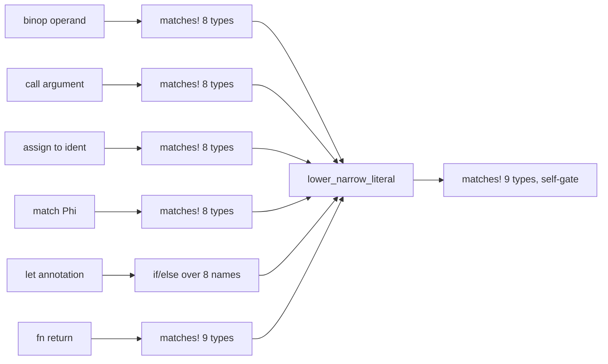

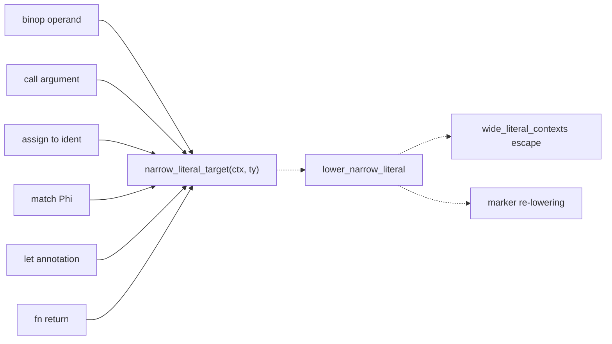

### loop-scope-break-policy — three loop arms, one of them forgets the break stack · Strong · score 22/25

- **Files**: `vow-types/src/check.rs:2671-2686` (`While`), `:2687-2718` (`ForEach`), `:2719-2755`
  (`Loop`); consumers `:2756-2784` (`Break`), `:2785-2794` (`Continue`); state at `:980` (`in_loop`)
  and `:983` (`break_types_stack`). **File-count estimate: 1.**
- **Score**: 22/25 — leverage 4, locality 4, blast radius 1, heat 5
  - *Leverage 4*: three arms simplify and the `Break`/`Continue` consumers stop reaching past the
    seam into two raw fields whose push/pop pairing nothing enforces.
  - *Locality 4*: loop-scoping policy becomes one table plus one applier that owns push/pop
    symmetrically.
  - *Blast radius 1*: one file, three arms, private state.
  - *Heat 5*: `check.rs` is the repo's highest-churn Rust file at 28 commits/90d, last 2026-09-14.
- **Problem**: each arm hand-rolls `in_loop += 1` / `break_types_stack.push(..)` / `check_block` /
  pop / `in_loop -= 1`, and the pairing is enforced only by eye. **`ForEach` increments `in_loop`
  but never pushes onto `break_types_stack`** (`:2713-2715`), where `While` pushes `None`
  (`:2680-2684`) and `Loop` pushes `Some(Vec::new())` (`:2723-2727`).
- **Deletion test**: **concentrates.** One applier owning the stack discipline replaces three
  hand-paired push/pop sites.
- **Three wrong behaviours that fall out of the one missing line** (verified, not inferred):
  `loop { for i in v { break 42; } break 7; }` merges `42` into the **outer** `loop`'s result type,
  while `vow_syntax::ast::loop_break_values` (`vow-syntax/src/ast.rs:402`, `:431`) never walks a
  for-each body — so the type checker and lowering (`vow-ir/src/lower/mod.rs:4371`, `:4417`) compute
  different break-value sets for the same program. `while c { for i in v { break 42; } }` blames the
  `while` for a break inside a for-each. `fn f(v: Vec<i64>) { for i in v { break 42; } }` is
  **silently accepted** with no diagnostic, the stack being empty.
- **Solution**: `loop_kind_spec(kind) -> LoopSpec { vow_context, break_slot }` where `break_slot` has
  three rows — `Push(None)`, `Push(Some(vec![]))` and `NoPush` — so today's `ForEach` anomaly is
  preserved *exactly* and becomes a visible, commentable row rather than a missing line. A private
  `with_loop_scope` applier owns `in_loop` and the stack; each arm keeps its own type computation.
- **Benefits**: **leverage** — the stack discipline is written once. **Locality** — the fix for the
  `ForEach` anomaly becomes a one-row edit in a follow-up. **Test surface** — `ExprKind::ForEach`
  appears in `check.rs` only twice outside tests (`:1876`, `:2687`) and in **zero** tests; the buggy
  arm is entirely unpinned today.

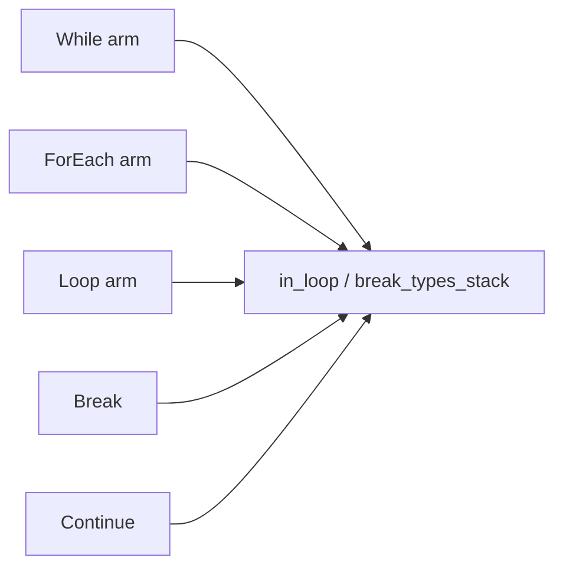

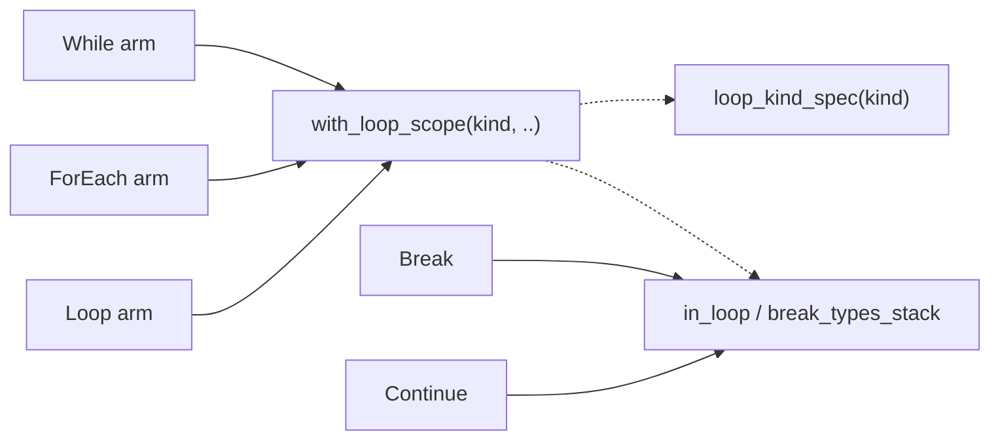

### builtin-arg-layout-spec — one arg-index convention, thirteen restatements · Worth exploring · score 21/25

- **Files**: `vow-verify/src/c_emitter.rs` — five lookup tables at `:218-227`
  (`vec_model_receiver_arg`), `:233-240` (`vec_op_value_arg`), `:296-318`
  (`string_model_receiver_arg`), `:320-326` (`string_model_extra_arg`), `:332-339`
  (`map_model_receiver_arg`); seven inline destructurings inside `emit_inst` at `:1346-1351`,
  `:1413-1418`, `:1452-1457`, `:1474-1479`, `:1489-1494`, `:1588-1594`, `:1613-1619`; and one
  arena-offset closure at `:1704-1714`. **File-count estimate: 1.**
- **Score**: 21/25 — leverage 4, locality 4, blast radius 1, heat 4 (`c_emitter.rs`, 16 commits/90d,
  last 2026-09-02).
- **Problem**: thirteen sites answer "for extern `name`, which `inst.args[i]` is the receiver, the
  stored value, the extra operand" — under one invariant convention (plain symbol ⇒ receiver is
  `args[0]`; `_in_arena` ⇒ arena is `args[0]` and receiver is `args[1]`) that is re-derived by hand
  every time, seven of them as ad-hoc `if name == "..._in_arena" { (1,2) } else { (0,1) }`.
- **Deletion test**: **concentrates** — one row per symbol replaces thirteen hand-derivations.
- **Divergence**: `__vow_vec_pin_to_root_val` is absent from `vec_model_receiver_arg` (`:218-226`)
  while its twin `__vow_string_pin_to_root` **is** present in `string_model_receiver_arg` (`:307`).
  It *is* in `is_vec_model_creator` (`:178`), so its result becomes a `__vow_vec_t`, but
  `collect_typed_vars` (`:366-370`) never marks its source `args[0]`, so `emit_inst` (`:1341-1344`)
  can emit `__vow_vec_t v{id} = int64_t v{source};` — exactly the `int64_t = __vow_vec_t` class this
  file's own comment at `:260-262` cites issue #505 for. Latent: in the common flow the source is
  already a vec creator's result.
- **Solution**: `builtin_arg_layout(name) -> Option<ArgLayout { arena_offset, receiver, value, extra }>`,
  with `emit_inst` using one uniform `let arg = |i| inst.args[layout.arena_offset + i].0`.
- **Benefits**: **leverage** across 13 sites; **locality** — a new `_in_arena` extern is one row
  rather than up to three table edits; **test surface** — the convention becomes assertable without
  building an IR function.

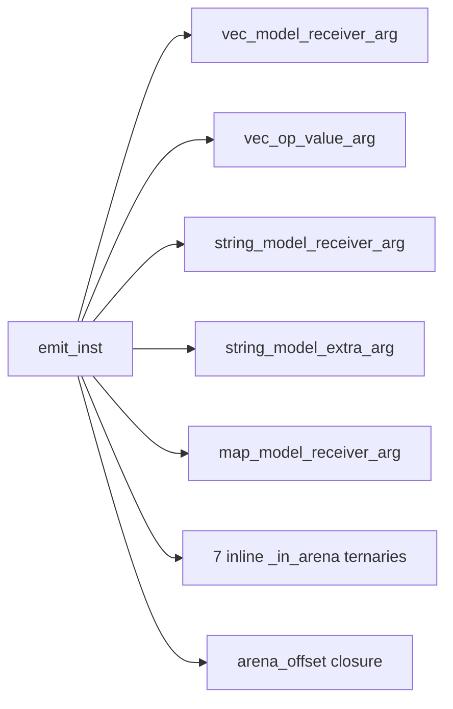

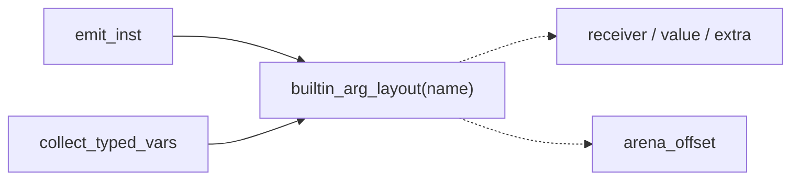

### parse-opt-payload-spec — seven identical Option-havoc arms, one calling an undeclared intrinsic · Worth exploring · score 21/25

- **Files**: `vow-verify/src/c_emitter.rs:1636-1686` (7 arms); the same 9-name set re-spelled at
  `:414-422` (`collect_option_vars`) and `:535-543` (`is_known_builtin`). **File-count estimate: 1.**
- **Score**: 21/25 — leverage 4, locality 4, blast radius 1, heat 4.
- **Problem**: every arm emits the identical three-line skeleton — nondet tag, `assume(tag==0||tag==1)`,
  conditional payload nondet — differing only in `(payload_nondet, Option<min>, Option<max>)`.
- **Deletion test**: **concentrates.**
- **Divergence**: `:1677` emits `__VERIFIER_nondet_ulong()`, which appears exactly once in the repo
  outside its own test. `emit_c_preamble` (`:2950-2972`) declares the 64-bit form as
  `__VERIFIER_nondet_unsigned_long` (`:2966`), which is also what `c_nondet_suffix` (`:2094-2112`)
  says is canonical. Every other unsigned sibling (`u8` `:1649`, `u16` `:1670`) uses plain
  `__VERIFIER_nondet_long()`. Two tests pin the two spellings independently (`:3690`, `:4475`) and
  neither compiles the emitted C, so nothing catches it.
- **Solution**: `parse_opt_model(name) -> Option<OptionParseModel { payload_nondet, payload_range }>`;
  the two other sites ask `parse_opt_model(name).is_some()` instead of re-listing nine strings.
- **Benefits**: **locality** — the undeclared-intrinsic bug becomes a one-cell edit; **test surface** —
  the emitted-C contract is already well pinned (`:4437-4477`, `:4481-4519`, `:3687-3693`).

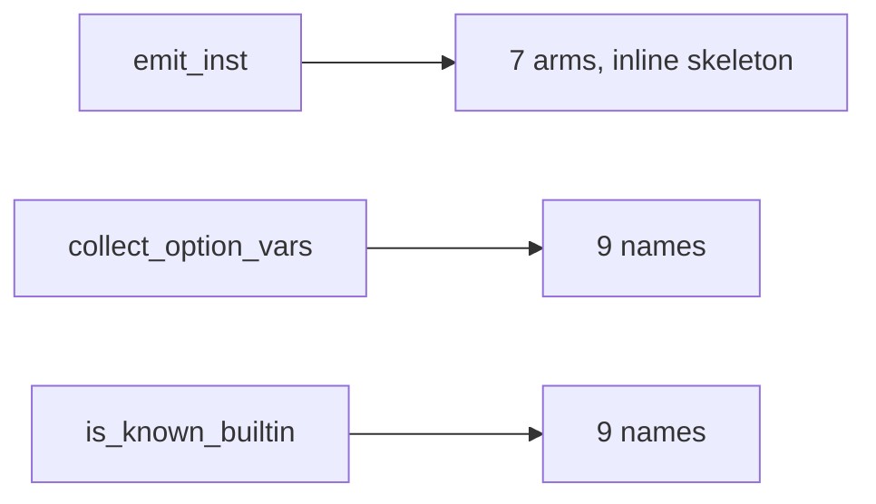

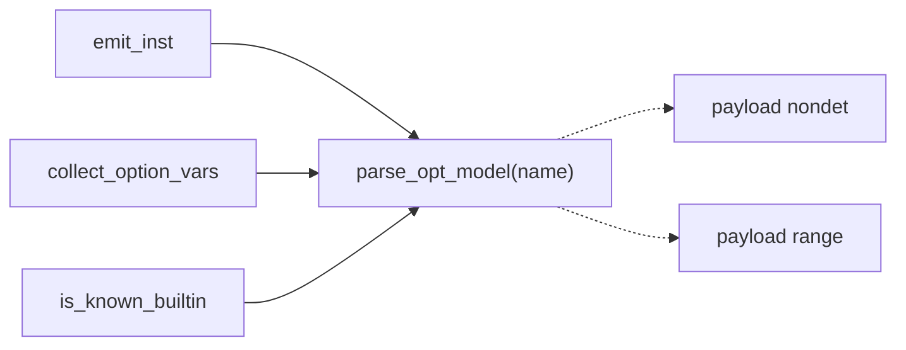

### extern-heap-origin-kind — 36 symbol rows fanned into five predicates, with rows missing · Worth exploring · score 20/25

- **Files**: `vow-ir/src/region.rs:1917-1977` (five predicates plus the `||` chain
  `heap_producing_extern`); consumers `:1694`, `:2029-2048`, `:3049`, `:3195`.
  **File-count estimate: 1.**
- **Score**: 20/25 — leverage 4, locality 4, blast radius 1, heat 3 (`region.rs`, 11 commits/90d,
  last touched 2026-08-17 — five weeks cold, which is what holds it below the two 22s).
- **Problem**: four of the five predicates have no caller other than the `||` chain; the *kind* each
  one establishes is discarded at the join, which is precisely why gaps are invisible.
- **Deletion test**: **concentrates.**
- **Divergences**: `__vow_btreemap_new` is missing from `map_creation_extern` (`:1967-1969`) though
  lowering emits it at `vow-ir/src/lower/mod.rs:3100` exactly parallel to `__vow_map_new` at `:3088`
  — so every `BTreeMap::new()` is classified non-heap. The eight sibling
  `__vow_string_parse_{i8,i16,i32,u8,u16,u32,u64}_opt` symbols are absent from
  `option_creation_extern` (`:1960-1965`), which lists only the `i64` pair.
  `vec_creation_extern` (`:1925`) omits the `_in_arena` variants that `string_creation_extern`
  spells out for all 14 of its families.
- **Solution**: `extern_heap_origin(sym) -> Option<HeapOriginKind>`, one row per family with a
  single `_in_arena` suffix rule; `heap_producing_extern` collapses to `.is_some()`.
- **Benefits**: **locality** — one table to audit against the runtime; **test surface** — a table
  test over the full symbol→kind map, where today only graph-level behaviour is pinned.

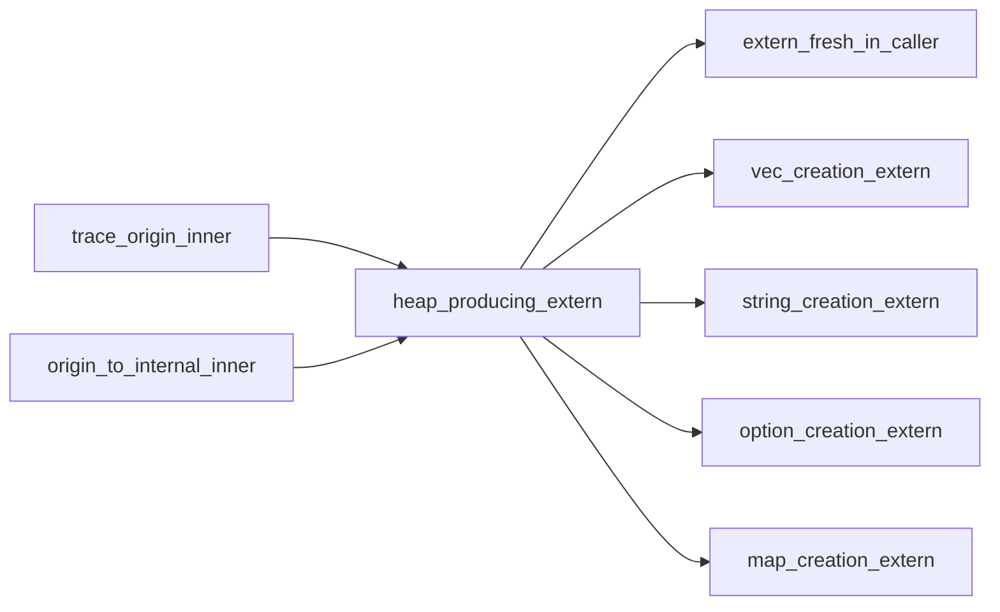

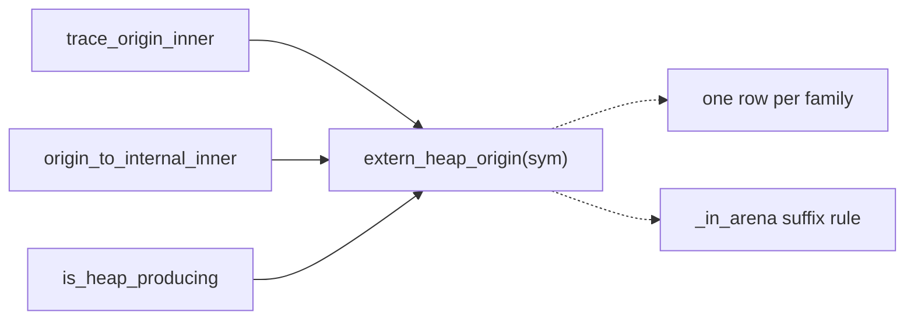

### extern-container-op-spec — the same container convention, five more spellings · Speculative · score 20/25

- **Files**: `vow-ir/src/region.rs:1979-1994`, `:1996-2013`, `:2015-2027`, `:2406-2414`,
  `:2416-2435`. **File-count estimate: 1.**
- **Score**: 20/25 — leverage 4, locality 4, blast radius 1, heat 3.
- **Problem**: five functions each re-derive "which arg is the container, which is the stored value,
  what do we call this operation", under the same `_in_arena`-shifts-by-one convention.
- **Deletion test**: **concentrates.**
- **Divergences**: `__vow_vec_push_val` / `_in_arena` / `__vow_vec_set_val` (`:1981-1983`) are known
  store edges and element writes but appear in **neither** `extern_growth_target` (`:1996-2013`) nor
  `extern_mutation_operation` (`:2015-2027`), while their non-`_val` twins do (`:1998`, `:2017`) —
  so pushing into a rodata-backed `Vec` via `__vow_vec_push_val` escapes
  `check_literal_mutations_post_inference` (`:3358-3414`). Arity guards drift on the identical
  symbol pair: `args.len() >= 3` at `:1984` vs `!args.is_empty()` at `:2007`/`:2010`.
- **Solution**: `extern_container_op(sym) -> Option<ContainerOp { receiver_arg, stored_value_args, label, grows }>`
  with the five functions becoming thin appliers.
- **Benefits**: **locality** and a removable `unwrap_or("container mutation")` fallback (`:3379`)
  that today licenses silent drift between two sets that happen to be equal.
- Marked *Speculative* rather than *Worth exploring* only because it overlaps
  `extern-heap-origin-kind` in the same file: whichever lands first re-anchors the other's lines.

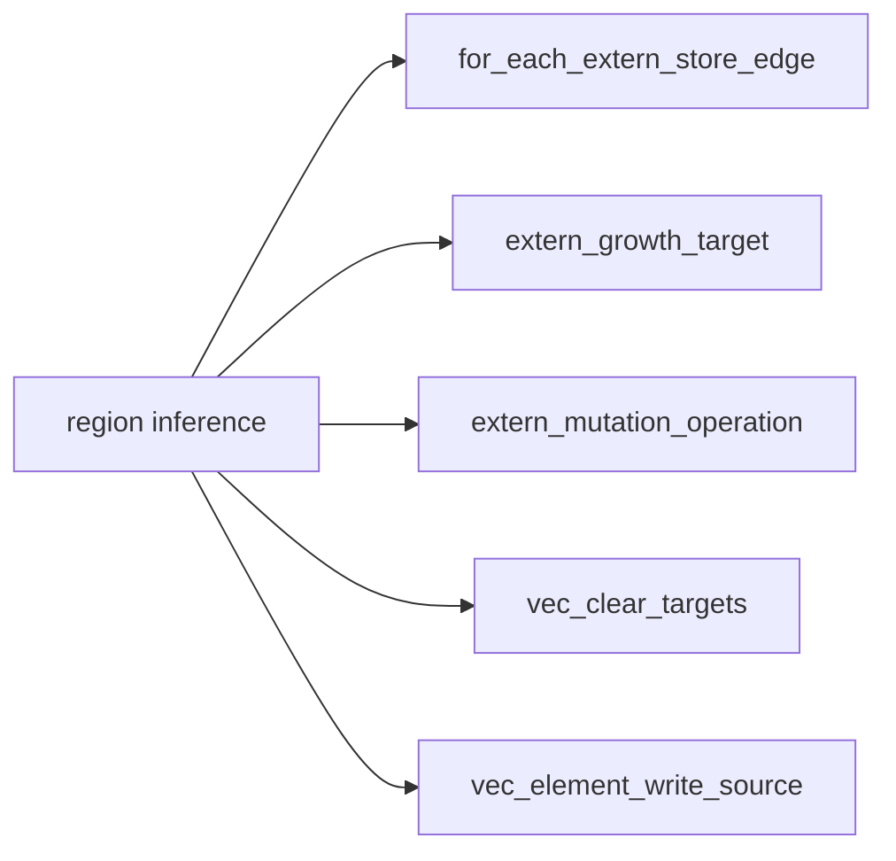

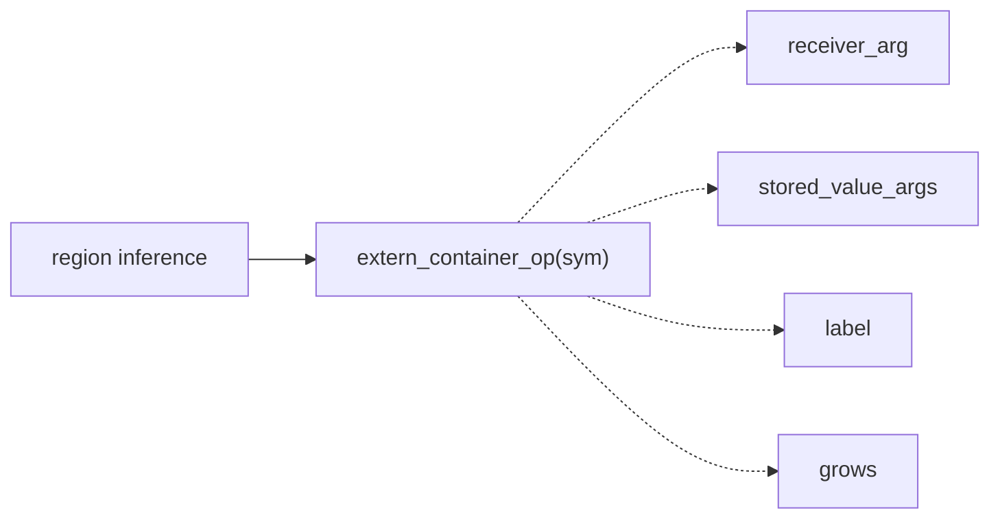

## Dropped

| Candidate | Dropped because |
|---|---|
| `extern-abi-spec-table` (`vow-codegen/src/cranelift_backend.rs:2451-3075`, 132 arms / 625 lines, scored 23/25 before the filter) | **Competes with a recorded architectural direction.** `CLAUDE.md` designates `docs/spec/operations.json` + `scripts/generate_operations.py` as the single checked source of runtime-symbol/ABI facts, splicing `catalogue_extern_sig` into *this very function* between `GENERATE:OPERATIONS` markers (`:2392-2410`), and states that follow-ups #1271–#1275 "should add entries and target files to the existing generator rather than inventing a new mechanism." A hand-rolled parallel Rust table is that invention. Recorded as a **judgement** drop citing that directive — **not** the ADR hard filter, which `docs/adr/0001-0003` do not trigger — so it is reversible once the catalogue absorbs this table. |
| `model-capacity-bound-spec` (`vow-verify/src/c_emitter.rs`, 12 sites) | Leverage 3, score 19/25. The `<`-at-create / `<=`-at-havoc split is coherent-but-undocumented policy, not a defect; the one self-inconsistency (`:1421` `<` vs `:1483` `<=`, both on strings) is a behaviour fork the autonomy contract reserves for a human. |
| `fs-path-arg-prologue` (`vow-runtime/src/lib.rs`, 9 `__vow_fs_*` functions) | Leverage 3, score 19/25. A real 8-line repeated prologue, but the seam is an argument-decoding helper rather than a policy table, and the error sentinel differs per function. |
| `main-help-prologue` (`vow/src/main.rs:826-1084`) | Leverage 2, score ~16/25. Eight byte-identical `--help` prologues, but the seam is a formatting/exit helper, not a policy. Overlaps the existing `driver-command-epilogue` entry. |
| `narrowing-conversion-matrix` (`vow-types/src/env.rs:352-461` vs `vow-ir/src/lower/mod.rs:161-184`) | Leverage 1 — **fails the deletion test.** Both sides were enumerated (27 source→target pairs × 3 modes = 81 names each) with **no live drift**; complexity would move, not concentrate. |
| `method-table-triple` (`vow-types/src/check.rs:337-367`, `:380-420`, `:427-455`) | Already in the backlog under `builtin-method-result-type-seam` (landed), `builtin-receiver-kind` and `builtin-method-arity-check`. |
| `builtin-method-spec` | Already in the backlog — reconciled to `landed` this firing (PR #1299 merged 2026-09-18). |

## Too large to automate

Nothing new this firing. `clif-shim-region-parity` remains the standing blast-radius-4 entry
(re-checked 2026-09-21: still ~20+ files crossing the `vow-codegen`/`vow-clif-shim` tier seam). Its
tractable slice is carded separately as `hidden-region-store-targets` (19/25).

`solver-classify-function` was also re-checked this firing (rubric reconciliation step 4): still a
pure, unit-tested seam with no shallowness to remove. Both `dropped` entries stay `dropped`.

## Pick

**`narrow-literal-context-admission`, 22/25.**

**The pick was close — a tie at 22 with `loop-scope-break-policy`**, broken deterministically by the
rubric: blast radius is 1 for both and heat is 5 for both, so the tie fell to *the candidate whose
files were touched most recently* — `vow-ir/src/lower/mod.rs` on 2026-09-18 against
`vow-types/src/check.rs` on 2026-09-14. `loop-scope-break-policy` is therefore the **runner-up
candidate** and the natural next firing; its `ForEach` anomaly is a live correctness gap and is
worth a bug issue independent of the deepening.

Two further reasons the tie-break lands somewhere defensible rather than arbitrary:

1. **It is purely behaviour-preserving.** The table reproduces today's per-context membership row for
   row, including the `U64` asymmetry. `loop-scope-break-policy` can be made behaviour-preserving too
   (via a `NoPush` row), but its value is mostly in the bug it exposes, which is a human's call to fix.
2. **It sits in `vow-ir`, where the change can be checked differentially.** IR output for the
   213-program `tests/run/` corpus can be diffed against the parent commit — the same verification the
   `builtin-method-spec` firing used. `vow-codegen` and `vow-verify` candidates have no equivalent
   IR-level diff to lean on.

Three carried-over candidates also sit at 21 (`vec-reserve-next-capacity-seam`, `arena-variant-rule`,
`esbmc-auto-timeout-policy`) and are unchanged from the 2026-09-18 firing; all remain `proposed`.

**Rust-only, as with every prior firing.** `compiler/lower.vow` mirrors the same `let`-annotation
chain at `:4867-4888` and calls its own `lower_narrow_literal` at `:2108`. Because this change is
behaviour-preserving, leaving the self-hosted compiler untouched introduces no new drift — the same
precedent `builtin-result-tag` and `builtin-method-spec` set.

## Design

Three designs were produced in parallel by sub-agents, each briefed to a radically different
interface philosophy, then adjudicated against the fixed criteria in order: **depth**, **locality**,
**seam placement**, **test surface**, **blast radius**. The hard constraint above all of them: the
change must be strictly behaviour-preserving — no compiled program's IR may change.

All three independently found a fact the candidate card got wrong, and the card is corrected here:
**the `let` site is a *fifth* U64-excluding context, not one of the admitting ones.** The 8-branch
chain never passes `Ty::U64` to `lower_narrow_literal`; instead `:4741-4759` emits a bare `IntCast`
to `U64` when `ctx.inst_ty(val) != Ty::U64`. That is *not* equivalent to re-lowering — it skips both
the `wide_literal_contexts` escape (`:4604`) and `lower_integer_marker_as` (`:4612`). So the split is
5 exclude / 2 admit, and the `let` site is the one place in the file where **both** mechanisms are
visible in source: re-lowering fixes width, `IntCast` fixes signedness.

### Design A — minimal surface: `narrow_target(ty, NarrowRule) -> Option<Ty>`

A 2-variant enum (`WidthOnly` / `WidthAndSignedness`) and one pure function; `lower_narrow_literal`'s
signature untouched. Net −24 lines.

*Honest weakness, stated by its own author*: the returned `Ty` always equals the input, so at five of
six sites the `Option` is a dressed-up `bool`. More seriously — it gives a respectable name to
something that may be a bug: if `u64` *ought* to re-narrow at binop operands, this hardens the
omission into vocabulary and makes it harder to notice.

### Design B — context parameter inside: `NarrowContext::admits(ty)`

`lower_narrow_literal` gains a `context: NarrowContext` parameter; all 13 call sites declare their
context; a 3-variant enum holds the rows. Net +45 lines.

**B produced the single most valuable artifact of the three — a full 13-site audit — and two of its
findings are binding on the winner:**

1. **There is a third row the candidate card missed**: six sites are pre-filtered to `{I128, U128}`
   (`:2186`, `:2203`, `:2992`, `:3200`, `:3773`, `:4472`) — three inline, three in their producer
   (`known_index_assignment_ty` `:4313`, the `.filter()`s at `:3763` and `:4469`).
2. **At 7 of 13 sites the type test cannot leave the call site**, because it also gates a
   *neighbouring* call — usually `record_wide_control_flow_context`, which writes the
   pointer-keyed `wide_literal_contexts` and thereby changes `ExprKind::Lit(Int)` lowering at
   `:1495`; or, at `:3538`, a block-surgery loop that would emit a spurious `Upsilon` for
   `phi_ty == Ty::I64`. Deleting such a guard is an IR change.

*Why it lost*: its core claim — "a caller learns *which context am I* instead of *which types are
admitted here*" — holds at only 6 of 13 sites by its author's own audit; at the other 7 the call site
still writes `NarrowContext::Annotated.admits(param_ty)` and still reasons about membership. And like
A, it re-types the 8-set and 9-set as literal `matches!` arms inside the new seam: the lists survive,
they just move. It is also the only design that grows the file.

### Design C — the domain fact: `narrow_int_width` + `diverges_from_speculative_int` · **WINNER**

Every integer-typed value in this lowerer is first emitted at a **speculative default** of
`Ty::I64` — a default already spelled three times (`integer_type_for_ir_ty`'s `_ => IntegerType::I64`
at `:4143`, `emit_integer_zero`'s `_` arm at `:4548`, `scalar_ty_for_field_type_name`'s
`_ => Ty::I64` at `:723`). Re-lowering is therefore not a question about *where the call is*. It is
one question: **how does the contextual `IntegerType` differ from `IntegerType::I64`?** Since
`IntegerType` is `{ width, signedness }` (`vow-ir/src/types.rs:62-66`), there are exactly four ways
to ask it, and the file already asks all four:

| set | predicate on `IntegerType` vs `I64` | members | sites |
|---|---|---|---|
| **A** | `width != W64` | 8: I8 U8 I16 U16 I32 U32 I128 U128 | `:1698` `:1796` `:2125` `:3538` `:4723` |
| **B** | `!= IntegerType::I64` | 9: A ∪ {U64} | `:4598` `:4961` |
| **C** | range ⊄ `i64` | 3: U64 I128 U128 | `:1497` `:4334` `:4604` |
| **D** | `width > W64` | 2: I128 U128 | the six `{I128,U128}` sites B found |

```rust
fn ir_integer_type(ty: Ty) -> Option<IntegerType>;
fn narrow_int_width(ty: Ty) -> Option<IntegerWidth>;   // set A: width != W64
fn diverges_from_speculative_int(ty: Ty) -> bool;      // set B: != IntegerType::I64
```

**Interface**: builds entirely on helpers that already exist — `ir_ty_is_integer` (`:1354`, verified
to cover exactly the ten integer variants, so `ir_integer_type(Ty::Bool)` is `None` rather than
`Some(I64)` via the `_` fallback) and `integer_type_for_ir_ty` (`:4132`). Nothing becomes `pub`.

**Why it won, criterion by criterion:**

- **Depth** — it is the only design where the membership is *derived* rather than *enumerated*. A and
  B both re-spell the 8-set and 9-set as literal `matches!` arms inside the new seam; the lists
  survive, they just move. C reduces set A to `width != W64` over a mapper that already exists, so a
  caller learns one fact instead of a list.
- **Seam placement** — **two adapters, not one**, and both are real rather than hypothetical: they
  correspond to two mechanisms the file already distinguishes, with the `let` site at `:4720-4759`
  doing both, visibly, in source. A's 2-variant enum is the same split under a name that does not say
  why.
- **Test surface** — an exhaustive `match` over all 16 `Ty` variants **with no `_` arm** makes a new
  `Ty` variant a compile error. A's `_ => false` and B's `matches!` rows both default silently.
- **Blast radius** — C ≈ −15 net, A ≈ −24, B ≈ +45. A and C are effectively equivalent; B loses.

**Where C is rationalizing, recorded honestly**: `emit_integer_zero:4533-4542` delegates the eight
set-A types to `emit_narrow_integer_constant` and then re-spells `U64` by hand, producing
byte-identical IR to what delegation would have produced. A designed split would have put `Ty::U64`
in the delegating arm. That duplication is evidence the current state **accreted** rather than being
reasoned; C's model explains the result, but cannot claim the author reasoned this way.

**Runner-up design: B**, for the call-site audit that constrains the implementation. A is the closer
design on shape but contributed less evidence.

**Two scope decisions taken here, deliberately:**

- **Set D is NOT folded in**, though C recommended it to make the `Option<IntegerWidth>` payload
  live. Those six sites are outside the seven this candidate was scored on; two of them (`:2203`,
  `:3773`) keep a producer-side filter that would then state the rule twice; and the file-count and
  diff estimate the pick was gated on did not include them. Recorded as a follow-up instead — along
  with set C (`:1497`, `:4334`, `:4604`), folding `emit_integer_zero`'s hand-spelled `U64` arm into
  its delegation, and `emit_integer_zero`'s `_` arm (`:4548-4554`), which today silently returns an
  `I64` constant for `Bool`/`Ptr`/`F32`/`Unit`.
- **No guard is deleted that also gates neighbouring work**, per B's finding. Only `:4961` is
  removed, being provably redundant with `lower_narrow_literal`'s own self-gate (which returns
  `original` before any `ctx` mutation); all three designs agree on that one. The `Shl`/`Shr`
  right-operand exception at `:1702-1704` stays at the call site, being an operand rule rather than
  a type rule. The `let` site's `u64` `IntCast` block at `:4741-4759` is untouched and must still
  fire — which depends on `narrow_int_width(Ty::U64)` being `None`, the single row where an error
  silently deletes an `IntCast`. It is pinned by test.

**Adjudicated with the advisor**, which saw all three written designs and the criteria.
