# Architecture review — vow — 2026-09-22

**Scope**: this is the first firing under the compiler-parity rule added to `CLAUDE.md` by #1330
(`a4f01497`). Hot spots come from the last 30 days of history: `compiler/main.vow` (30 commits),
`vow-types/src/check.rs` (13), `compiler/lower.vow` (13), `vow-ir/src/lower/mod.rs` (12),
`compiler/checker.vow` (11), `compiler/c_emitter.vow` (10) and `compiler/verifier.vow` (8). Two
parallel sub-agents did the scan:

- **(a)** re-checked the top `proposed` backlog entries, all carded against the Rust side only, for
  their self-hosted twins;
- **(b)** looked for fresh policies that live in both compilers, especially ones that have drifted
  between them.

`CONTEXT.md` does not exist in this repo, so domain vocabulary comes from `CLAUDE.md` and
`docs/spec/`. ADRs 0001–0003 were read, and the pick contradicts none of them.

**Picked**: `narrow-int-width-self-hosted`. See `.architecture/backlog.md`; the PR number is recorded
there once the PR opens.

**Branch**: `sym/vow/routine/refactor-audit/01M33370Q9`, **adopted, not created**. It is not the
default branch, is 0 commits ahead of `origin/main`, has no upstream, and `git ls-remote` shows no
such head on origin. Under the autonomy contract the branch keeps its name for the whole run; the
slug is recorded here and in the backlog instead.

**Degradations**: none. `gh` is authenticated, and sub-agents and the advisor are available.

**Diagram legend**: solid edges are the interface a caller must learn. Dashed edges are inside the
implementation.

## How the parity rule changes the ranking

`CLAUDE.md` now says: *"always modify BOTH the Rust compiler and the self-hosted compiler … This
applies to behaviour-preserving refactors and unattended architecture-deepening runs too … If a
change cannot be expressed in Vow … do not land the Rust half alone … Earlier Rust-only landings
recorded in `.architecture/` are outstanding debt, not precedent."*

The rule has three consequences for this firing.

1. **Every compiler candidate is re-scoped to both compilers.** An entry carded against the Rust side
   only is scored here with its self-hosted twin included: more files, and sometimes a different
   story. Sub-agent (a) found that the top `proposed` entry, `loop-scope-break-policy`, rested on a
   premise the self-hosted compiler contradicts (see its card).
2. **The three Rust-only landings the rule names as debt are now candidates in their own right.**
   Those landings are `builtin-result-tag` (#1290), `builtin-method-spec` (#1299) and
   `narrow-literal-context-admission` (#1327). For each, the Rust half of the seam exists and the
   self-hosted half does not.
3. **How this run reads the rule for a self-hosted-only mirror.** The rule's stated purpose is that
   *"a Rust-only refactor widens the gap between the two"*, and it forbids landing *"the Rust half
   alone"*. A PR that adds the missing **self-hosted** half of a seam already landed in Rust does not
   land a half alone. It completes a change whose other half is on `main` already, and it narrows
   the gap rather than widening it. This run therefore treats such a mirror as satisfying the rule.
   The Rust side is touched only to point its keep-in-sync comment at the new Vow names. A reviewer
   who reads "always modify BOTH" literally, to bar a self-hosted-only PR, should reject on that
   ground. No other part of the pick depends on this reading.

## Candidates

### narrow-int-width-self-hosted — the narrowing-admission rule, still spelled out seven times in `lower.vow` · Strong · score 22/25

- **Files**: `compiler/lower.vow` — the admission predicate at seven sites:
  - `:2112-2116` — `lower_narrow_literal`'s own gate, a 9-type list;
  - `:2375-2377` — binop operand, an 8-type list;
  - `:2623-2627` — call argument, 8 types;
  - `:3442-3444` — assignment to an identifier, 8 types;
  - `:4473-4475` — match-result Phi, 8 types;
  - `:4909-4932` — `let` with a type annotation, eight separate `if`s over type-name strings;
  - `:5533-5535` — the function's trailing return, 9 types.

  The Rust twin is already deep: `narrow_int_width` / `diverges_from_speculative_int` at
  `vow-ir/src/lower/mod.rs:4139-4155` (#1327). **File-count estimate: 2** at scoring (`compiler/lower.vow` plus
  a new `compiler/tests/test_lower_narrow_int_width.vow`). **Revised to 3 at step 4**, because the
  adjudicated design adds `ity_int_width_bits` to `compiler/ir.vow`. A Rust keep-in-sync comment
  makes 4.
- **Score**: 22/25 — leverage 4, locality 4, blast radius 1, heat 5
  - *Leverage 4*: seven sites stop restating membership, and the four 8-type pre-filters in front of
    `lower_narrow_literal` stop second-guessing the function's own gate. This is the grade #1327
    received for the same deepening on the Rust side.
  - *Locality 4*: adding an integer type, or changing the `u64` rule, is currently an edit to seven
    lists spread over about 3,400 lines. Afterwards it is one derived predicate, and it is the same
    predicate by name in both compilers.
  - *Blast radius 1*: the change is contained. It touches private free functions in one module and no
    published interface.
  - *Heat 5*: `lower.vow` has 31 commits in 90 days and 13 in 30, last touched 2026-09-21. It is the
    hottest compiler source after `main.vow`.
- **Problem**: the question *"must a value of type `T` be re-lowered at its native narrow width
  here?"* is answered at seven sites using two different membership lists:
  - an **8-type** list that omits `u64`, at four sites plus the `let` chain;
  - a **9-type** list that includes it, at two sites.

  None of the seven derives the answer from what the lists actually encode, which is *integer, and
  not 64 bits wide* versus *integer, and not `i64`*. The Rust compiler got the derived form in #1327.
  The self-hosted compiler, which is the primary one, still has the lists, so the two compilers now
  express one policy in two shapes. The next person to add an integer type has to find seven Vow
  lists that the Rust side no longer has.
- **Deletion test**: **concentrates.** Replacing the seven inline lists with two derived predicates
  removes the ability to disagree about `u64` at a distance, and makes a new `ITY_*` code a one-row
  decision. Deleting `lower_narrow_literal` itself would scatter the marker re-lowering back across
  its call sites. That function is already deep; the shallow part is the admission test wrapped
  around it.
- **Solution**: add `narrow_int_width(ty) -> i64` and `diverges_from_speculative_int(ty) -> bool` to
  `lower.vow`, derived from an integer-width accessor rather than listing members. Then:
  - rewrite the four 8-type pre-filters and the 9-type self-gate over those two predicates;
  - rewrite the `let` chain to compose the existing `ity_for_scalar_type_name` (`:1103-1118`, the
    exact twin of Rust's `scalar_ty_for_field_type_name`) with `narrow_int_width`;
  - rewrite the trailing-return 9-type pre-filter over `diverges_from_speculative_int`.

  The change is behaviour-preserving. Each site keeps its current membership row for row: 8 at five
  sites and 9 at two.
- **Benefits**:
  - **Leverage**: two named predicates replace seven lists.
  - **Locality**: the `u64` question is decided in one place per compiler, and in the same place in
    both.
  - **Test surface**: the predicates become directly unit-testable in `compiler/tests/`. Today they
    can be reached only by lowering a whole program. No test in `compiler/tests/` covers narrowing
    at all. The new test can be exhaustive over the 16 `ITY_*` codes and pin the old 8-set and 9-set
    as a differential, which is the same shape as Rust's
    `narrow_int_width_and_divergence_are_exhaustive_over_ty` (`mod.rs:6047`).

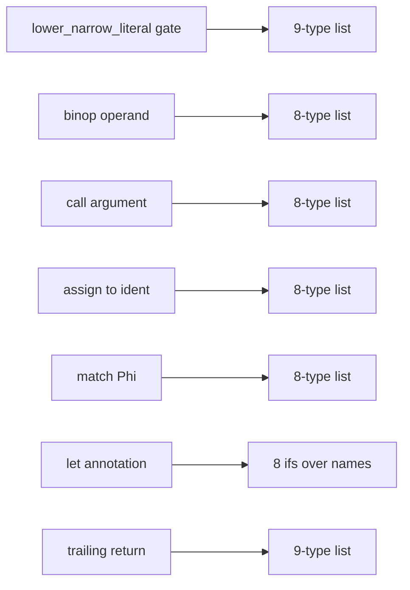

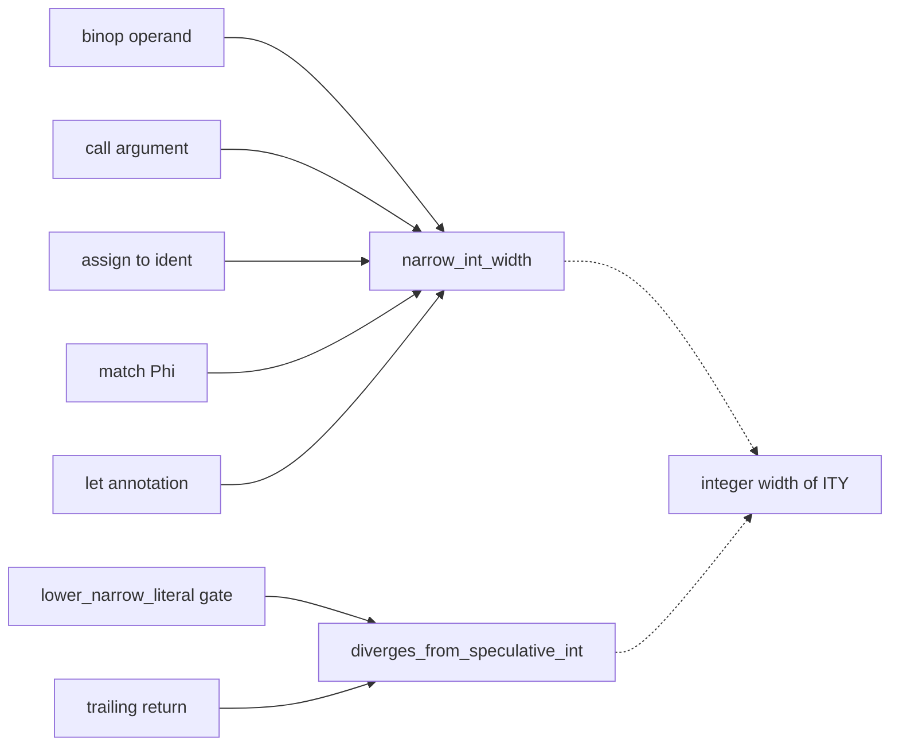

### builtin-result-tag-self-hosted — the builtin result-tag classification, inline in `lower.vow` · Strong · score 22/25

- **Files**: `compiler/lower.vow:2541-2603`, inside the `ext != ""` builtin-call branch of
  `lower_expr`, and carrying a *"Keep these builtin result tags in sync with tag_builtin_result"*
  comment. The Rust twin is `builtin_result_tag` at `vow-ir/src/lower/mod.rs:207-241` (#1290).
  **File-count estimate: 2.**
- **Score**: 22/25 — leverage 4 (the same grade #1290 received: one deeply nested dispatch site stops
  carrying about 40 names), locality 4, blast radius 1, heat 5 (`lower.vow`, as above).
- **Problem**: the classification of about 40 builtin names into String heap, Vec heap and
  `Option<elem>` is 60 lines of independent `if`s, interleaved with the `lctx_tag` calls that apply
  it. Sub-agent (b) compared it with the Rust table row for row and found **no drift**. The debt is
  shape, not behaviour.
- **Deletion test**: concentrates. The table becomes one pure function that can be tested without
  lowering a call.
- **Solution**: add `builtin_result_tag_kind(name) -> i64` and `builtin_result_option_elem(name) ->
  i64`, or one struct holding both, with the `lctx_tag` / `lctx_tag_option_elem` applier left at the
  call site. It must keep the `_try` + `new_narrow_intrinsic_target` early path.
- **Benefits**: the result-tag set becomes one reviewable function in each compiler, and the only
  test, which is on the Rust side (`builtin_result_tag_classifies_names`), gets a self-hosted twin.

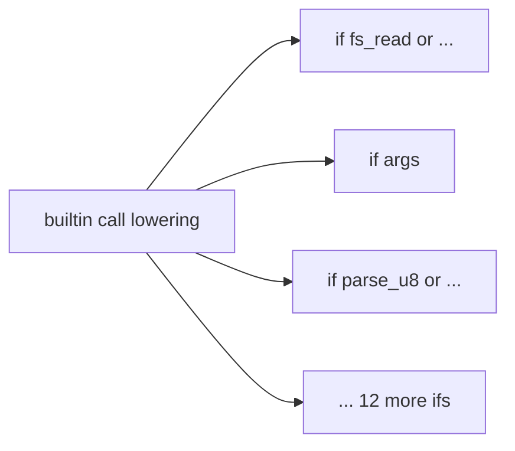

### builtin-method-spec-self-hosted — the 20 uniform builtin-method arms, inline in `lower.vow` · Worth exploring · score 22/25

- **Files**: the `EXPR_METHOD` arm at `compiler/lower.vow:3747-4114`. It has 20 uniform rows
  (String `len`/`push_str`/`eq`/`byte_at`/`push_byte`/`clear`/`parse_i64`/`parse_u64`/`contains`;
  HashMap `len`/`get`/`contains_key`/`remove`; BTreeMap `len`/`get`/`contains`; Vec `len`/`pop`/
  `clear`/`truncate`) and 6 arms that must stay inline. The Rust twin is `builtin_method_spec` at
  `vow-ir/src/lower/mod.rs:305` (#1299). **File-count estimate: 2**, but the largest diff here:
  roughly −200/+110 in `lower.vow` plus a test of about 100 lines.
- **Score**: 22/25 — leverage 4, locality 4, blast radius 1, heat 5.
- **Problem**: the same one-dispatch-site table as #1299. However, the self-hosted rows **differ
  from Rust in how the argument is lowered**:
  - `push_str`, `eq`, `byte_at`, `push_byte` and `contains` use plain `lower_expr` (`:3768`,
    `:3784`, `:3800`, `:3816`, `:3882`), where Rust uses `Consumed` for all but `contains`;
  - `truncate` uses `lower_expr` with a `ConstI64(0)` fallback;
  - HashMap `get`/`contains_key`/`remove` call `lower_consumed_expr` with **no** missing-argument
    guard, whereas Rust falls back to `ConstUnit`;
  - there is also a dead empty `if` at `:3896`.

  A behaviour-preserving mirror therefore needs five argument modes, not Rust's four. Converging
  on Rust's four would need an IR-diff argument that the checker never lets a linear argument reach
  those methods.
- **Deletion test**: concentrates, as in #1299.
- **Why "Worth exploring" rather than "Strong"**: the mode drift means the mirror either keeps a
  fifth mode that Rust lacks, which makes the two tables disagree by construction, or makes a
  convergence decision. Either way it is a bigger and riskier diff than the other two mirrors.

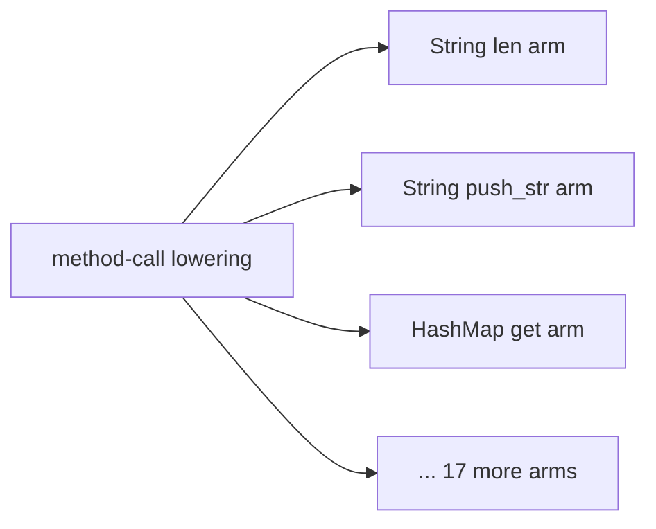

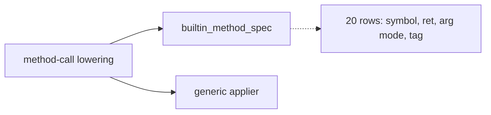

### nondet-spec — nondet call, body suffix and preamble declarations, hand-kept three ways per compiler · Worth exploring · score 21/25

- **Files**:

  | Table | Rust | Vow |
  |---|---|---|
  | Harness nondet call | `vow-verify/src/esbmc.rs:109-127` | `compiler/verifier_harness.vow:14-37` |
  | Body nondet suffix | `vow-verify/src/c_emitter.rs:2094-2112` | `compiler/c_emitter.vow:664-679` |
  | Preamble declarations | `c_emitter.rs:2950-2971` (17 externs) | `c_emitter.vow:3440-3459` (13) |

  **File-count estimate: 5–6.**
- **Score**: 21/25 — leverage 4, locality 5, blast radius 2 (5–6 files, 4 modules across 2
  languages), heat 4 (`c_emitter.vow` 23 commits in 90 days, last 09-21; `esbmc.rs` 13, last 09-02).
- **Problem and drift**:
  - The Rust harness uses `__VERIFIER_nondet_uchar`/`ushort`/`uint`, while the Rust body and both Vow
    tables use `unsigned_char`/`unsigned_short`/`unsigned_int`. Rust's preamble declares both
    spellings.
  - Vow's body table falls back to `int` for i128/u128, where Rust has `int128`/`uint128`.
  - Rust's `parse_u32_opt` payload (`c_emitter.rs:1677`) calls `__VERIFIER_nondet_ulong()`, which no
    preamble declares.
  - The two test suites pin opposite spellings (`esbmc.rs:1173-1195` against `test_verifier.vow:8-26`).
- **Why not picked**: it scores one point below the pick. It also changes behaviour: Rust's emitted C
  changes for u8/u16/u32 parameters. And it carries an open question this run cannot settle from the
  code: whether ESBMC treats the SV-COMP short names specially. A firing that picks it should test
  both spellings against the installed ESBMC first.

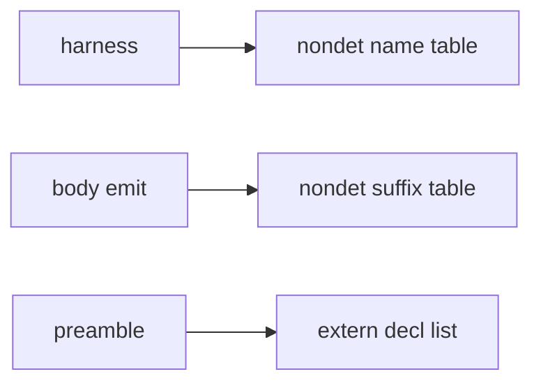

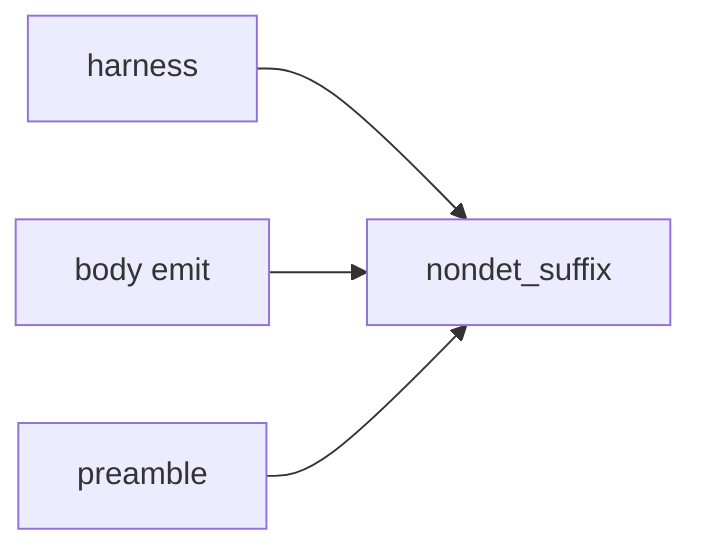

### bool-context-verdict — the self-hosted checker never requires `bool` for `if`, `&&`, `||` or `!` · Worth exploring · score 21/25

- **Files**:
  - Rust: `vow-types/src/check.rs` repeats `ty != Bool && ty != Never` plus an emit at seven sites:
    `:1474`, `:1513`, `:1550`, `:2162`, `:2170`, `:2229` and `:2685`.
  - Vow: `compiler/checker.vow` checks only contract clauses (`:806`). The other constructs return
    `CTY_BOOL()` without checking: `:2350-2352` (`&&`/`||`), `:2493-2495` (`!`) and `:2865`
    (`if` condition).

  **File-count estimate: 4–5.**
- **Score**: 21/25 — leverage 4, locality 4, blast radius 2, heat 5 (`check.rs` 29 commits in 90
  days, `checker.vow` 30, both last touched 09-21).
- **Problem**: `if 5 {}`, `1 && true` and `!3` are type errors in the Rust compiler and are accepted
  by the self-hosted one.
- **Why not picked**: it makes the **primary** compiler reject programs it accepts today. That is a
  correctness fix, not a deepening. Its blast radius includes `examples/` and `benchmarks/`
  programs built only by `build/vowc`, and nobody swept those this run. File it as a fix. Neither
  compiler checks a `while` condition; that gap belongs on a separate card.

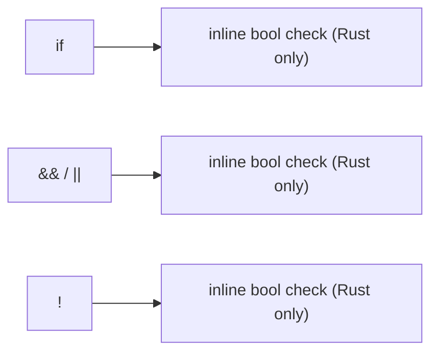

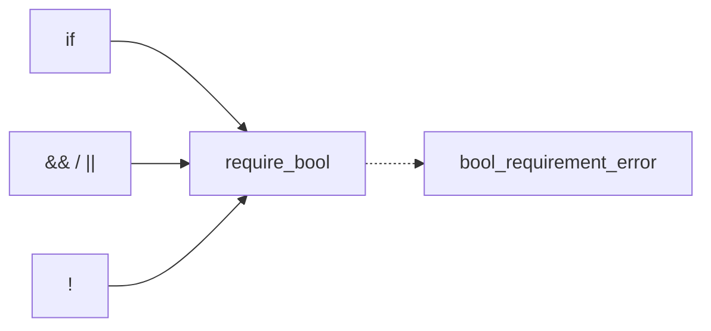

### cex-const-fold-self-hosted — the counterexample constant folder, duplicated in `main.vow` without #585's overflow fix · Worth exploring · score 20/25

- **Files**: `compiler/main.vow:240-278` (`inst_const_i64_string_by_id`) and `:288-334`
  (`callee_i64_string_for_call`). The Rust seam is `fold_binary_i64` at `vow/src/cex_eval.rs:33-47`.
  **File-count estimate: 3** (`main.vow`, `verifier.vow`, `test_verifier.vow`).
- **Score**: 20/25 — leverage 3, locality 4, blast radius 1, heat 5.
- **Problem**: both Vow copies fold `+!`, `-!` and `*!` as wrapping arithmetic. #585 fixed that on
  the Rust side only. The first copy also lacks the `IOP_CONST_U64` case that the second has.
- **Why not picked**: it scores lower and changes self-hosted behaviour for checked-overflow
  constant arguments. It is also a parity-gap *fix* rather than a behaviour-preserving mirror.

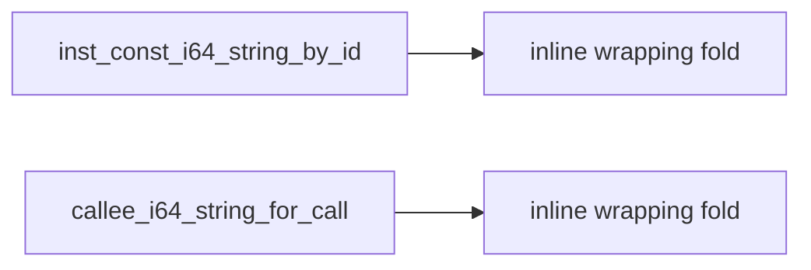

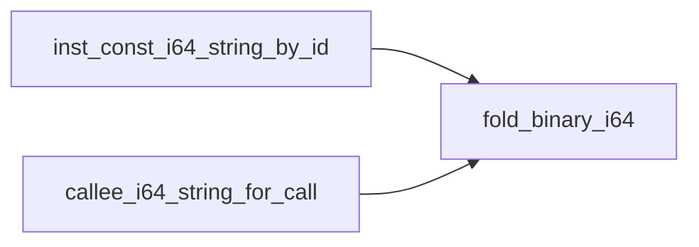

### violated-property-lines — the ESBMC output-section scan, repeated in each extractor in both compilers · Worth exploring · score 19/25

- **Files**:
  - Rust `vow-verify/src/esbmc.rs`: `:196-212`, `:217-241`, `:297-313`, and the complement
    `:381-400`.
  - Vow `compiler/verifier.vow`: `:634-653`, `:686-705`, `:750-772`, and the complement twice at
    `:1109-1148` and `:1150-1180`.

  **File-count estimate: 3.**
- **Score**: 19/25 — leverage 3, locality 4, blast radius 1, heat 4.
- **Drift**:
  - On a malformed `vow:` label, the Vow parser stops at the first one (`:645-647`), where Rust keeps
    scanning.
  - At `Violated property:`, the Vow counterexample scan re-enters later sections, where Rust
    `break`s.
  - Vow's `parse_block_visits` never strips ` (binary)` and has no reader anywhere in `compiler/`,
    so it is dead code that writes a field nobody reads.
- **Why not picked**: lower score. The drift only shows on malformed or multi-counterexample ESBMC
  output.

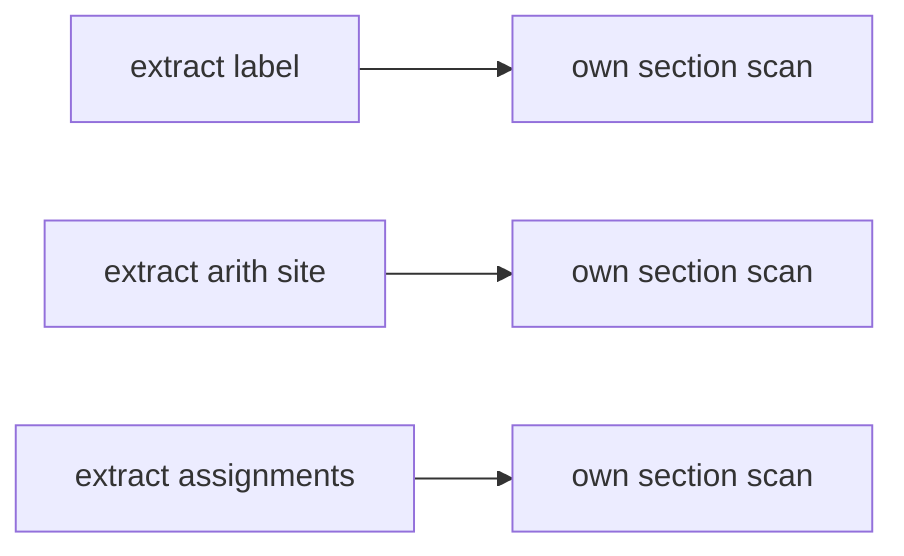

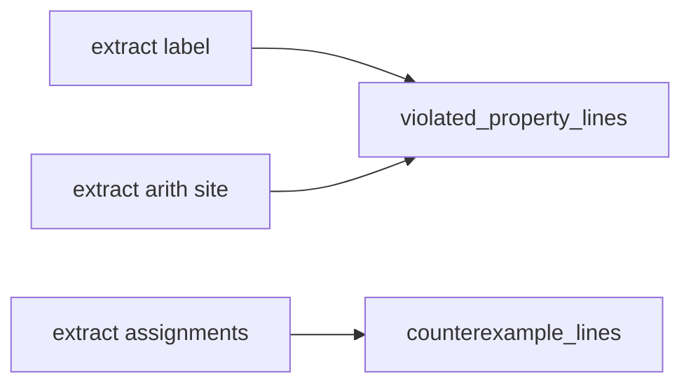

### ty-carries-region — region inference disagrees across compilers on which IR types are scalar · Worth exploring · score 18/25

- **Files**:
  - Rust `vow-ir/src/region.rs:3650-3656` (`is_scalar_ty`, 8 names, 5 callers), plus a third
    spelling of the same policy at `:2689`.
  - Vow `compiler/region.vow:3285-3291` (`is_scalar_ity`, 12 names, 7 callers).

  **File-count estimate: 3–4.**
- **Score**: 18/25 — leverage 3, locality 4, blast radius 1, heat 3 (both files 11 commits in 90
  days, none in 30, last touched 2026-08-17).
- **Problem**: #995 (`f5d2a16e`) added i8/i16/u16/u32 to the Vow list only. So Rust treats those
  four narrow integers as region-carrying, which gives them spurious hidden arena parameters in
  stage-0 output (PLAUSIBLE, not observed). Both sides treat i128/u128 as region-carrying.
- **Why not picked**: the seam's natural form, *only `Ptr`/`LinearPtr` carry a region*, changes
  i128/u128 on **both** sides. Choosing between that and the minimal "Vow's 12 names win" is a
  behaviour fork the autonomy contract reserves for a human.

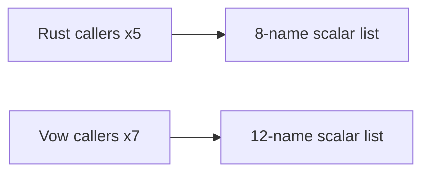

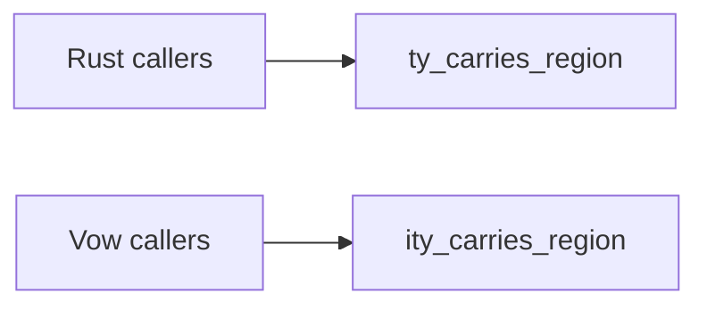

### Re-scored under the parity rule (existing entries)

These entries were carded against the Rust side only. Sub-agent (a) found their self-hosted twins,
and each is re-scored with that twin included. Anchors are in the backlog.

| Entry | Was | Now | Why |
|---|---|---|---|
| `loop-scope-break-policy` | 22 | **19** (L3, Loc4, BR2, H5) | **Premise does not hold.** The self-hosted `EXPR_FOR` *does* push loop kind 0 (`checker.vow:2998-2999`), and `break` with a value is rejected under kind 0 (`:3101`). That matches `grammar.md:674/723`. The card's behaviour-preserving `NoPush` row would carry the Rust bug into the self-hosted compiler. What is left is a Rust correctness fix (make `ForEach` push `None`) plus a cosmetic seam on the Vow side. File it as a fix. |
| `builtin-arg-layout-spec` | 21 | 21 (L4, Loc4, BR1, H4) | `c_emitter.vow:716-767` has the same tables, about 14 inline restatements, and the **same** missing `__vow_vec_pin_to_root_val` row (`:727-737`). Now 3 files (`c_emitter.rs`, `c_emitter.vow`, `test_c_emitter.vow`). |
| `parse-opt-payload-spec` | 21 | **19** (L3, Loc4, BR1, H4) | The Vow side is already factored through `emit_narrow_parse_option` (`c_emitter.vow:1953-1964`) and does **not** have the undeclared `nondet_ulong` bug. What is left is a Rust fix plus one Vow arm (i32, `:2270-2281`). Overlaps `nondet-spec`. |
| `extern-heap-origin-kind` | 20 | 20 (L4, Loc4, BR1, H3) | `region.vow:4263-4318` matches row for row, including the same missing `__vow_btreemap_new` / `parse_*_opt` rows. Now 3–4 files. |
| `extern-container-op-spec` | 20 | 20 (L4, Loc4, BR1, H3) | `region.vow:4320-4384` and `:1519-1545` match row for row, including the same missing `push_val` rows. Vow has no arity-guard drift. |
| `vec-reserve-next-capacity-seam` | 21 | 21 (unchanged) | Only `vow-runtime`, which both compilers link (`vow-linker/src/lib.rs:4`, `vow-clif-shim/src/lib.rs:2918`). There is no `.vow` twin, so the parity rule is satisfied trivially. |
| `arena-variant-rule` | 21 | **20** (L4, Loc4, BR2, H4) | A third copy in `compiler/clif.vow:244-380` agrees with the backend and the shim, but it is now an edit target: 3 implementations plus tests. |
| `esbmc-auto-timeout-policy` | 21 | **20** (L4, Loc4, BR2, H4) | `compiler/verifier.vow:504-517` is now an edit target rather than documentation. It remains a behaviour fork. |

### Also carded (compact)

- **`vec-elem-untagged-scalars`** — 20/25 (L3, Loc4, BR1, H5), about 2–3 files. The "Vec element
  types not recorded" list has four different contents across eight sites in the two lowerers
  (Rust `lower/mod.rs:841-855`, `:4817-4820`, `:4950-4953`, `:5191-5194`; Vow `lower.vow:1276-1278`,
  `:4950-4953`, `:5469-5473`, `:5753`). Rust push lowering filters to I128/U128 at `:3733-3738`,
  and Vow does not (`:4052`). The fix changes behaviour and sits next to the pick, so land the pick
  first. *Before*: eight callers → four lists. *After*: eight callers → one predicate per compiler.
- **`branch-result-merge`** — 20/25 (L3, Loc4, BR1, H5), about 2 files. Rust merges branch result
  types through `merge_result_ty` (`check.rs:480-494`) for `match`, `if` and `loop`. Vow's
  `merge_result_tid` (`checker.vow:2283-2288`) has no `Never` or incompatible-type handling, and
  `if` uses its own weaker inline merge (`:2871-2890`). This is a parity gap that changes behaviour
  on the self-hosted side. *Before*: `if` → inline merge, `loop`/`match` → weak merge. *After*:
  all three → one merge seam.

## Dropped

| Candidate | Dropped because |
|---|---|
| `narrow-literal-context-admission` | Not dropped: **landed**. #1327 merged 2026-09-21 (`gh pr view 1327` returns MERGED). Its self-hosted half is carded separately as `narrow-int-width-self-hosted`, so that the `landed` hard filter does not exclude the mirror. |
| `test-status-failure-set` | Not a deepening. It is a bug: `vow/src/test_runner.rs:388-393` counts `failed \| compile_error \| verify_failed \| contract_skipped` as failures but not `"timeout"` (produced at `:38-44`), so a run whose only problem is a timed-out test exits 0. `main.vow:2319-2328` counts timeouts correctly. Recorded for a human to file. |
| `esbmc-status-classify` | Leverage 2. The timeout text match differs (`esbmc.rs:916` misses "Timed out"; `verifier.vow:535-543` misses "TIMEOUT"), and `exit_code == -2` handling is repeated 5 times in `verifier.vow`. It is a small drift fix, not a deepening. |

## Too large to automate

`clif-shim-region-parity` and `division-abort-spec` remain as recorded. No fresh candidate this firing
reaches blast radius 5.

## Pick

**`narrow-int-width-self-hosted`, 22/25.** It ties on 22 with `builtin-result-tag-self-hosted` and
`builtin-method-spec-self-hosted`. **The pick was a tie**, and the other two are the natural next
firings.

All three live in `compiler/lower.vow`, so all three keys of the rubric's tie-break tie:

1. blast radius — 1 for all three;
2. heat — 5 for all three;
3. most recently touched file — the same file.

This run extends the tie-break with two further keys. Both are deterministic and both come from the
rubric's own axes:

4. **Smaller file-count estimate.** This is the finer-grained measure the blast-radius band is
   derived from. It is 2 for all three, so it ties.
5. **More inline sites collapsed.** This is how leverage, the doubled axis, is counted. The
   narrow-literal mirror collapses **7** sites; the result-tag and method-spec mirrors collapse **1**
   dispatch site each. That decides it.

Key 5 also matches the risk profile. The pick and the result-tag mirror are strictly
behaviour-preserving in both compilers. The method-spec mirror carries a five-versus-four
argument-mode question.

**Runner-up candidate**: `builtin-result-tag-self-hosted`, 22/25. Among the three 22s it has the
smaller diff and no drift, which puts it ahead of `builtin-method-spec-self-hosted`.

**Why not a 21**: every 21 either changes behaviour on at least one compiler (`nondet-spec`,
`bool-context-verdict`, `vec-reserve-next-capacity-seam` on the map paths) or scores below the
three mirrors on heat (`builtin-arg-layout-spec`, heat 4).

## Design

Three sub-agents worked in parallel, each briefed to produce a deliberately different interface.
Every design must keep each site's membership row for row (8 types at five sites, 9 at two), so the
self-hosted IR stays byte-identical.

### Design A: minimal surface, an exact mirror of the Rust names

- **Interface**: two functions in `compiler/lower.vow`, both with the Rust names and no new
  vocabulary.
  - `narrow_int_width(ty: i64) -> i64` is a four-row width table: 8, 16, 32 or 128, and 0 for
    none. There is no 64 row.
  - `diverges_from_speculative_int(ty: i64) -> bool` is `ir_ty_is_integer(ty) && ty != ITY_I64()`.
- **Sites**:
  - The four 8-type pre-filters become `narrow_int_width(..) != 0`.
  - The self-gate becomes `!diverges_from_speculative_int(ty)`.
  - The `let` chain becomes `let annotated = ity_for_scalar_type_name(type_name); if
    narrow_int_width(annotated) != 0 { … }`, and the `u64` `IntCast` branch after it is unchanged.
  - The trailing return keeps its gate, re-spelled over `diverges_from_speculative_int`.
- **Hides**: which `ITY_*` codes are integers, and at what width. The numbering is non-contiguous.
  It also hides that `u64` is the one code on which the two predicates disagree.
- **Test**: `compiler/tests/test_lower_narrow_int_width.vow`, with three checks mirroring Rust's
  three tests:
  - exhaustive over the 16 codes plus out-of-range codes;
  - a differential against the legacy 8-type and 9-type lists over codes -1 to 16;
  - the `let` composition row by row, including unknown names.
- **Trade-offs**:
  - There is no general width accessor, so `narrow_int_width` is its own table rather than being
    derived from an integer shape.
  - The width value is never read; every site only tests `!= 0`.
- **Diff**: about +19/−44 in `lower.vow` and about 105 test lines, in 2 files.

### Design B: the integer-shape fact lives with the `ITY_*` codes in `ir.vow`

- **Interface**: one domain accessor in `compiler/ir.vow`, next to the codes. It is the
  self-hosted twin of Rust's `IntegerWidth::bits()` (`vow-ir/src/types.rs:44-54`):
  - `ity_int_width_bits(ty: i64) -> i64` returns 8, 16, 32, 64 or 128, and 0 for non-integers
    and unknown codes.

  The two predicates stay in `compiler/lower.vow` with the Rust names, because "i64 is the
  speculative default" is a lowering rule:
  - `narrow_int_width` is the width with 64 mapped to 0;
  - `diverges_from_speculative_int` is `ity_int_width_bits(ty) != 0 && ty != ITY_I64()`.
- **Sites**: the same as A.
- **Rejected alternatives**:
  - An `IntShape` struct return was rejected because structs are heap-allocated
    (`grammar.md:804`) and this is the hot lowering path.
  - `ity_int_is_signed` was left out because nothing would call it yet.
- **Hides**: the same as A. In addition, the width and integer-ness of a code live in the one
  module every `ITY_*` consumer already imports. The test also pins
  `ity_int_width_bits(ty) != 0 ⇔ ir_ty_is_integer(ty)`.
- **Trade-offs**:
  - It touches one more file, the one that 10 modules import. The change is additive, and a grep
    of the flat namespace built by `concat_vow.sh` found no name clash.
  - It opens a natural home for later consumers, which are out of scope here:
    - `module_io.vow:531-558`, the integer-type wire codec;
    - c_emitter's `ity_is_wide`.
- **Diff**: about +10 in `ir.vow`, about +16/−44 in `lower.vow` and about 110 test lines, in 3 files.

### Design C: optimised for the most common caller, a context-keyed entry point

- **Interface**:
  - six `NARROW_CTX_*()` codes: `DEFAULT`, `BINOP_OPERAND`, `CALL_ARG`, `ASSIGN`, `MATCH_PHI`
    and `LET_ANNOTATION`;
  - `narrow_admits(ty, nctx) -> bool`, derived as *integer ∧ ≠ i64 ∧ (≠ u64 ∨ nctx = DEFAULT)*;
  - `lower_narrow_literal_in(ctx, a, eid, original, ty, nctx)`, which gates and then delegates to
    the unchanged `lower_narrow_literal`.
- **Sites**:
  - The call-argument, assignment and `let` sites call the entry point unconditionally.
  - The binop and Phi sites keep a gate, `narrow_admits(.., CTX)`, because neither one delegates.
  - The trailing return drops its gate, as Rust did at `mod.rs:4995`.
- **Hides**: the per-context `u64` decision, now written as a row.
- **Trade-offs**, as its own author stated them:
  - Six codes carry one bit. `DEFAULT` is exactly `diverges_from_speculative_int`, and every
    other row is exactly `narrow_int_width(..) != 0`.
  - It introduces a swapped-argument bug class: `(ty, nctx)` are both `i64`.
  - It is a **differently shaped seam** from Rust's. Under the parity reading this report relies
    on (a mirror *completes* the landed change), that lands a second vocabulary for one policy in
    one compiler only. To be parity-honest it would have to change Rust too. That would re-open
    the 2026-09-21 adjudication, which rejected exactly this context-parameter shape for Rust.
- **Diff**: about net 0 in `lower.vow` and about 140 test lines. Rust gets 0 lines if the change
  is Vow-only, or about +30–45 if Rust is changed to match.

### Adjudication criteria

These are applied in order: **depth**, **locality**, **seam placement**, **test surface**, **blast
radius**.

### Verdict: Design B

The advisor adjudicated.

- **Depth.** B is the only design that *derives* the membership from a width fact instead of
  re-spelling it. A's `narrow_int_width` is its own four-row table with a conspicuous missing 64
  row. That is the same "re-spells the set inside the new seam" defect that lost the Rust
  adjudication one firing ago: the 2026-09-21 report picked its design C for exactly this reason, in
  the same file, over the same policy. C's six codes carry one bit.
- **Locality.** The width fact sits beside the `ITY_*` codes. Whoever adds a code therefore sees the
  width decision in the same place.
- **Seam placement.** `ir.vow` is the module every `ITY_*` consumer already imports. Two prospective
  adapters are named, not a hypothetical one: `module_io.vow:531-558`'s integer-type codec and
  `c_emitter`'s `ity_is_wide`. Both are out of scope here.
- **Test surface.** B's test additionally pins `ity_int_width_bits(ty) != 0 ⇔
  ir_ty_is_integer(ty)`.
- **Blast radius.** A wins here, 2 files against 3, but this is the tie-breaker between
  *otherwise-equal* designs, and they are not equal.

**Runner-up design: A.** It lost on depth: its width table re-spells membership instead of deriving
it.

**Why C lost.** It fails on parity, the objection its own author called decisive. A context-keyed
seam in the self-hosted compiler alone is a second vocabulary for a policy that Rust expresses as
`narrow_int_width` / `diverges_from_speculative_int`. That undoes the "a mirror completes the landed
change" reading this report relies on.

**Decisions carried into implementation:**

- **Keep the trailing-return gate**, re-spelled over `diverges_from_speculative_int`. Rust deleted
  its equivalent at `mod.rs:4995`. Both choices produce identical output: `block_result_eid` is pure
  and `lower_narrow_literal` returns before mutating `ctx`. The difference is deliberate, and the PR
  says so.
- **No contracts on the new functions.**
  - `lower.vow:1347-1349` records a latent Cranelift bug with inline OR-chain postconditions once
    `lower.vow` is imported into a compiler test, which the new test does.
  - The only tight `ensures` would restate the body.
  - A `requires` bounding `ty` could not be discharged at call sites that pass arbitrary codes.
- **File-count estimate revised from 2 to 3** (`ir.vow`, `lower.vow`, the new test) before
  implementation, so step 5 watches the diff against the real number.
- **Rust**: no functional edit. A comment next to `narrow_int_width` /
  `diverges_from_speculative_int` names the self-hosted twins, following the keep-in-sync pattern at
  `mod.rs:206`. It is comment-only, so it has no codecov exposure.
