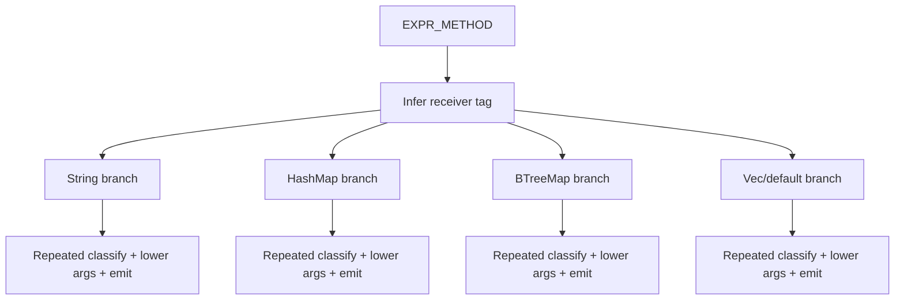
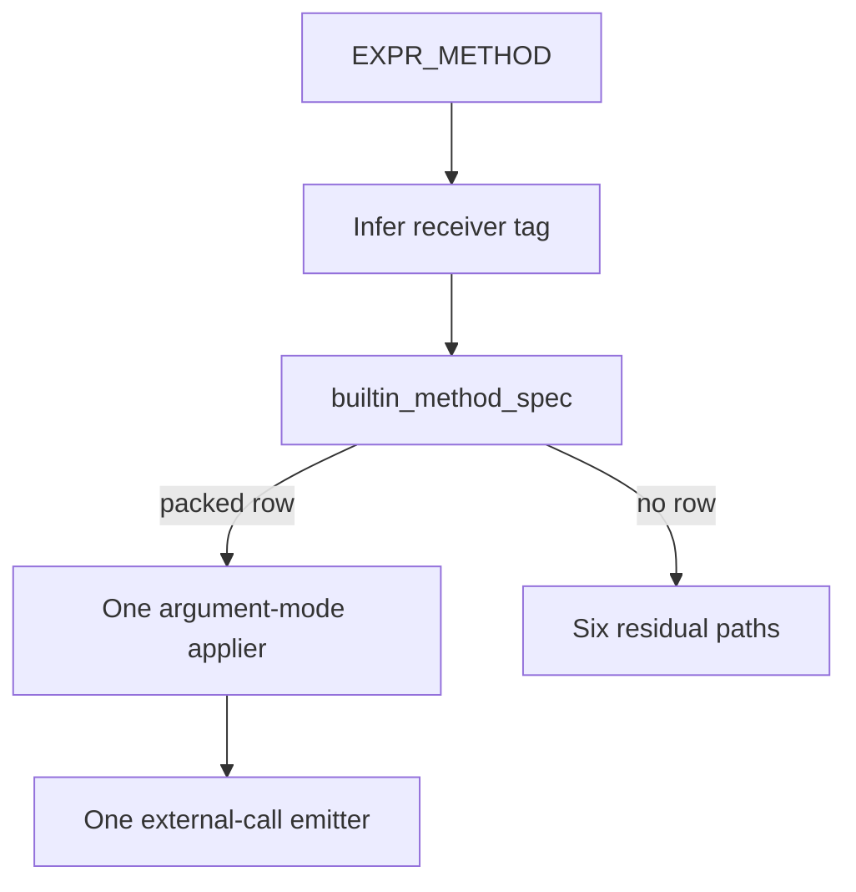

# Self-hosted builtin method specification seam

Date: 2026-09-24
Branch: `sym/vow/routine/refactor-audit/01M3A7ST6T`
Base: `origin/main` at `ea33a53b5d1b12005477fe4efdbf40cc1baa54a3`

## Outcome

Deepen `compiler/lower.vow` by moving 20 uniform builtin-method rows out of the `EXPR_METHOD` control flow and behind one packed, allocation-free classifier. The lowering path now consumes that classifier through a single emitter. Six methods whose lowering is structurally distinct remain explicit residual arms.

The Rust compiler already owned the equivalent decision behind `vow-ir/src/lower/mod.rs::builtin_method_spec`; its synchronization comment now identifies the self-hosted seam and the intentional argument-mode difference.

## Selection

The persisted architecture backlog was recovered from the parent of commit `4326e3af`, which removed the old `.architecture` directory. Prior `pm-deepen` pull requests were checked first so merged work was not repeated.

Scoring uses five axes from 0 to 5: leverage, locality, blast-radius safety, recurrence/heat, and interface depth.

| Candidate | Leverage | Locality | Safety | Heat | Depth | Total | Decision |
| --- | ---: | ---: | ---: | ---: | ---: | ---: | --- |
| Self-hosted builtin method specification | 4 | 4 | 4 | 5 | 5 | 22 | selected |
| Builtin argument layout specification | 4 | 4 | 4 | 4 | 5 | 21 | runner-up |
| Compact metadata access | 4 | 4 | 3 | 5 | 5 | 21 | larger blast radius |
| Contract status mapping | 4 | 4 | 4 | 3 | 4 | 19 | colder seam; Rust side already deep |
| Arena routing | — | — | — | — | — | excluded | already routed through one operation per implementation; proposed deletion test did not hold |

The selection is deterministic: 22 is the highest persisted score. The runner-up loses on recurrence/heat, not on estimated implementation ease.

## Problem

`compiler/lower.vow::lower_expr` previously encoded four coupled decisions repeatedly inside `EXPR_METHOD`:

1. receiver and method recognition;
2. runtime symbol selection;
3. result IR type and result tag;
4. argument lowering and missing-argument fallback.

Twenty rows repeated the same call construction around five argument modes. A new uniform builtin required another branch and another opportunity for the runtime symbol, type, tag, span, or fallback to drift from the Rust compiler.

Deletion test: if the inline uniform arms are removed before introducing the seam, String, HashMap, BTreeMap, and Vec builtin calls stop lowering. After this change, those 20 arms are absent and the behavior remains covered through the classifier and one emitter.

## Competing designs

Four interfaces were designed before implementation.

### A. Packed classifier and generic emitter — selected

`builtin_method_spec(receiver_tag, method) -> i64` returns zero for no match or a positive packed descriptor containing:

- runtime-symbol code;
- result IR type;
- one of five argument modes;
- optional result-tag code;
- span-patching bit.

Small pure accessors decode the descriptor. The `EXPR_METHOD` path applies it once.

### B. Deep mutable lowering adapter

A helper would accept the lowering context, receiver, argument list, and source expression, then emit the call directly or return a sentinel for no match.

This hides more mechanics, but it creates a wide mutation-heavy interface and makes row metadata difficult to test without constructing the entire lowering context.

### C. Receiver-family helpers

Separate helpers for String, HashMap, BTreeMap, and Vec would each own recognition and emission.

This improves local readability but preserves four policy locations and does not produce one synchronization surface with Rust.

### D. Mirrored row vocabulary — strongest rejected design

Restructure the Rust and Vow compilers around matching row fields and accessor names.

This maximizes visual parity. It loses to A because Rust already has a deep table seam with four `MethodArg` variants, while the self-hosted compiler must preserve five legacy modes. Forcing a shared vocabulary would churn correct Rust production code and widen the blast radius without reducing the Vow emitter further.

## Adjudication

A typed external judgment evaluated the four designs in this fixed order:

1. module depth;
2. locality;
3. seam placement;
4. direct test surface;
5. blast radius.

Design A won. It keeps classification pure and directly testable, places lowering mechanics at the existing `EXPR_METHOD` seam, preserves current behavior without Rust restructuring, and avoids allocating a temporary specification struct in compiled Vow code.

## Interface and invariants

The descriptor layout is private to `compiler/lower.vow`:

- bits 0–4: runtime-symbol code;
- bits 5–8: result IR type;
- bits 9–11: argument mode;
- bit 12: `Option` result tag;
- bit 13: patch source span.

Zero is reserved for no match. All 20 valid rows use nonzero symbol codes.

Five argument modes preserve prior behavior exactly:

- no argument;
- `lower_expr`, missing argument becomes `ConstUnit`;
- unguarded `lower_consumed_expr`;
- guarded `lower_consumed_expr`, missing argument becomes `ConstUnit`;
- `lower_expr`, missing argument becomes `ConstI64(0)`.

Span stamping remains limited to `String.parse_i64`, `String.parse_u64`, and `BTreeMap.get`. `Option` tagging remains limited to those three rows. Surplus arguments remain ignored by classified rows.

The following six structurally distinct paths remain explicit:

- `String.substring`;
- `HashMap.insert`;
- `BTreeMap.insert`;
- `Vec.push`;
- `unwrap`;
- unknown-method fallback, including evaluation of all supplied arguments.

## Before

## After

## Test-first evidence

The interface test was written before production code in `compiler/tests/test_lower_builtin_method_spec.vow`.

Red evidence: the first release test command failed with undefined classifier, accessor, and mode symbols. No production classifier existed.

Green evidence: after implementation and release-runtime build, the same test passed with the Rust stage-0 compiler. It exercises:

- every one of the 20 classified rows;
- exact runtime symbol, result type, argument mode, result tag, and span flag;
- receiver precedence and unknown-method decline;
- representative emitted calls;
- missing-argument fallback differences.

The rebuilt self-hosted fixed-point compiler also passed the same test: one passed, zero failed, zero skipped.

## Verification completed

- `cargo build --release --all -j6`
- `cargo fmt --all -- --check`
- `cargo test --release --all -j6`: 1,699 passed across 43 suites; 2 ignored
- `cargo clippy --release --all -j6 -- -D warnings`
- `python3 scripts/generate_operations.py --check`
- `scripts/bootstrap.sh --skip-cargo`: stage-2 and stage-3 SHA-256 fixed point matched at `955a4e45377be161ff06a7ca1ba45e93b3d9a9480bfa203d927faf22b6873c81`
- `build/vowc test compiler/tests/test_lower_builtin_method_spec.vow --module-root compiler`: 1 passed
- `scripts/full_test.sh`: 1,087 passed, 0 failed, 20 skipped across the complete CI-gating harness

The first post-implementation test attempt reached linking but found no release `libvow_runtime.a`. Building the required release workspace artifact resolved the environment prerequisite; the unchanged test then passed.

## Vocabulary and context

No domain vocabulary changed. This report uses three implementation-local terms:

- **builtin method specification**: the pure recognition and metadata decision for one uniform builtin method;
- **argument mode**: the existing lowering/fallback behavior applied to a classified method's first argument;
- **residual arm**: a method whose bespoke lowering is intentionally not represented by the uniform specification.

No `CONTEXT.md` exists in the repository, and these terms do not change the product domain model, so no context-file update is warranted.

## Proposed ADR

### Title

Keep uniform builtin-method policy behind compiler-local specification seams

### Context

The Rust and self-hosted compilers must agree on receiver/method membership, runtime symbols, result types, and result tags. Their internal argument-lowering representations differ: Rust currently needs four `MethodArg` variants; self-hosted Vow must preserve five modes.

### Decision

Each compiler owns one pure builtin-method specification seam and one generic application path. Synchronize semantic row fields, not internal representation types. Keep structurally distinct lowering outside the table. Prefer packed scalar metadata in self-hosted Vow when it avoids temporary aggregate allocation and remains directly testable through accessors.

### Consequences

Adding a uniform builtin method requires one row per compiler and focused parity tests. Reviewers have one policy surface in each implementation. The packed layout is private and must remain covered by accessor-level tests. Methods with multiple arguments, generic type propagation, element narrowing, or control-flow semantics remain explicit until they genuinely share an application policy.

## Environment degradations

The `cargo` and Cargo plugin shims were not available through the default executable lookup despite the stable toolchain being installed. All Rust gates used the explicit stable toolchain path, with its `bin` directory prepended for `cargo-fmt` and `cargo-clippy`. No quality gate was skipped or narrowed.
